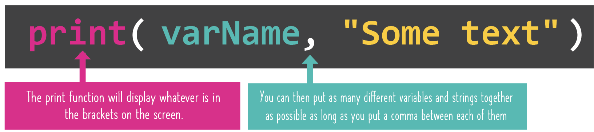

# Concatenar

Literalmente significa **combinar texto (recordemos que 'texto' es un string) junto con variables en una misma oración**

De esta manera podemos hacer que nuestro input y output tenga una buena apariencia.

Intentemos con el siguiente codigo. Copia y pega en el *main.py*

```
myName = input("¿Cuál es tu nombre? ")
myLunch = input("¿Que vas a comer de almuerzo? ")
print(myName, "va a comer un buen", myLunch, "muy pronto!")
```
Hicimos una oración completa utilizando string y variables. 
Funciona de esta manera: resulta que la funcion *print()* puede imprimir todo lo que le pongamos, con tal y le coloquemos una coma (,) entre cada fracción



Vamos a intentar con otro código:

```
number = input("Give me a number: ")
group = input("Give me a collective noun for a group of things: ")
thing = input("Give me the name of a weird or wacky thing: ")
print("No I don't think that", number, "is a", group, "of", thing,". That's just odd.")
```

Podemos combinar tanto texto como queramos, solo que deben estar separado por una coma(,)

## Errores comunes
Primero borra todo código que está en el *main.py* y copia cada código que hay debajo y haz click en *Run* para que veamos los errores:

### Invalid Syntax
```
yourName = input("Name: ")
whatYear = input("What year is it?: ")
print(yourName "thinks it is" whatYear)
```

El error presente en este código es que no hay una coma(,) que separe las fracciones de texto.

### Nuestro codigo corre, pero se ve un poco raro
```
yourName = input("Name: ")
whatYear = input("What year is it?: ")
print("yourName, thinks it is, whatYear")
```
Esto se debió por encerrar las variables dentro comillas ("), y el computador los toma como string

## Arregla este código
Trata de corregir el codigo que está full de errores:
Recuerda borrar todo codigo anterior que tengas:
```
print("=== Your Song Generator ===")
print("""You'll be asked a bunch of questions
then we'll make you up an amazing
song, totally copyright free 😭""")
print()
person = input("Name a person famous for something good: ")
thing = input("Name a thing they did: ")
place = input("Name a place you like: ")
rhyme = input("Give me a verb that rhymes with your person's name: ")
print()
print("There was a person called" name)
print("Who did something cool like", thing, "at the wonderful", place "where you'll find me", rhyme)
```

La solición está en [main.py](./main.py)