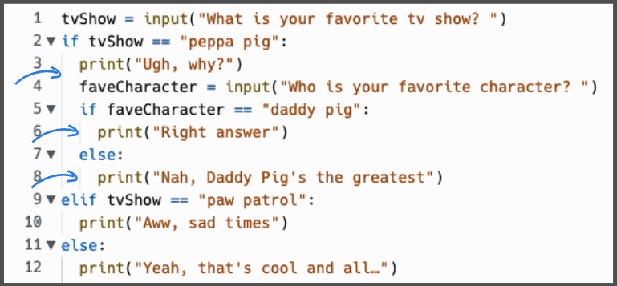

# Dia 7: anidados (nesting)

Nesting es cuando ponemos una declaracion *if* dentro de otra declaracion *if* usando el poder de la sangria. El segundo *if* dentro del primer *if* necesita ser espaciado una vez mas.

Presta atecion a las lineas verticales (como se muestran en la imagen) para asegurarte que los espaciados sean los correctos.



¿Notaste que el segundo *if* debajo de `faveCharacter` y como está espaciado con sangria?


```
tvShow = input('¿Cual es tu show de TV favorito? >')
if tvShow == 'peppa pig':
  print('uhg, ¿por que?')
  faveCharacter = input('¿Cual es tu personaje favorito? >')
  if faveCharacter == 'daddy pig':
    print('Respouesta correcta')
  else:
    print('nah, papá cerdito es el mejor')
elif tvShow == 'paw patrol':
  print('aww, triste')
else:
  print('Si!, ese tambien es cool...')
```

## Errores comunes
### Sintax Error
¿Que hay de malo en este codigo?

```
tvShow = input("What is your favourite tv show? ")
if tvShow == "peppa pig":
  print("Ugh, why?")
  faveCharacter = input("Who is your favourite character? ")
  if faveCharacter == "daddy pig":
    print("Right answer")
else:
  print("Nah, Daddy Pig's the greatest")
elif tvShow == "paw patrol":
  print("Aww, sad times")
else:
  print("Yeah, that's cool and all…")
```

*Respuesta:* el primer else y su accion deben tener un espacio de sangria cada una.

## Arregla mi código
Trata de arreglar el codigo que está lleno de errores
```
order = input(What would you like to order: pizza or hamburger? ")
if order = "hamburger":
print("Thank you.")
  cheese = input("Do you want cheese?")
  if cheese == "yes":
  print("You got it.")
else: 
    print("No cheese it is.")
elif order == pizza:
  print("Pizza coming up.")
  toppings = input("Do you want pepperoni on that?")
  if toppings = "yes"
    print("We will add pepperoni.")
else:
  print"Your pizza will not have pepperoni.")
```

aqui está mi solucion

```
order = input("What would you like to order: pizza or hamburger? > ")
if order == "hamburger":
  print("Thank you.")
  cheese = input("Do you want cheese? yes or no > ")
  if cheese == "yes":
    print("You got it.")
  else: 
    print("No cheese it is.")
elif order == "pizza":
  print("Pizza coming up.")
  toppings = input("Do you want pepperoni on that? yes or no >")
  if toppings == "yes":
    print("We will add pepperoni.")
  else:
    print("Your pizza will not have pepperoni.")
else:
  print(f'Ok {order} will be!! thanx for coming')

```
## Reto del dia 7: Generador de preguntas para falsos fans

Quieres averiguar si otra persona es un verdadero superfan del mismo programa, película o interés que tú? Crea un programa que pregunte qué le interesa a alguien e incluye sentencias if anidadas para hacer preguntas de seguimiento molestas para ver si alguien es el verdadero fan.

Asegúrate de incluir múltiples sentencias if/elif y sentencias if anidadas.

La solución la ven en [main.py](./main.py)

``````