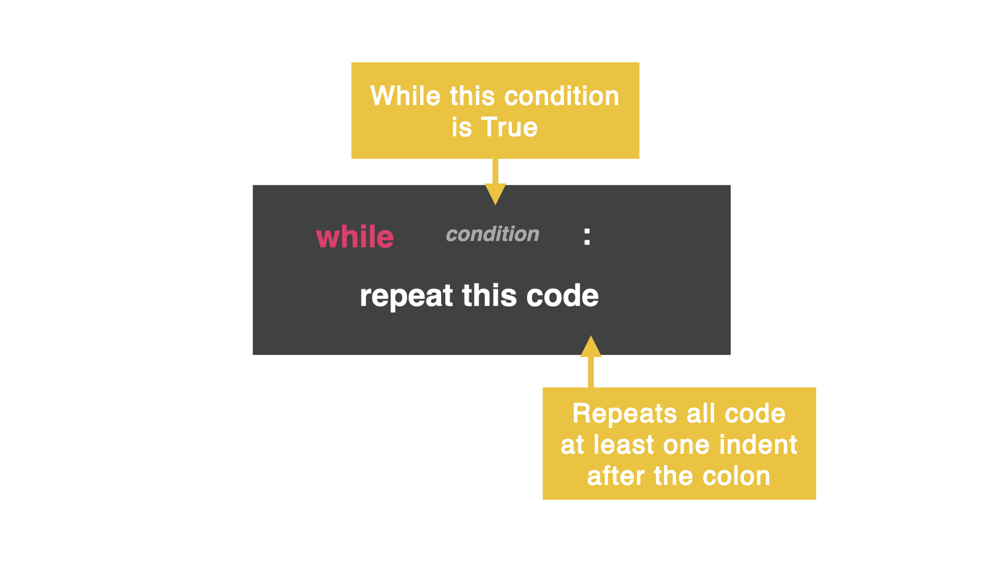

# Dia 15: Todo sobre loops

En el dia 14 hicimos yna juego de piedra, papael o tijeras, pero en el cual debiamos hacer click en -run-_ cada vez, lo que hacia una experiencia terrible, arreglemos eso con un loop `while`.

## loop While
Un loop while le permite al codigo repetirse a si mismo basado en una condicion que le demos

Es similar a una declaracion _if_ en el cual le haces una pregunta, mientras la respuesta sea afirmativa va a repetir el codigo nuevamente.



En el siguiente codigo, la variable es llamada `counter` y es inicializada en cero. El loop _while_ tiene la condivion diciendo "mientras el contador sea menos a 10, haz esto"

En este caso, `print()` la variable y luego añadir `+=1` a esa variable. Mientras la vatiable sea menor a 10, el loop repetirá el codigo.

```
counter = 0
while counter < 10:
  print(counter)
  counter +=1
```

## Loop infinito
Hay que tener mcuho cuidado con no crear un loop infinito accidentalmente. Esto es cuando el computador creara un loop sin un cierre, se ejecutará hasta el fin de los tiempos

Soluciona el loop añadiendo 
```
variable += 1
```

Esto solo dice "cuenta hasta 10 de a uno a la vez" para hacer que el loop termine

No olvides, si tu condicion es `>` entonces talvez necesites `-=`. Esto restará de la variable en vez de aumentar.

## Errores comunes

### Loop Infinito
¿que pasa con este codigo?

```
counter = 0
while counter < 10:
  print(counter)
```

Respuesta: ¿ves una serie de 0 imprimiendose una y otra vez? Has creado un loop infinito porque el contador va a ser siempre menor a 10. En este caso, deten manualmente el loop añadiendo `counter += 1`

### Nada pasa
```
counter = 0
while counter > 6:
  print(counter)
  counter += 1
```

Respuesta: El problema es la condicion. La inigualdad nos dice que r sea mayor a 6 que haga algo, y añade +1, pero el contador comienza en cero, por lo tanto no es mayor a 6.

Se soluciona cambiando la inigualdad a `<`.

### Salida

```
exit = ""
while exit != "yes":
  print("🥳")
exit = input("Exit?: ")
```

Tu tambien puedes usar un loop `while` para salir del loop con texto, "mientras no escribas 'yes' el computador va a escribir '🥳'"

Corre el codigo y mira que pasa

Respuesta: espera, no impoirta que escribas, siempre vas a obtener "🥳", chequea la indectacion

```
exit = ""
while exit != "yes":
  print("🥳")
  exit = input("Exit?: ")
```

## Reto del dia 15
Escribe un codigo que repita. Dentro del loop, pregunta al usuario que sonido de animal quieren oir

ejemplo:

```
What animal do you want?: Cow
A cow goes moo.

Do you want to exit?: no

What animal do you want?: A Lesser Spotted lemur
Ummm...the Lesser Spotter Lemur goes awooga.

Do you want to exit?: yes
```

LA solucion la puedes ver en [main.py](./main.py)