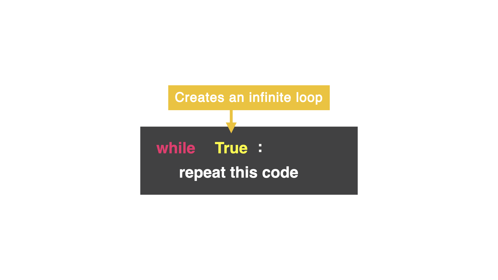
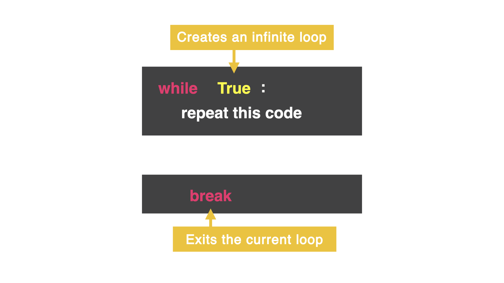

# Bucle `While True`

En el dia 15, aprendimos a crear un bucle while. sin embargo, hay muchas maneras de de hacer un bucle infinito accidental, y es una pesadilla.

## Introduciendo el bucle While True:



## Intentemos
¿Que pasará con el codigo abajo?

```
while True:
  print("This program is running")
print("Aww, I was having a good time 😭")
```
Este tipo de bucle tiene dos condiciones: `True` y `False`. Nota la 'T' mayuscula y la 'F' mayuscula

Es este bucle, le estamos diciendo a la computadora:

"Mientras True sea True, haz esto una y otra y otra vez"

Hicimos un bucle infinito, pero espera...

## Detenerlo
Hay una manera de detener el bucle, con la palabra `break`. Este comando saca al computador del bucle y detiene el codigo en ese punto. Incluso si hay mas codigo despues de la palabra `break` y dentro del bucle.

Despues del `break`, el computador salta fuera del bucle la prixima linea de codigo sin sangria



## Intentemoslo

Ejecuta el codigo abajo y nota como el bucle va a ejecutarse hsta `break`. La siguiente linea sin sangria de codigo va a ejecutarse

## Errores comunes

### Error en el nombre
¿Que error hay aqui?
```
counter = 0
while true:
  answer = int(input("Enter a number: "))
  print("Adding it up!")
  counter += answer
  print("Current total is", counter)
  addAnother = input("Add another? ")
  if addAnother == "no":
    break
print("Bye!")
```

El error es la letra mayuscula en `true`

### Error de sintaxis

Copia y mira que error hay aqui

```
counter = 0
while True:
  answer = int(input("Enter a number: "))
  print("Adding it up!")
  counter += answer
  print("Current total is", counter)
addAnother = input("Add another? ")
if addAnother == "no":
  break
print("Bye!")
```

Son errores de sangria en las lineas 7,8,9

```
counter = 0
while True:
  answer = int(input("Enter a number: "))
  print("Adding it up!")
  counter += answer
  print("Current total is", counter)
  addAnother = input("Add another? ")
  if addAnother == "no":
    break
print("Bye!")
```

## Reto del dia 16

Crea un juego para que el usuario adivine la letra de un fragmento de una cancion. El usuario debe pensar la letra correcta de la cNcancion en tantos intentos como sea posible.

La solucion la veras en [.main.py](./main.py)