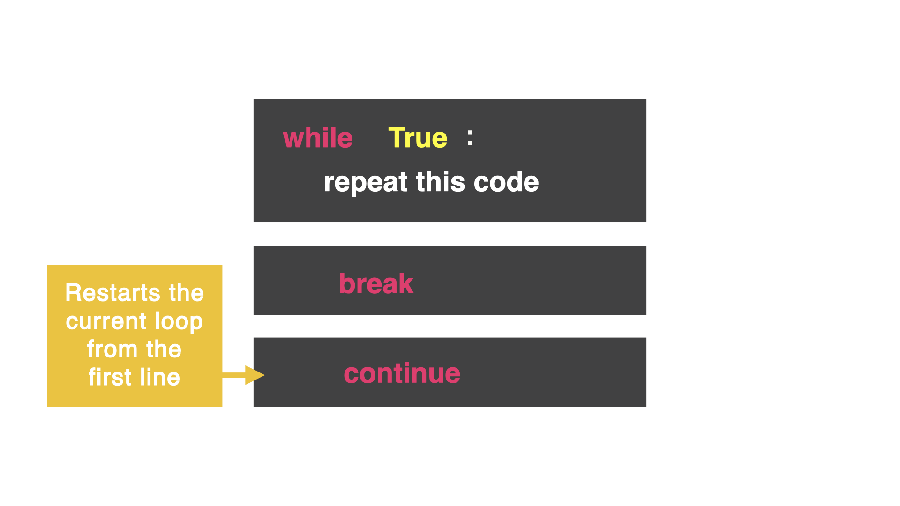
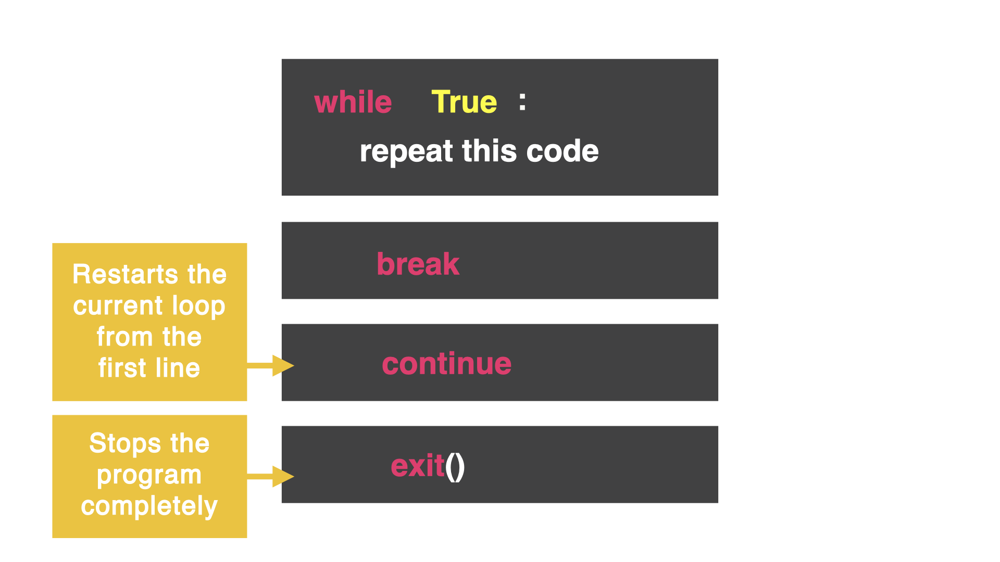

# Otro truco

Hasta ahora hemos usado el comando `break` el el bucle `while True. `break` sale completamete del bucle y va hasta la siguiente linea sin indexacion,. Sin embargo, quizas quisieramos parar el cdigo y comenzarlo nuevamente desde el principio. (esto es ideal para construir juegos)


En el código abajo, el juego corre y el usuario es preguntado si  quiere ir a la derecha o a la izquierda. Si el usuario elige izquierda, cae a su muerte, y `break` sacara al usuario fuera del bucle. Ese es el juego:

```
while True:
print("You are in a corridor, do you go left or right?")
direction = input("> ")
if direction == "left":
  print("You have fallen to your death")
  break
```

Bueno, esto está un poco aburrido y no es muy diferente  lo que aprendimos en el dia 16.. ahora el truco:

## El comando `continue`

El comando `continue` para de ejecutar el codigo en el bucle y comienza en el inicio del bucle nuevamente. Esencialmente, queremos llevar al usuario a al pregunta original




Añadiendo `continue` va a comenzar y preguntará de nuevo al usuario: Do you go left or right?".

```
while True:
print("You are in a corridor, do you go left or right?")
direction = input("> ")
if direction == "left":
  print("You have fallen to your death")
  break
elif direction == "right":
  continue
else:
  print("Ahh! You're a genius, you've won")
```

La declaracion `else` a una impresion cualquiera aparte de "left" o "rigth", mientras el usuario es un ganador, no necesitamos usar `break`

## Ir al la salida mas cercana

El codigo anterior continúa el bucle incluso si el usuario ha ganado. Vamos a corregir con el comando `exit()`



El comando `exit()` para completamente el programa y no correra ninguna otra linea de codigo

Copia el codigo debajo e intentalo. ¿Hace lo que esperas?

```
while True:
  print("You are in a corridor, do you go left or right?")
  direction = input("> ")
  if direction == "left":
    print("You have fallen to your death")
    break
  elif direction == "right":
    continue
  else:
    print("Ahh! You're a genius, you've won")
    exit()
print("The game is over, you've failed!")
```

## Errores comunes

```
while True:
  print("You are in a corridor, do you go left or right?")
  direction = input("> ")
  if direction == "left":
    print("You have fallen to your death")
    break
  elif direction == "right":
    continue
  else:
    print("Ahh! You're a genius, you've won")
    exit
print("The game is over, you've failed!")
```

Respuesta: `exit()` es una funcion y necesita los parentesis para ejecutarse

## Reto del dia 17

Vamos a modificar el juego de piedra, papel, o tijeras del dia 14

1. Usa un loop para repetir el juego en multiples rondas
2. Manten el puntaje del jugador 1 y jugador 2
3. Cuanod uno de los jugadores llegue a tres ganadas, usa `break` y `exit()`
4. usa `continue` para reiniciar ña ronda hasta que uno de los jugadores llegue a 3 ganadas
5. Tu ultima linea de codigo debe ser para mostra los resultadops de cual jugador gano

la solucion a este reto lo encuentran en [main.py](.main.py)