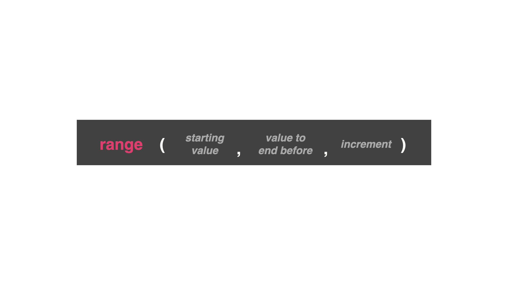

# Dia 20: ¿Que puede hacer `range` realmente?

Asignale a `range` un numero, y él va a contar hasta ese numero. Sin embargo, puedes darle a la funcion `range` algunas otras opciones.

* Valor de inicio: En que numero va a comenzar el conteo
* VAlor de finalizacion: El numero siguiente al que va a terminar el conteo (por ejemplo, si le das un valor final de 10 la funcion  va a contar hasta 9)
* Incremento: Cuanto deberpá incrementar el conteo cada vez que realice el bucle.



El valor de finalizacion tiene un no dicho "menor que". Quiere decir que la coputadora va a detener el bucle antes del numero que está escrito en el rango.

## Intentemos unos ejemplos:
El primer numero en este rango es 100, es el valor de inicio. El segundo valor en este rango es 110, el valor final (recuerda que siempre el valor final es uno mas que donde realmente va a terminar)

👉 ¿Que numero va a imprimir este codigo primero? ¿Cual numero será el final? Copia y pega este codigo y ejecutalo

```
for i in range(100, 110):
print(i)
```

👉 ¿Que esperas que imprima el rango de abajo? Copia y pega y ejecuta para que veamos

```
for i in range(1, 7):
print("Day", i)
```

👉 ¿Que pasa si ejecutamos este código?

```
print("Thirteen Times Table")
for i in range(1, 13):
  print(i, "x 13 =", i * 13)
```

## Ahora añadamos un incremento a nuestro rango
Si colocamos `for i in range (0, 1000000)` sabemos que comenzará en 0 y terminará en 999.999 (que es el numero antes del numero final en el rango), ahora si colocamos un incremento de 25

👉 ¿Que numeros espera que se vea?

```
for i in range (0, 1000000, 25):
print(i)
```

## Contando en reversa

En este ejemplo, comenzaremos a contar desde 10 y contará en reversa hasta 0 (porque 0 viene antes del valor final en el rango) y de 1 en 1

```
for i in range(10, -1, -1):
print(i)
```

## Errores comunes
```
for i in range (10, 0):
print(i)
```
Si el numero final es menor que el numero de inicio, se debe colocar un reductor, porque la funcion `range` aumenta el contador por defecto

## Reto dia 20
### Generador de listas
Preguntale al usuario el numero de inicio, el numero final y la cantidad de incremento. Proyecta una respuesta basado en la respuestas del usuario

```
Example:
Start at: 200
End before: 300
Increment between values: 20

200
220
240
260
280
```

La solucion la obtendran en [main.py](./main.py)