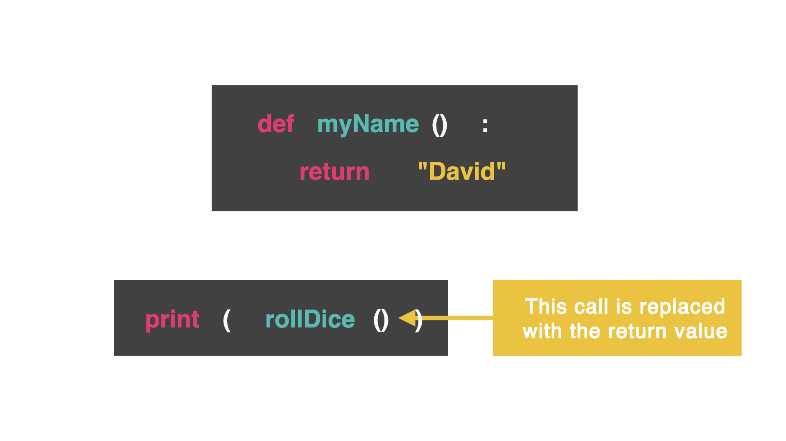

# Comando `return`
Vayamos mas profundo en las subrutinas. ¿Pueden enviar informacion de vuelta a la parte iunicial del programa?
Hagamops esto con el comando `return`



El comando `return` envia informacion de vuelta a la parte del codigo que lo llamó. Eso signofoca que la llamada a la funcion es reemplazada con lo que sea que haya retornado.

Ya lo vimos antes con la importacion de librerias y numeros aleatorios. Podemos usar el numero aleatorio donde sea que lo queramos.

## Pin picker
Esta subrutina crea un numero de pin aleatorio para nosotros. Esta subrutina llamada `pinPicker`tiene el parametro llamado `number` (la cantidad de numeros que yo quiero tener en este pin). Entonces, hay un string (llamada `pin`) que está vacio y un bucle `for` que es usado para crear una cantidad definida de numeros aleatorios. La variable `number` controla cuantas veces el bucle va a añadir un nuevo numero al pin. Esto se logra mediante `+=`que concatena el valor nuevo. 

👉 Probemos a ver que pasa

```
#subroutine has parameter called `number`
#`number` shows how many numbers we want the pin to have
def pinPicker(number):
  import random
  pin = "" #this is the empty string
  for i in range(number): #for loop shows defined amount of random numbers
    pin += str(random.randint(0,9)) #we want a string of random numbers between 0-9
  return pin

pinPicker(4) #4 means we want 4 random numbers
```

¿Nada pasa? ¿Por que?

La linea `pinPicker(4)` que llama por un pin de 4 digitos está siendo reemplazada por un pin de 4 digitos (genial, pero no vemos que pasa algo)

No estamos diciendo que la computadora no hace nada con el string que fue creado. ¿Como hacemos que el string aparezca?
Con un `print()` claro está

Asignemos una variable a `pinPicker()`

```
myPin = pinPicker(4)
```

y ahora la imprimimos

```
print(myPin)
```

## Errores comunes
### Nada pasa
¿Cual es el problema aqui?
```
def areaOfTriangle(base, height):
  area = 0.5 * base * height
  return area

areaOfTriangle (5, 22)
```

No estamos asignando una variable a la funcion para mostrarlo con un `print()`

### Name error
```
def areaOfTriangle(base, height):
  area = 0.5 * base * height
  return area

areaOfTriangle (5, 22)
print(area)
```

* Aqui vemos un concepto llamado scope (alcance).
* Las variables que son creadas dentro de una subrutina, solo pueden ser llamadas dentro de esa subrutina.
* NO podemos llamar a la variable `area` fuera de la subrutina}
* Necesitamos crear una cariable `area` dentro de la subrutina
```
def areaOfTriangle(base, height):
  area = 0.5 * base * height
  return area

area = areaOfTriangle (5, 22)
print(area)

```

## Reto del dia:
Ampliemos el proyecto del día 24 y creemos un generador de estadísticas de salud para un personaje de un videojuego.

* Crea una subrutina que lance un dado de cualquier tamaño y devuelva ese número.
* A continuación, crea una segunda subrutina que lance un dado de seis caras y otro de ocho.
* Multiplica el número de los dados de seis caras y ocho caras juntos y devuelve esa subrutina como las estadísticas de salud de un personaje para un videojuego.
* Imprime las estadísticas de salud del personaje.
* Añade un bucle para dar al usuario la opción de generar las estadísticas de salud de otro personaje.
(¡Realmente vemos esto en los videojuegos!)

🥳 ¡Puntos extra si preguntas por el nombre del personaje y doble punto extra si usas diferentes colores!

La solucion la encuentras en [main.py](./main.py)