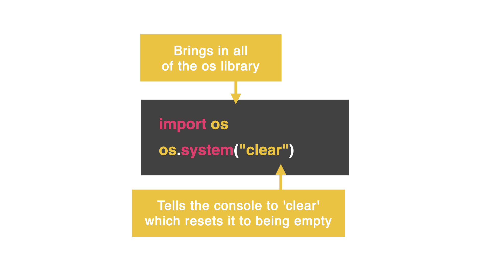
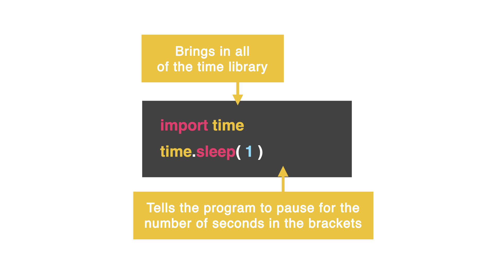

# Dia 26, importando otras librerias
## Libreria `os`
¿Que es la libreria `os`?
Ella nos permite 'hablar' con la consola. Una de las cosas mas poderosas que nos permite hacer es limpiar la consola.

### Importando la libreria `os`
El siguiente codigo solo imprime los numeros del 1 al 1000

```
import os
for i i range(1,1000)
  print(i)
```

### Añadiendo `os.system`
Podemos limpiar la consola usando la funcion `os.system` para 'limpiar' la consola.



👉 Añade esta linea de codigo abajo:
```
os.system('clear')
```

¿Notaste como limpia la consola? ¿Genial, verdad?

### Intentemoslo de nuevo:
En el siguiente codigo, queremos que el programa de la biemvenida diciendo 'Bienvenido a Replit' y luego lo borre, y luego pregunte al usuario su username en una pantalla en blanco. Retira el codigo anterior, y pega el siguiente, y ejecuta

```
import os
print("Welcome")
print("to")
print("Replit")

os.system("clear")

username = input("Username: ")
```

'Welcome to Replit' fue borrado incluso antes de que tuvieramos la oportunidad de leerlo.

Arreglemoslo con otra libreria

## Libreria Time

Podemos importar una segunda libreria añadiendo una `,`despues del nombre de la primera libreria



```
import os, time
```
Esta libreria nos permite pausar la ejecucion de un programa por un tiempo especifico

La funcion `time.sleep(i)`nos permite pausar la ejecucion por la cantidad de segundos que coloquemos en los `()`

Añade esto al codigo _antes_ que la consola es 'limpiada', para pausar el programa por un segundo antes de pedir el nombre de usuario

```
time.sleep(1)
os.system("clear")
```
## Reto del dia
* Utiliza un bucle while true para crear un título para un reproductor de música.
* Permitir al usuario seleccionar reproducir una canción y usar la subrutina llamada 'play' cuando seleccione la canción.
* Dale al usuario la opción de salir del programa.
* El título debe aparecer y hacer una pausa junto con las opciones del menú.
* Si el usuario elige cualquier otra cosa, empezar de nuevo limpiando la pantalla.

Utiliza este codigo para comenzar

```
from replit import audio
import os, time

def play():
  source = audio.play_file('audio.wav')
  source.paused = False # unpause the playback
  while True:
    # Start taking user input and doing something with it
    input()

while True:
  # clear the screen 

  # Show the menu

  # take user's input

  # check whether you should call the play() subroutine depending on user's input
```

Aqui hay un ejemplo:
```
🎵 MyPOD Music Player

Press 1 to Play
Press 2 to Exit

Press anything else to see the menu again.
```

La solucion la tenemos en [main.py](./main.py)