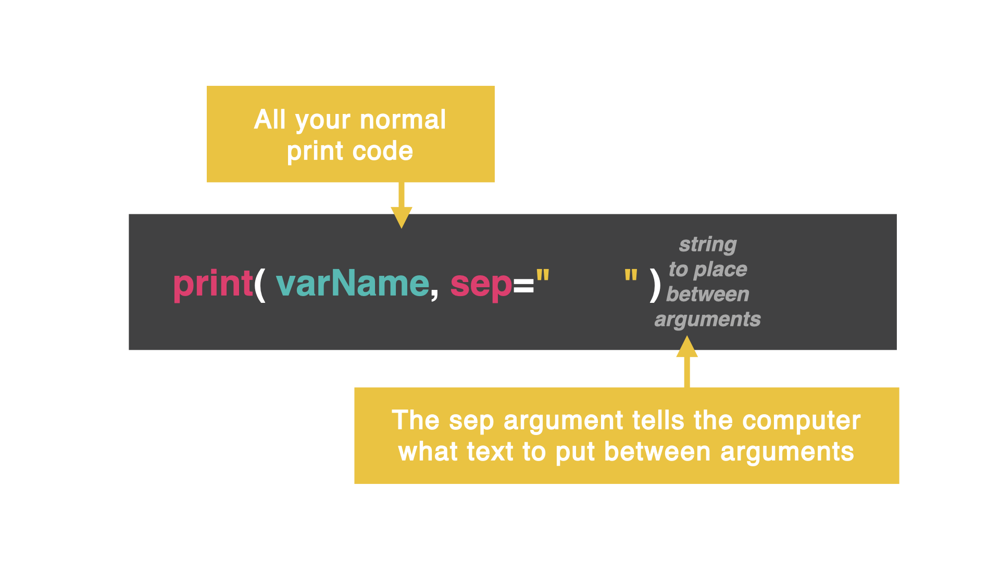
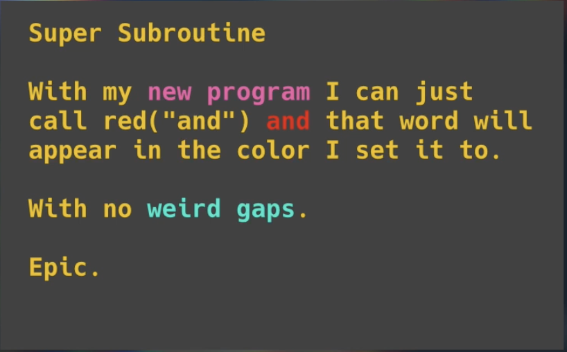

# Dia 29: Los secretos del `print()`
## Secreto 1: `end`
Ya podemos crear una declaracion `print()` como un jefe,  pero hay algunas cosas que puedes hacer para hacerlas más fáciles.

Añadamos algunos segundos argumentos secretos a la sentencia print y veamos qué ocurre.

Por defecto, al final de cada `print()`, el computador clickea `enter`

👉 Recuerda, como un rango de números muestra cada número en una nueva línea...

```
for i in range(0, 100):
print(i)
```


### Añadimos un espacio
👉 Modifiquemos ese codigo y veamos si pordemos imprimir con un espacio entre cada numero en lugar de una nueva linea.
¿Que notamos?
```
for i in range(0, 100):
print(i, end=" ")
```

### Añadimos un espacio y una coma
👉 ¿Que tal si queremos añadir una coma y un espacio? Intentemoslo añadiendo `,` al argumento:

```
for i in range(0, 100):
print(i, end=', ')
```

### Añadiendo una nueva linea, una tabulacion, o una tabulacion verticall

👉 ¿Que pasa si añadimos estas distintas opciones e nuestro segundo argumento? 

```
#new line
for i in range(0, 100):
  print(i, end="\n")
```
```
#tab indent
for i in range(0, 100):
  print(i, end="\t")
```
```
#vertical tab
for i in range(0, 100):
  print(i, end="\v")
```

## Secreto dos: `sep`

Si, seguimos usando `end` cuando este capitulo es sobre `sep`. Borra el código viejo que esta en nuestro main.py y ejecuta el siguiente:

```
print("If you put")
print("\033[33m", end="") #yellow
print("nothing as the")
print("\033[35m", end="") #purple
print("end character")
print("\033[32m", end="") #green
print("then you don't")
print("\033[0m", end="") #default
print("get odd gaps")
```

Ahora concatenemos todo:

```
print("If you put", "\033[33m", "nothing as the", "\033[35m", "end character", "\033[32m", "then you don't", "\033[0m", "get odd gaps", end="")

```

Talvez notemos que estamos recibiendo un raro doble espaciado entre cada una de las secciones, arreglemos eso:

### Cambiando el color con `sep`
Toma ese mismo codigo y cambia el `end` por el `sep` (abreviatura para 'separator') y añade un espacio al final de cada cadena de caracteres. ¿Que pasa?



De esta manera es as facil controlar el espaciado en textos o emojis tambien.

## Secreto 3: cursor
¿Por que estamos viendo esto nuevamente? Ya esto lo sabemos

```
import os

for i in range(1, 101):
  print(i)
  os.system("clear")
```

¿Todo se va muy rapido? Tal vez estes pensando en `import time`

Intentemoslo asi, pero ¿notas algo?

### Ese gran cursos blanco
Apuesto que no sabias que eso se puede borrar. Es solo un comando escondido en el comando `print()`

```
print("\033[?25l", end='')
```

Intentemos el mismo codigo, pero apaguemos el cursor:

```
import os, time
print('\033[?25l', end="")
for i in range(1, 101):
  print(i)
  time.sleep(0.2)
  os.system("clear")
```

¿Y que tal si lo queremos volver a encender?

```
print("\033[?25h", end='')
```

## Reto del dia
Escribe una subrutina que escriba texto en color. Todo lo que hará es imprimir el texto en ese color y volver el color a normal cuando termine.

Controla el final y el sep para que no haya símbolos aleatorios o espacios.

Echa un vistazo a este recurso github para los códigos de color.



La solucion está en [main.py](./main.py)

Los distintos colores y formatos estan en [este repositorio](https://gist.github.com/rene-d/9e584a7dd2935d0f461904b9f2950007)