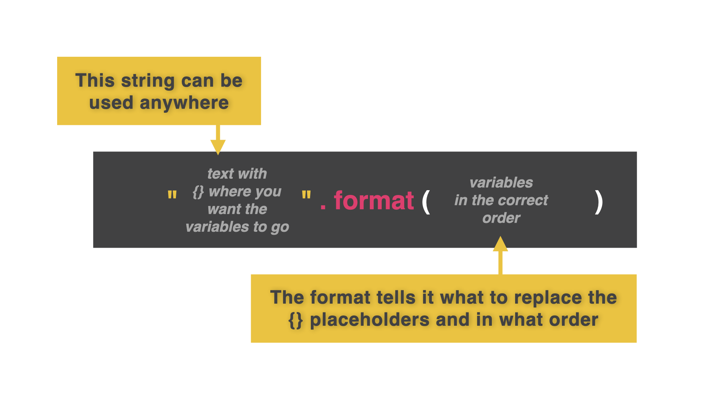
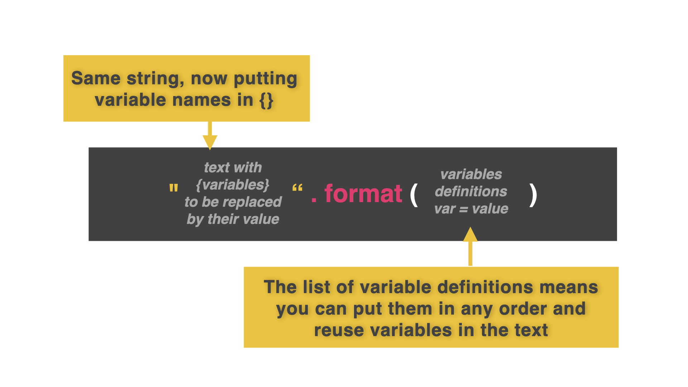
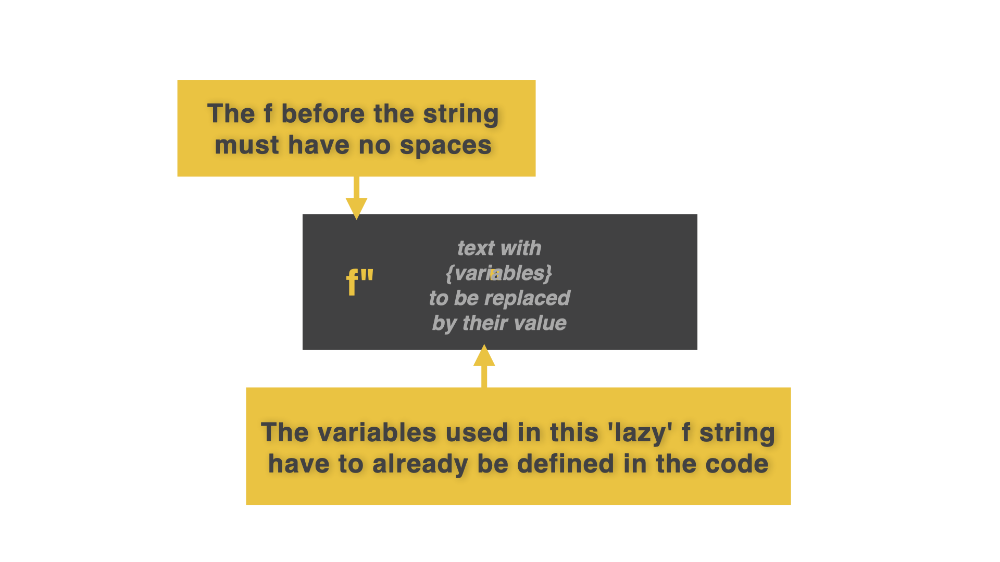
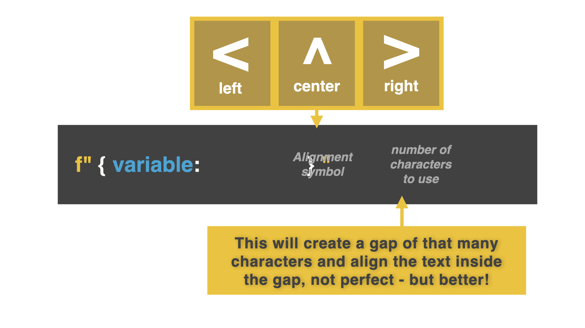

# f-strings

f-strings (format string) son la mejor manera de combinar variables y texto juntos. 

👉 Miremos como se combinan variables en la version antigua, concatenando

```
name = "Katie"
age = "28"
pronouns = "she/her"

print("This is", name, "using", pronouns, "pronouns and is age", age)
```
👉 Ahora miremos como se usa con un f-string con el mismo codigo. ¿Que cambios le hicimos a este código?

```
name = "Katie"
age = "28"
pronouns = "she/her"

print("This is {}, using {} pronouns, and is {} years old.".format(name, pronouns, age))
```



¿Hay una manera mas facil? Vamos a averiguarlo

## Variables Locales

podemos configurar variables dentro de un f-string. De esta manera, no importa el orden de las variables.

👉 Mirando este codigo nuevamente, podemos  configurar variables dentro del texto mismo.

```
name = "Katie"
age = "28"
pronouns = "she/her"

print("This is {name}, using {pronouns} pronouns, and is {age} years old. Hello, {name}. How are you? Have you been having a great {age} years so far".format(name=name, pronouns=pronouns, age=age))
```

¿Que se cambió?
1. Reemplazamos `{}` con el nombre de las variables
2. Reemplazamos cada variable dentro de `{}` con lo que está definido en `.format( = )`



👉 Podemos asignar sentencias concatenadas a variables. Fíjate en esto. Creamos una variable llamada respuesta y la hacemos igual a una sentencia concatenada. Ahora puedo usar esta respuesta fácilmente donde quiera.

```
name = "Katie"
age = "28"
pronouns = "she/her"

response = "This is {name}, using {pronouns} pronouns, and is {age} years old. Hello, {name}. How are you? Have you been having a great {age} years so far".format(name=name, pronouns=pronouns, age=age)

print(response)
```
## El poder de f...
En lugar de todo ese lío... prueba esto.

Usa la letra f antes de cualquier cadena con {} para nombres de variables (y olvídate de ese asunto del .format).



Mira el mismo codigo y mira la diferencia usando esta tecnica

```
name = "Katie"
age = "28"
pronouns = "she/her"

response = f"This is {name}, using {pronouns} pronouns, and is {age} years old. Hello, {name}. How are you? Have you been having a great {age} years so far"

print(response)
```

Incluso puedes usar este truco cpn el triple comilla `"""`(recuerda lo que hicimos el  [dia 1](../Dia-01/README.md))

## Alineacion



Izquierda = `<`
Derecha = `>`
Centrado = `^`

Probemos este codigo:

```
for i in range(1, 31):
print(f"Day {i} of 30")
```

👉 Arreglémoslo añadiendo una alineación a la izquierda de 2 caracteres de longitud.

```
for i in range(1, 31):
print(f"Day {i: <2} of 30")
```

## Reto del dia 30
+ Crea un programa que utilice un bucle que pregunte al usuario qué le ha parecido cada uno de los 30 días de retos hasta el momento.
+ Para cada día, pida al usuario que responda a una pregunta y la reafirme en una frase completa alineada en el centro debajo del título.

La solucion la tenemos en [main.py](./main.py)