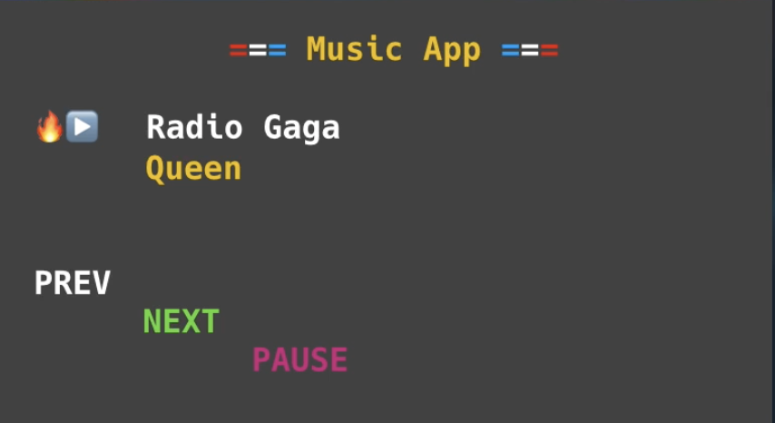
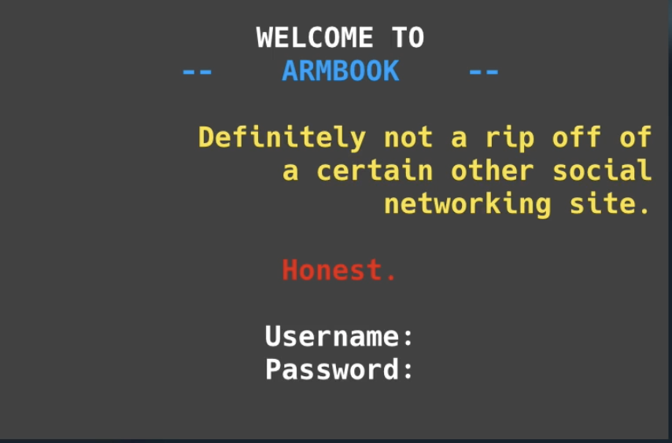

# Dia de reto: Crear una interfaz de usuario

* Crea una interfaz de usuario clásica utilizando la manipulación de cadenas.
* Crea estas dos interfaces de usuario (abajo) usando todo lo que sabes sobre extensiones de sentencias print y cadenas-f.
* La segunda es un poco más complicada ya que implica alineación.
* No hay sentencias de entrada. Se trata de usar print y variables de formas interesantes. Sin embargo, es posible que desee crear una subrutina para hacer el cambio de color más fácil (como lo hizo en el día 29).

Interfaz 1

Interfaz 2

La solucion la ven en [main.py](./main.py)