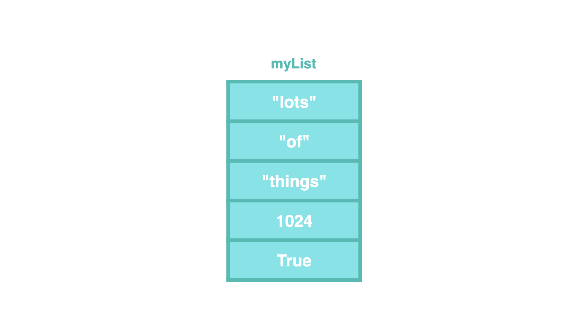
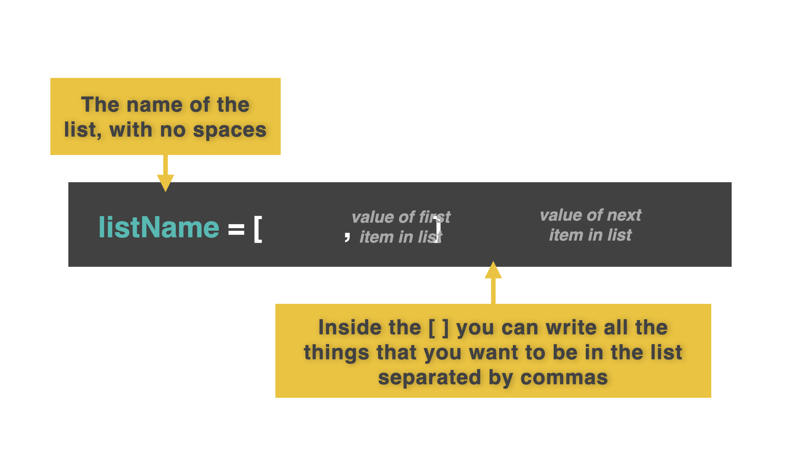
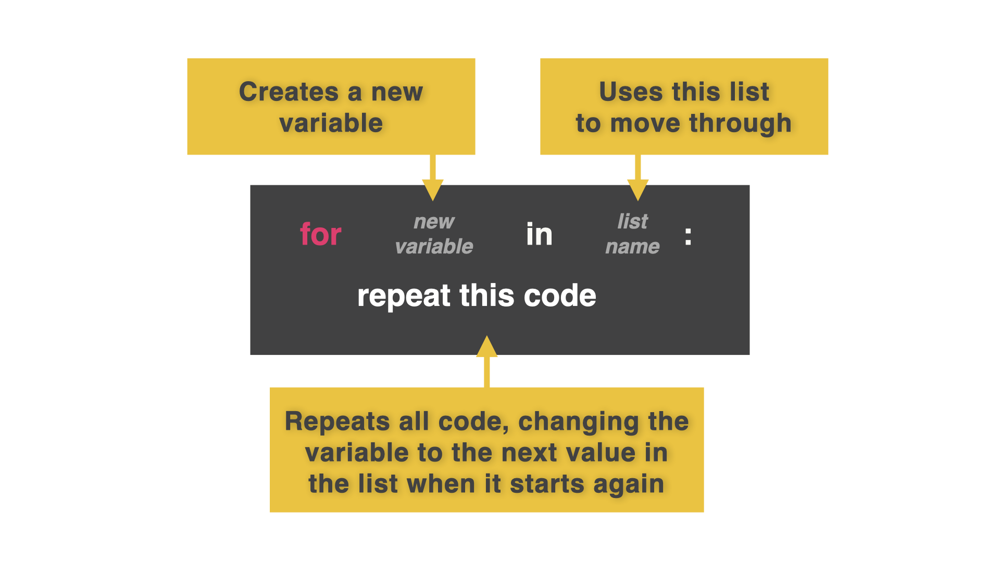

# Dia 32: Listas
> Nota, aunque ya hemos hecho listas antes, no está mal repasarlo

En ciencias de computacion, aprendemos sobre una estructura de datos llamada _matrices_ (arrays).
Arrays están para guardar mar de una cosa con el mismo nombre de variable

Sin embargo, Puthon usa _Listas_. Listas, son literalmente listas de items. Cualquier dato de cualquier tipo de dato, puede incluirse en una lista. POdemos extraer, eliminar o cambiar listas.

Quizas te preguntes: "¿Cual es el objetivo de una lista?"

A veces, no siempre sabes cuantos datos necesitas almacenar. Podemos usar un bucle para movernos por los datos de una lista sin tener que decirle manualmente a la computadora cuantas cosas hay en esa lista

## A partir de 0

En lo que respecta a Python, esta es una lista. Observa que comenzamos a contar el preimer elemenos e 0 (en lugar de 1)



Ejemplo: en esta lista, "lots" es el indice 0, "of" es el indice 1, etc.

POdemos agregar directamente a la lista con el nombre de la variable, `[ ]` con el numero de indice de la fila.


## Listas de impresion
Podemos imprimir datos de la misma manera



Hagamos una lista de nuestro horario de clases

```
timetable = ["Computer Science", "Math", "English", "Art", "Sport"]
```

Hoara vamos a imprimirlo:

```
print(timetable)
```

Eh.. eso se ve feo con todos los `[]` y `""` imprimiendose tambien. Si necesito imprimir el index 1 en mi horario, necesito decirle a la computadora:

```
print(timetable[1])
```

¿Puedes imprimir la tabla entera?

## Cambiando listas
Tambien podemos cambiar las listas y el index

Ya construimos una lista con `timetable = ` pero queremos cambiar el index 4, "sport". Podemos hacer eso llamandolo con `[ ]`

```
timetable = ["Computer Science", "Math", "English", "Art", "Sport"]
print(timetable[0])
print(timetable[1])
print(timetable[2])
print(timetable[3])
print(timetable[4])
```

Añade lo siguiente ahora

```
timetable[4]= "Watch TV"
```

¿Por que no se imprime correctamente? Hemos creado el horario, impreso y cambiado el index 4 del horario.

Sin embargo, necesitamos imprimir la version cambiada. 

```
timetable = ["Computer Science", "Math", "English", "Art", "Sport"]
print('old version')
print(timetable[0])
print(timetable[1])
print(timetable[2])
print(timetable[3])
print(timetable[4])

timetable[4]= "Watch TV"
print("\n\n")
print('new version')
print(timetable[0])
print(timetable[1])
print(timetable[2])
print(timetable[3])
print(timetable[4])
```

## Listas y bucles
¿Por que debemos escribir todas esas lineas de codigo?

Aqui está el mejor amigo de las listas: BUCLES



POdemos reemplazar todas esas lineas de codigo que escribimos por solo dos lineas de codigo:

```
timetable = ["Computer Science", "Math", "English", "Art", "Watch TV"]
for lesson in timetable:
  print(lesson)
```

Ahora le hemos dado a la computadora una lista,  le hemos dicho que a cada valor en la lista la llame "lesson" y que haga algo con ella

## Errores comunes
### se comienza a contar desde 0
```
colors = ["Red", "Orange", "Yellow", "Green", "Blue", "Violet"]
print(f"The first color is {colors[1]}")
```
El primer index en las listas es 0 siempre

```
colors = ["Red", "Orange", "Yellow", "Green", "Blue", "Violet"]
print(f"The first color is {colors[0]}")
```

Quiero acceder al ultimo color de mi lista, ¿por que se cae?

```
colors = ["Red", "Orange", "Yellow", "Green", "Blue", "Violet"]
print(f"The last color is {colors[6]}")
```

Porque no hay un index 6, al comenzar la lista en 0, el ultimo index es 5

```
colors = ["Refd", "Orange", "Yellow", "Green", "Blue", "Violet"]
print(f"The last color is {colors[5]}")
```

## Reto del dia

* Crea una lista que almacene saludos en distintos idiomas. Empieza por el idioma que hablas.
* Después, busca en Internet saludos en otros idiomas. Aquí tienes una lista de saludos para empezar.
* Importa la biblioteca ramdon`. Genera un número aleatorio entre 0 y el número máximo de elementos de tu lista.
* De forma aleatoria, cuando el usuario haga clic en ejecutar, imprime uno de los saludos.
* Utilice una cadena f.

La solucion esta en [main.py](./main.py)