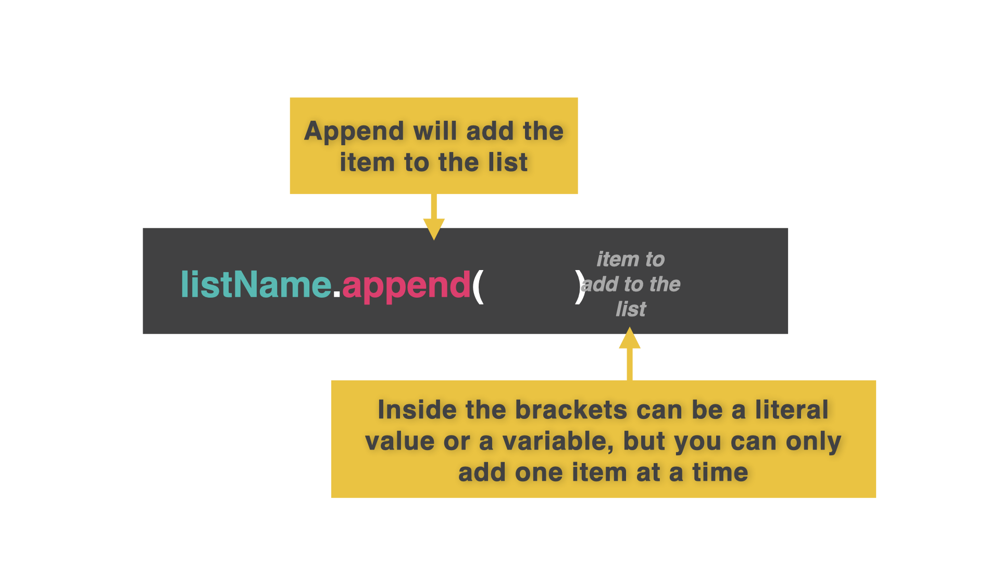

# Listas dinamicas
Listas dinamicas son maneras de usar una lista en blanco y por agregar o borrar items cuando queramos.
## Listas en blanco

Hagamos una agenda hoy. NO vamos a colocar nada en esta lista (todavia). Detras de escena, la computadpra va a reconocer este codigo como una lista en blanco.

```
myAgenda = []
```

## Agregar a una lista
`.append`nos va a agregar lo que sea que esté dentro de `()` a la lista.



Vamos a usar un bucle `While True` para añadir items a la lista. Lo vamos a almacenar en una variable llamada `item`. Añade este codigo:

```
while True:
  item = input("What's next on the Agenda?: ")
  myAgenda.append(item)
  printList()
```

## Imprimiendo nuestra nueva lista
¿No se ve lo que pusiemos en la lista? Necesitamos `print()` la lista cada vez para poder ver los cambios. Usemmos una subrutina para eso

```
myAgenda = []

def printList():
  print() #this is just to add an extra space between items
  for item in myAgenda:
    print(item)
  print() #this is just to add an extra space between items

while True:
  item = input("What's next on the Agenda?: ")
  myAgenda.append(item)
  printList()
```

¿Ves como la subrutina nos permite añadir un nuevo item a nuestra agenda e imprime la lista entera cada vez?

Podriamos hasta importar las librerias `os` y `sleep` para pausar y limpiar el codigo para hacer que esta dinamica se vea aun mejor.

> Recuerda: una lista siempre debe inicializarse, incluso antes de una subrutina


## Eliminar un item de la lista

Hagamos unos ambios a nuestra lista. LE preguntaremos al usuario si quieren añadir o eliminar un item de la lista

```
myAgenda = []

def printList():
  print() 
  for item in myAgenda:
    print(item)
  print() 

while True:
  menu = input("add or remove?: ")
  if menu == "add":
    item = input("What's next on the Agenda?: ")
    myAgenda.append(item)
  elif menu == "remove":
    item = input("What do you want to remove?: ")
    myAgenda.remove(item)
  printList()
```

Notemos como estamos utilizando `.remove()`, esta funcion eliminará todo lo que está dentro de `( )`.


## Errores comunes

### Eliminar algo que no esté ahi

Añadamos "recording" a la lista cuando lo ejecutemos, pero vamos a eliminar "nap", un feo error aparece

```
myAgenda = []

def printList():
  print() 
  for item in myAgenda:
    print(item)
  print() 

while True:
  menu = input("add or remove?: ")
  if menu == "add":
    item = input("What's next on the Agenda?: ")
    myAgenda.append(item)
  elif menu == "remove":
    item = input("What do you want to remove?: ")
    myAgenda.remove(item)
  printList()
```

¿Como lo solucionamos?

Lo que podemos hacer es verificar que si existe ese item en nuestra lista.

```
myAgenda = []

def printList():
  print() 
  for item in myAgenda:
    print(item)
  print() 

while True:
  menu = input("add or remove?: ")
  if menu == "add":
    item = input("What's next on the Agenda?: ")
    myAgenda.append(item)
  elif menu == "remove":
    item = input("What do you want to remove?: ")
    if item in myAgenda:
      myAgenda.remove(item)
    else:
      print(f"{item} was not in the list")
  printList()
```


## Reto del dia
Creemos nuestro administrador de listas:

* Pregunta al usuario si quiere ver, agregar o editar la lista
* Si el usuario quiere ver, `print()` de una manera mas bonita, quizas con una subrutina
* Si ellos eligen agregar un item a la lista, permiteles que lo ecriban y eso se agregue hasta el fondo de la lista
* Si quieren editar la lista, preguntales cual item ya terminaron y quitalos de la lista
* NO nos preocupemos por los duplicados
* El primer item que el usuario coloque, deberá ser el primero que se elimine
* Añade un titulo, algo de color, alinecion del texto, o emojis. Lucete!!
Ejemplo:

```
To Do List Manager:
Do you want to view, add, or edit your to do list?
view

Record video for day 34
```

La solicuon la encuentra en [main.py](./main.py)