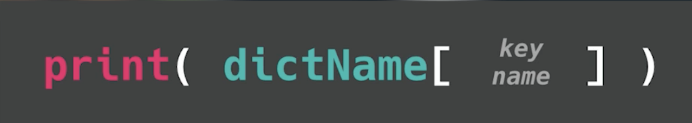
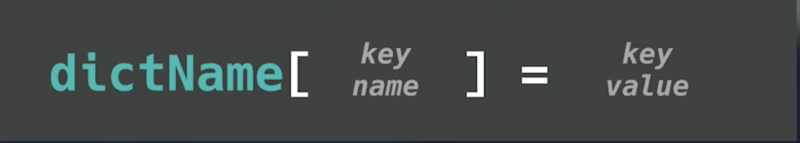

# Diccionarios

Como habrás adivinado, nos encantan las listas. Sin embargo, los elementos de la lista se acceden en orden por número de índice.  No siempre es así como queremos que funcione.

Los diccionarios son un tipo de lista ligeramente diferente que accede a los datos dando a cada elemento una **clave**.  Esto crea lo que llamamos pares **clave:valor**.

Ahora podemos acceder a cada elemento a través de su clave, en lugar de tener que recordar en qué índice se encuentra en la lista.

## Creando un diccionario - ¡Corchete! 

Curly, curly braces...

Para crear un diccionario empezamos como una lista, pero con llaves `{}`. Este diccionario almacenará datos sobre un usuario.

Los datos se insertan en pares clave-valor como este. Cada par está separado por una coma:


👉 El primer par clave:valor de abajo tiene "nombre" como clave y "David" como valor. Pruébalo:

``python
miUsuario = {"nombre": "David", "edad": 128}
```


## Imprimir las claves

Para imprimir un diccionario, podemos utilizar la **clave** en lugar del índice. Ten en cuenta que **seguimos utilizando corchetes** para acceder a los elementos (ej: `["nombre"]`).



👉 Vamos a `imprimir` "nombre".

``python
miUsuario = {"nombre": "David", "edad": 128}

print(miUsuario["nombre"])

# Este código produce 'David'.
```

## Cambiar un elemento
Puedes usar la sintaxis `=` para cambiar valores clave.



👉 Cambiemos 'David' por 'El legendario David'.
``python
miUsuario = {"nombre": "David", "edad": 128}

miUsuario["nombre"] = "El legendario David"
print(miUsuario)

# Este código produce ...


# Errores comunes


## Impresión con teclas y fStrings
👉 Vamos a `ejecutar` este código y ver qué pasa:

``python
miUsuario = {"nombre": "David", "edad": 128}

print(f "Tu nombre es {miUsuario["nombre"]} y tu edad es {miUsuario["edad"]}")
```

  - Ten en cuenta que tenemos que poner las claves entre **comillas simples** `''` dentro del fString cuando usamos esta técnica.

- Esto es porque ya hemos utilizado comillas dobles para iniciar y finalizar el fString. Así que usar `""` para el valor del diccionario haría que Python se confundiera.

``python
miUsuario = {"nombre": "David", "edad": 128}

print(f "Tu nombre es {miUsuario['nombre']} y tu edad es {miUsuario['edad']}")

# Este código produce 'Tu nombre es David y tu edad es 128'.
```
## ¿Error de sintaxis?

👉 ¿Por qué recibes un error de sintaxis en la línea de la sentencia print?


```python
miUsuario = {"nombre": "David", "edad": 128}

print(miUsuario{"nombre"})
```

- La sentencia `print` utiliza **corchetes**. Las llaves `{}` sólo se utilizan para llamar al valor.

``python
miUsuario = {"nombre": "David", "edad": 128}

print(miUsuario["nombre"])
```

</detalles>

## ¿Indefinido?

👉 ¿Cuál es el problema aquí?
```python
miUsuario = {nombre: "David", "edad": 128}

print(miUsuario["nombre"])
```

La clave, _nombre_, en el diccionario debe ir entre comillas.

```python
miUsuario = {"nombre": "David", "edad": 128}

print(miUsuario["nombre"])
```

## ¿Clave de repuesto?

👉 ¿Cuál es el problema aquí?
```python
miUsuario = {"nombre": "David", "edad": 128, "edad" = 129}

print(miUsuario)
```

Un diccionario no puede tener dos claves con el mismo nombre. Siempre anula a la anterior. Por lo tanto, la 129 anula a la edad, 128.

```python
miUsuario = {"nombre": "David", "edad": 128}

miUsuario["edad"] = 129

print(miUsuario)
```

# 👉 Reto del día 40

El reto de hoy consiste en crear una tarjeta de contacto utilizando un diccionario.

1. Pide al usuario que introduzca su nombre, fecha de nacimiento, teléfono, correo electrónico y dirección física.
2. Almacénalo todo en un diccionario.
3. Imprimirlo de forma atractiva una vez almacenado.

Ejemplo:

```
🌟Tarjeta de contacto🌟

Introduzca su nombre > David Morgan

Introduzca su fecha de nacimiento > 01/01/1900

Introduzca su número de teléfono > 01234 567890

Introduzca su dirección de correo electrónico > david@replit.com

Introduzca su dirección > The Cupboard Under The Stairs, Replit Towers, NY.

Hola David Morgan. Nuestro diccionario dice que naciste el 01/01/1900, podemos llamarte al 01234 567890, enviarte un email a david@replit.com, o escribir a The Cupboard Under The Stairs, Replit Towers, NY.
```

💡 Consejos 

- Puede que aquí te resulte útil `"""`.
- No olvides `.strip()` para eliminar los espacios no deseados.
- Presta mucha atención a cuándo usar `[]` y cuándo usar `{}`.
- Si quieres divertirte un poco más, prueba a [investigar el método `.update()`](https://www.w3schools.com/python/python_dictionaries_add.asp) para conocer otra forma de trabajar con diccionarios.

La solucion la puede encontrar en [main.py](./main.py)