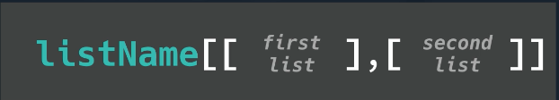
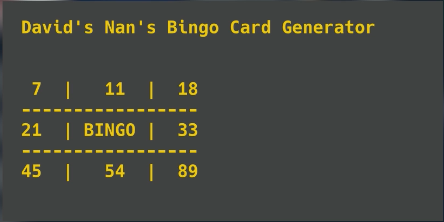

# Lleva tu lista a una nueva dimensión

Presten mucha atención, amigos, porque las **listas 2D** son básicamente tablas.

Las tablas son estructuras de datos bidimensionales donde podemos almacenar datos tanto vertical como horizontalmente. 

Normalmente esto significa que los datos verticales se usan para **campos** (una categoría - nombre, ID, galleta favorita, etc.) y los datos horizontales se usan para **registros** (todos los datos de cada categoría).


Entre bastidores, vemos una lista *dentro* de una lista. Olvídate de lo que sabes sobre la lectura de una tabla con matemáticas o geografía: "primero cruza el pasillo (eje x) y luego baja las escaleras (eje y)". 

Aquí, haremos **primero** el índice de fila y luego el índice de columna. 


## Recuerda...

Aquí tenemos una lista 1D. Tenemos el nombre de la lista como variable, un igual para establecer el valor, y corchetes para mostrar que es una lista. Las listas 2D son *muy* similares. 
```
my1DList = ["Johnny", 21, "Mac"]
```

## Añadiendo la segunda dimensión

Para añadir la segunda dimensión, ponemos listas *dentro* de la primera lista. 



👉 Cada nueva lista tiene su propio conjunto de corchetes y está **separada por una coma**. Esta disposición del código es agradable para ayudarnos a visualizar la lista 2D como una tabla, pero...

```
my2DList = [ ["Johnny", 21, "Mac"],
             ["Sian", 19, "PC"],
             ["Gethin", 17, "PC"] ]
```
 ...también puedes maquetarlo así
 
```
my2DList = [ ["Johnny", 21, "Mac"], ["Sian", 19, "PC"], ["Gethin", 17, "PC"] ]
```
Ahora, vamos a `imprimir` esta lista.

## Imprimiendo desde una lista 2D
*Recuerda, cualquier comentario sobre el código se escribe en verde así:* 

```
#estos son comentarios para ti, el ordenador los ignorará
```
### la lista completa
👉 Podemos imprimir una lista 2D entera igual que hacemos con una lista 1D.  Sin embargo, esto imprimirá **todos** los corchetes, comas, etc.


```
print(miLista2D)

# Esto mostrará [['Johnny', 21, 'Mac'], ['Sian', 19, 'PC'], ['Gethin', 17, 'PC']].
```
### una sola fila
Para imprimir una sola fila, utiliza un solo corchete `[]` en el comando `print`.  Sin embargo, seguirás teniendo todos esos corchetes y comas.  

👉 En este ejemplo, estoy imprimiendo la primera fila (índice 0) - todos los datos sobre Johnny.


```
print(miLista2D[0])

# Este código muestra ['Juanito', 21, 'Mac'].
```

### un solo dato

El **primer** corchete hace referencia a la lista, mientras que el segundo hace referencia al elemento dentro de esa lista.

👉 He aquí un par de ejemplos:


```
my2DList = [ ["Johnny", 21, "Mac"],
             ["Sian", 19, "PC"],
             ["Gethin", 17, "PC"] ]

print(my2DList[0][0])
# Este código produce 'Johnny'. Es el nombre de Juanito de la lista 0 (primer corchete), elemento 0 (segundo corchete)

print(my2DList[1][2])
# Este código muestra 'PC'. Es la preferencia informática de Sian de la lista 1 (primer corchete), elemento 2 (segundo corchete)
```

### ¡Pruébalo y explora una nueva dimensión!

### Edición de una lista 2D

Podemos editar valores en una lista 2D de la misma manera que variables y listas 1D. Sólo tienes que cambiar el valor a los nuevos números de índice de fila y columna.

👉 En este ejemplo, Sian se ha unido al lado oscuro, así que vamos a actualizar su preferencia informática a Linux.
```
my2DList = [ ["Johnny", 21, "Mac"],
             ["Sian", 19, "PC"],
             ["Gethin", 17, "PC"] ]

my2DList[1][2] = "Linux"
# La línea anterior cambia el elemento 2 de la lista 1 de PC a Linux

print(my2DList[1])
# Utilizo esta línea para mostrar la lista 1 y comprobar que el cambio se ha producido correctamente.
```
### Juega con la asignación de nuevos datos a la lista.

# Errores comunes

*Primero, borra cualquier otro código de tu fichero `main.py`. Copia cada fragmento de código en `main.py` haciendo clic en el icono de copia en la parte superior derecha de cada cuadro de código. A continuación, pulsa `run` y comprueba qué errores se producen. Corrige los errores y pulsa "run" de nuevo hasta que estés libre de errores. Haz clic en "Respuesta" para comparar tu código con el correcto.

## ¿'Índice fuera de rango'?

👉 ¿Qué es un error 'out of range'?


```
my2DList = [ ["Johnny", 21, "Mac"],
             ["Sian", 19, "PC"],
             ["Gethin", 17, "PC"] ]

print(my2DList[0][3])

```

<detalles> <sumario> 👀 Respuesta </sumario>

- El segundo corchete hace referencia al elemento 3 de la lista 0. No hay elemento 3 ya que el índice de la lista sólo llega hasta 2. Recuerda que todo empieza en el índice 0.

```
my2DList = [ ["Johnny", 21, "Mac"],
             ["Sian", 19, "PC"],
             ["Gethin", 17, "PC"] ]

print(my2DList[0][2])

```

</detalles>


# 👉 Meca Tu Nana Muy Feliz

El reto de hoy es crear un cartón de bingo. Oh, sí, porque la programación no es sólo para vosotros, jóvenes y modernos gatos. 😆

En fin, tu reto es habilitar "juegos de azar para mayores" (aka Bingo), y lo conseguirás así:

1. Generar aleatoriamente una serie de número entre 0 y 90.
2. Asigna a cada número un lugar en una lista 2D.
3. Los números deben estar en orden numérico, de izquierda a derecha.
4. Los números no deben repetirse.
5. El cuadrado central no debe contener ningún número. Debe contener la palabra "¡BINGO!".
6. Cuando se ejecuta el programa, el cartón de bingo debe aparecer en la pantalla.


Ejemplo:



<detalles> <sumario> 💡 Pistas </sumario>

- Asegúrate de incluir 'prettyprinting'.
- Trate de usar una lista 2D con cada sublista como una fila.
- Genera aleatoriamente los números y anexa cada uno a una lista a medida que lo haces.
- Utiliza `.sort()` para ordenar la lista de números antes de añadirlos a la tarjeta.


</detalles>