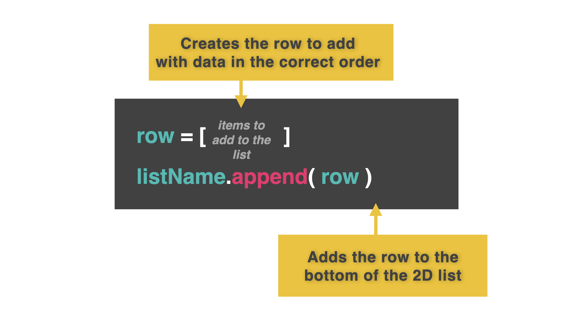
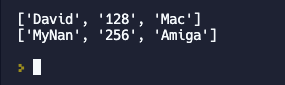
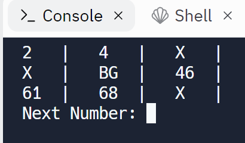
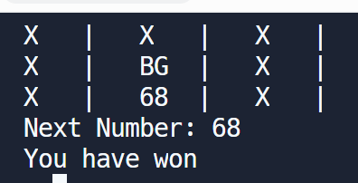

# Listas dinámicas 2D

Las listas dinámicas son listas que rellenamos sobre la marcha, recibiendo información del usuario y añadiéndola a la lista sobre la marcha.

Aquí estamos combinando varias técnicas. He dejado comentarios detallados en el código para ayudar. Recuerda, los comentarios se pueden encontrar con `# comment` en verde dentro del código.

## Bucles, append() y break

Aquí hay un ejemplo para obtener algunos detalles simples del usuario (nombre, edad, preferencia de computadora) y agregarlos a una lista como una fila completa. Esta lista seguirá recibiendo datos hasta que el usuario responda 'y' a la pregunta '¿salir? 


Una vez que recogemos la entrada del usuario en una fila, vamos a `append` toda la fila a la lista. Las columnas se mantienen y conservamos la estructura de las listas 2D. 


##

👉 Vamos a probarlo:

```
listOfShame = [] 
# Creates an empty list.

while True: 
  # Starts a never ending loop (until we end it)
  name = input("What is your name? ")
  age = input("What is your age? ")
  pref = input("What is your computer platform? ")
  # Get the user input.

  row = [name, age, pref] 
  # Assigns the 3 variables into a single row.

  listOfShame.append(row) 
  # Adds the contents of the row variable at the end of the list

  exit = input("Exit? y/n") 
  # Get user choice to quit, yes or no?

  if (exit.strip().lower()[0] == "y"): 
    # strip removes unwanted spaces from the input. lower()[0] makes sure the first character of the input is lower case so it can be compared to 'y'
    break # break ends a loop and jumps to the next line of code that is not part of the loop.

print(listOfShame) # Outputs the list. Note this is NOT part of the loop (not indented), it only runs once the loop ends.
```

### Pruébalo. ¿Puedes añadir también el Nan de David?

### prettyPrint()

Tío, esa salida `print(listOfShame)` sí que es fea.

👉 En el código de abajo, he añadido una subrutina `prettyPrint` para embellecer la salida. Recuerda que ya lo hicimos en el [día 34](../Dia-34).

```
def prettyPrint():
  print() 
  # Puts a blank row at the top
  for row in listOfShame: 
    #loops to the next row when the end of the current one is reached
     print(row) 
    # prints the new row
  print() 
  # prints a blank line between rows


listOfShame = [] 

while True: 
  name = input("What is your name? ")
  age = input("What is your age? ")
  pref = input("What is your computer platform? ")

  row = [name, age, pref] 

  listOfShame.append(row) 

  exit = input("Exit? y/n") 

  if (exit.strip().lower()[0] == "y"):
    break 

prettyPrint() 
# Call the prettyPrint subroutine instead of printing the list directly.
```
Este código produciría una salida como ésta


Hay un poco de rareza. Las filas se imprimen, pero sólo parecen una lista con todos esos símbolos. Necesitamos un bucle para extraer cada fila y otro para extraer cada elemento de las columnas.

## ¿Impresión más bonita?

👉 Esta versión de `prettyPrint()` usa fStrings para alinear mejor las pestañas.

*Nota: esto sólo muestra la subrutina actualizada (no el código entero)*.

```
def prettyPrint():
print() 
for row in listOfShame: 
  for item in row: 
    # item refers to each item in the column for that row
   print(f"{item:^10}", end=" | ") 
    # :^10 means 10 characters as the space with the data in the center. The end character has been changed to space vertical line space to make it look more like a table.

  print() 

print()
```
Este código produciría una salida como esta


### Juega con la impresión bonita. No lo olvides, ¡ahora puedes usar esta subrutina para todas tus otras listas!

# ¿Añadir o eliminar?

Podemos añadir registros, pero vamos a ampliar para dar al usuario la opción de elegir si desea añadir o eliminar. ¿Queremos eliminar toda la fila o sólo un elemento?


Pedimos al usuario que elija entre añadir o eliminar. Si elige eliminar:
- preguntamos por un nombre de la lista (nos aseguramos de que está bien escrito)
- extraemos cada fila de la lista, de una en una
- comprobamos si la fila contiene el nombre.
- si el nombre está en la fila, usamos el método `.remove()` para eliminar la **fila completa**, no sólo el nombre.

👉 *En el código de abajo, sólo he mostrado el bucle que funciona con la lista.  He omitido la subrutina `prettyPrint` para que podamos centrarnos en los cambios. De nuevo, revisa los comentarios para más explicaciones.

``
listOfShame = [] 

while True: 
  menu = input("Add or Remove?") # Gives the user a choice prompt and stores their input.

  if(menu.strip().lower()[0]=="a"): # Uses selection to run the 'add' code if user inputs 'a'. I've "sanitized" the input here too.
    
    name = input("What is your name? ")
    age = input("What is your age? ")
    pref = input("What is your computer platform? ")
    
    row = [name, age, pref] 
  
    listOfShame.append(row) 
    # All the 'add' code is now indented, so it's part of the 'add' branch and will only run if the user enters 'a'.

  else: # If the user doesn't choose 'a', run this new remove code instead.
    name = input("What is the name of the record to delete?") # Get the input of a name
    for row in listOfShame: # Use a loop to extract one row at a time
      
      if name in row: # Check if the name is in the extracted row.
        listOfShame.remove(row) # remove the whole row if name is in it

  prettyPrint()
```


### ¡Ponte a remover y mira lo que puedes hacer!
## 👉 Desafío del Día 44

¡Es hora de más bingo! Puedes reutilizar tu código del [día 43](../dia-43), pero esta vez añade las siguientes características:

1. Pregunta repetidamente al usuario qué número sale a continuación.
2. Comprueba el cartón de bingo para ver si el número elegido coincide con uno del cartón.
3. Si el cartón de bingo está lleno de "X", el usuario ha ganado.


Ejemplo:




<detalles> <sumario> 💡 Pistas </sumario>
  
- Crea una subrutina llamada `createCard` para limpiar parte del código del día 43.
- Utiliza una variable y un bucle para almacenar cuántas x hay en la tarjeta.  Añade una cada vez que se sustituya un número.
- Comprueba la variable cada vez para ver si ha alcanzado el número mágico ganador.

</detalles>

La solucion la encuentra en [main.py](./main.py)