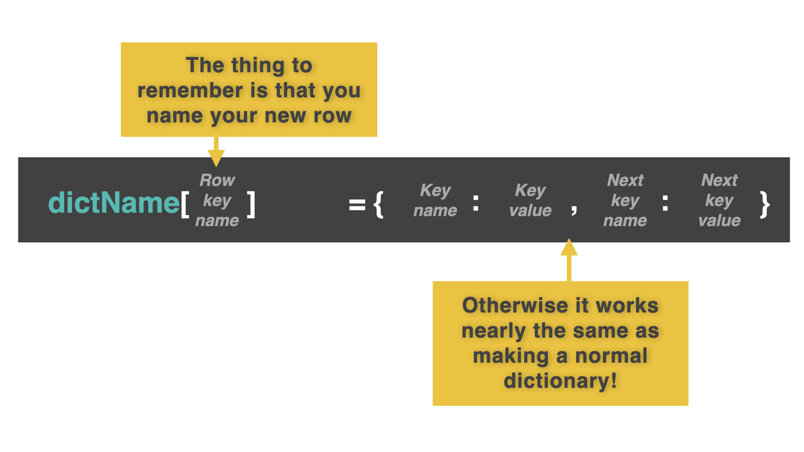
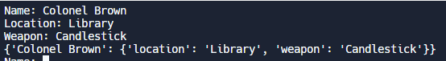
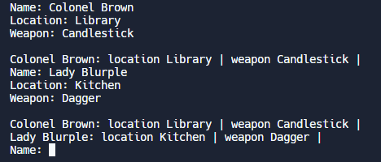

# Diccionarios 2D

Sí, los diccionarios han vuelto. Eso sólo puede significar una cosa. ¡Es hora de volver a poner nerviosos a los abogados con el regreso de las Mokébestias! ¡Hurra!

Aunque tendrás que esperar para tu dosis de bestias.  

En primer lugar, nuestros ejemplos se centrarán en el juego de mesa completamente orignal de 'Ha ocurrido un asesinato en una habitación con un arma y tienes que adivinar quién lo ha hecho' 😆

Bonito. Pegadizo.
##
Recuerda que los diccionarios son muy parecidos a las listas, salvo que almacenan los datos como pares **clave:valor**. El valor es lo que vale y la clave es como se llama. La clave se utiliza para acceder al valor, y las claves son más significativas que los números de índice. 

Hoy vamos a ampliar nuestras locas habilidades con los diccionarios a la segunda dimensión.



## Añadiendo dinámicamente a un diccionario 2D

👉 Este código añade dinámicamente a un diccionario 2D comenzando con un diccionario vacío y utilizando un bucle infinito para añadir la entrada del usuario.

```
clue = {}

while True:
  name = input("Name: ")
  location = input("Location: ")
  weapon = input("Weapon: ")

  clue[name] = {"location": location, "weapon":weapon} #line 7

  print(clue)
```

La verdadera magia ocurre en la 7ª línea de código. En lugar de usar `.append()` como haríamos con una lista, creamos una nueva entrada en el diccionario. 

La clave es el nombre de la bestia, **pero el valor es un diccionario completamente nuevo** que contiene los detalles de la bestia.


Cada par clave:valor del diccionario es ahora una clave que accede a un diccionario relacionado.


Mira la salida y podrás ver el nuevo diccionario anidado dentro del primero.



👉 ¿Puedes probar este código con Lady Blurple con una cuerda en el estudio?

## Pretty Printing

👉 Este ejemplo te muestra cómo añadir una subrutina `prettyPrint()` que funciona con un diccionario 2D.

```
def prettyPrint():
  print()
  
  for key, value in clue.items():
    # moves along every 'key:subDictionary' pair and outputs the key (the name of the character).
    print(key, end=": ")
    for subKey, subValue in value.items():
      # (nested) `for` loop moves along every subkey and subvalue in each subDictionary.
      print(subKey, subValue, end=" | ")
    print()
```


Cuando se combina con el código del diccionario 2D: 
```
clue = {}
def prettyPrint():
  print()
  
  for key, value in clue.items():
    # moves along every 'key:subDictionary' pair and outputs the key (the name of the character).
    print(key, end=": ")
    for subKey, subValue in value.items():
      # (nested) `for` loop moves along every subkey and subvalue in each subDictionary.
      print(subKey, subValue, end=" | ")
    print()
    
while True:
  name = input("Name: ")
  location = input("Location: ")
  weapon = input("Weapon: ")

  clue[name] = {"location": location, "weapon":weapon} 

  prettyPrint()
  ```
la salida tiene este aspecto.




### ¡Pruébalo y profundiza en los diccionarios!

# Acceso a un único elemento

Para acceder a un único elemento en un diccionario 2D, utilizamos **dos corchetes** igual que con una lista 2D.

👉 Este ejemplo almacena los datos de los usuarios sobre su progreso en los 100 Días del Código. Observa cómo he configurado cada uno como un diccionario 1D antes de almacenarlos todos en un diccionario 2D.


```
john = {"daysCompleted": 46, "streak": 22}
janet = {"daysCompleted": 21, "streak": 21}
erica = {"daysCompleted": 75, "streak": 6}

courseProgress = {"John":john, "Janet":janet, "Erica":erica}

print(courseProgress)
```

##

👉 Para acceder a un elemento, utilizo dos corchetes `[]`. Así que para ver sólo los resultados de Erica, añadiría 

```
print(courseProgress["Erica"])
# The bracket contains the key that references the sub dictionary.
```
##
👉 ¿Y si sólo queremos ver cuántos días ha completado Erica?

```
john = {"daysCompleted": 46, "streak": 22}
janet = {"daysCompleted": 21, "streak": 21}
erica = {"daysCompleted": 75, "streak": 6}

courseProgress = {"John":john, "Janet":janet, "Erica":erica}

print(courseProgress["Erica"]["daysCompleted"])
# The first bracket contains the key that references the sub dictionary. The second bracket contains the key that references the sub item. This will output '75'.
```

### ¡Pruébalo y profundiza en los diccionarios!

# Errores comunes

*Primero, borra cualquier otro código de tu fichero `main.py`. Copia cada fragmento de código en `main.py` haciendo clic en el icono de copia en la parte superior derecha de cada cuadro de código. A continuación, pulsa `run` y comprueba qué errores se producen. Corrige los errores y pulsa "run" de nuevo hasta que estés libre de errores. Pulsa en la `👀 Respuesta` para comparar tu código con el código correcto.*

## Error de Clave

👉 ¿Por qué me aparece el error ``key error``?


```
john = {"daysCompleted": 46, "streak": 22}
janet = {"daysCompleted": 21, "streak": 21}
erica = {"daysCompleted": 75, "streak": 6}

courseProgress = {"John":john, "Janet":janet, "Erica":erica}

print(courseProgress["Erica"]["daysComplete"])
```

<detalles> <sumario> 👀 Respuesta </sumario>

Había intentado hacer referencia a 'daysComplete' en la última línea. Esta clave no existe. Se llama 'daysCompleted' en el código.

``python
john = {"diasCompletados": 46, "racha": 22}
janet = {"díasCumplidos": 21, "racha": 21}
erica = {"díasCumplidos": 75, "racha": 6}

courseProgress = {"John":john, "Janet":janet, "Erica":erica}

print(progresoCurso["Erica"]["díasCumplidos"])
```

</detalles>

# 👉 Desafío del día 46

Hoy vas a programar una Mokébeast Mokédex completa.  Sí, creo que nos estamos saliendo con la nuestra hasta ahora...

No olvides que puedes reutilizar tu código del [**Día 42**](../Dia-42) aquí.

Tu Mokédex debería:

1. Almacenar *múltiples* Mokébeasts usando un bucle.
2. Obtener los detalles de las bestias.
3. Añadir los detalles a un diccionario 2D.
4. Repetir hasta que el usuario quiera parar.
5. Imprimir el Mokédex completo utilizando la función `prettyPrint()`.

Ejemplo:

```
🌟MokeBeast Generator🌟

Input the beast name > PikaWho?

Input the beast element > Air

Input the beast special move > Shaved fish

Input the beast starting HP > 50

Input the beast starting MP > 50

Again? y/n > n

name: PikaWho? |  element: Air  |  special move: Shaved Fish  |  HP: 50  | MP: 50
```

<detalles> <sumario> 💡 Pistas </sumario>.

- No hay mucho aquí que no puedas obtener de los ejemplos de las páginas 1 y 2 por hoy.
- Piensa en lo que puedes añadir para que el espaciado se vea bien? (fstrings, `>`, etc.)

</detalles>

La solucion la encontramos en [main.py](./main.py)