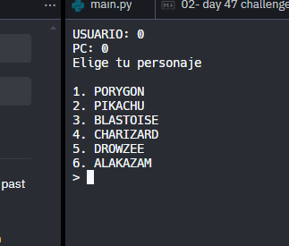
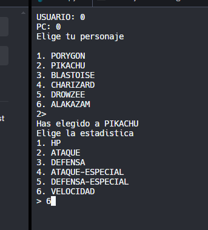

# ¡Siente el poder de mis estadísticas! 

Hoy os traemos otro reto para que practiquéis las habilidades que habéis aprendido en los últimos días.

En este desafío, recrearemos [Top Trumps](https://en.wikipedia.org/wiki/Top_Trumps), el juego con el nombre que lleva haciendo reír a los escolares británicos desde 1978 (vale, en realidad no, ¿pero puedes culparme por más chistes británicos?).  

Se trata de un juego de lucha de estadísticas basado en cartas en el que puedes comparar las estadísticas de objetos de una categoría: personajes de programas de televisión, camiones, coches, aviones, queso (mmmmm).


Recuerda que si necesitas más ayuda, puedes acudir a nuestro [Foro de los 100 días de código](https://ask.replit.com/c/100-days-of-code/30) o a [Replit 101](https://www.eventbrite.com/e/399444046897) para recibir ayuda en directo del inigualable David.

# 👉 Desafío del día 47

Muy bien Top Trumpers. Su programa debe funcionar así.

1. Elige una categoría. Algo que sea popular. Ya sabes como 'los profesores de informática más guapos' 😆.
2. Almacena la información de **dos** objetos diferentes en un diccionario 2D.
3. El campo clave debe ser **nombre**.
4. Los datos en el sub diccionario deben ser algunas estadísticas sobre el objeto. Por ejemplo
   1. Inteligencia
   2. Guapo
   3. L33t c0ding skillz
   4. Nivel de calvicie

5. Utiliza un bucle infinito para que el usuario elija una de las dos cartas y, a continuación, elija una estadística de esa carta.
6. Mostrar el stat elegido para ambas tarjetas y la salida que ha ganado.

🥳 Puntos extra por:
- Hacer el diccionario dinámico para que puedas añadir tus propias cartas.
- Usar un bucle para jugar el juego en un formato de 2 jugadores, llevando la cuenta de los puntos conseguidos.

Ejemplo:

```
🌟Top Trumps🌟

Bienvenido al simulador de Top Trumps 'Los profesores de informática más guapos'

Elige tu carta: 1 - Sr. Morgan 2 - Sr.Colley 

> 1

Elige tu estadística:
1. Inteligencia
2. Belleza
3. L33t c0ding skillz
4. Nivel de calvicie

> 4

El Sr. Morgan tiene un nivel de calvicie de 99
Sr. Colley tiene un nivel de calvicie de -68

************* ¡El Sr. Morgan gana! ********

¿Otra vez? sí/no > n
```

<detalles> <sumario> 💡 Pistas </sumario>

- Si vas a añadir tus propias cartas dinámicamente, prueba a usar la función `random.choice()` para `sacar` dos cartas del mazo.
</detalles>





La solucion se encuentra en [main.py](./main.py)
