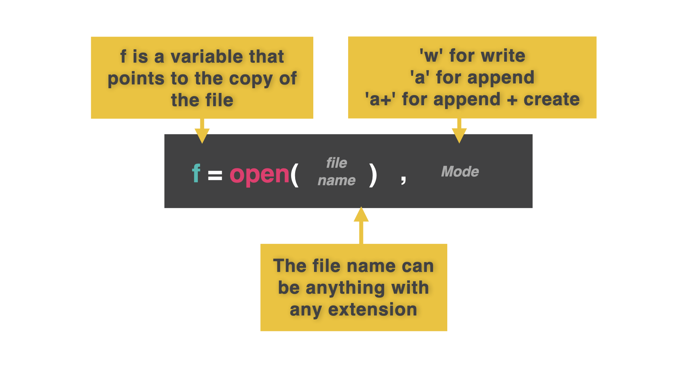
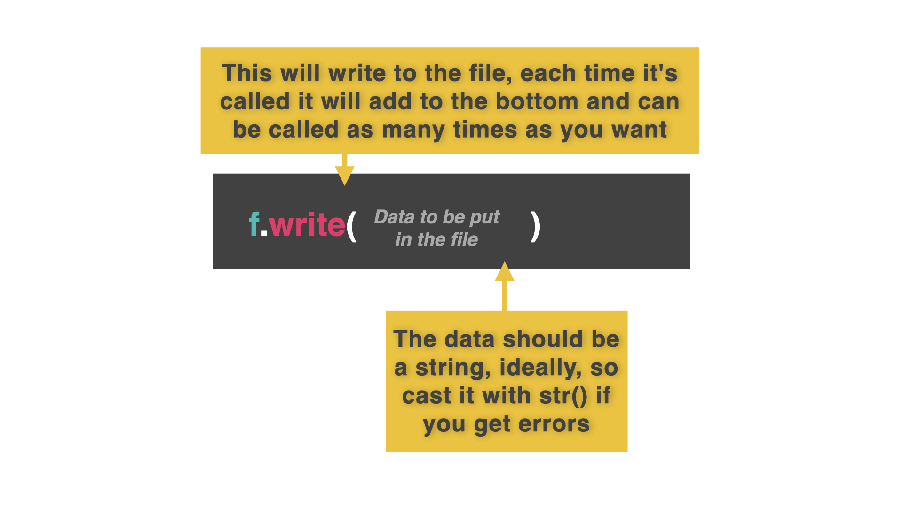
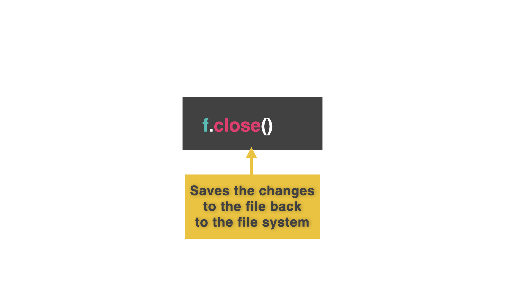
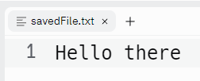
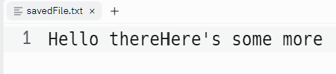
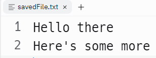

# Escritura de archivos

Nuestras réplicas no necesitan ser sólo un archivo que contenga todo el código y los datos.  Podemos escribir los datos en otros archivos para almacenarlos a más largo plazo, y luego acceder a ellos cuando los necesitemos.

👉 Para hacer esto vamos a usar la pestaña **Archivos** en la barra de herramientas de la izquierda.  Su aspecto es el siguiente:


## Memoria temporal

Cuando usamos variables, listas, diccionarios y otras estructuras de datos en nuestro código, los datos que contienen se almacenan en la RAM del ordenador.

La RAM es almacenamiento *temporal* (normalmente llamado memoria).  Se utiliza para guardar datos e instrucciones de los programas que tu ordenador tiene abiertos en ese momento.

El problema es que cuando un programa termina o se cierra, sus datos e instrucciones se eliminan de la RAM para liberar espacio.

Esta es la razón por la que tuvo que volver a introducir todos los datos de prueba de sus programas de listas y diccionarios dinámicos cada vez que los ejecutaba.  Los contenidos de esas listas/diccionarios eran removidos de la RAM cuando el programa terminaba de ejecutarse.


## Creando un Nuevo Archivo

Para evitar esta increíblemente molesta tarea de reingreso de datos, vamos a hacer que el programa guarde los datos en un archivo. El fichero existirá en almacenamiento *secundario* (los discos duros de los servidores de Replit en este caso). 

👉 Así es como se abre un fichero. Esta única línea de código tiene **tres** características importantes:

```
f = open("savedFile.txt", "w")
```



1. **La variable (`f`):** Es necesaria para permitir que tu programa se comunique con el archivo. Normalmente tendría un nombre bonito y significativo. Sin embargo, necesitarás escribir el nombre de esta variable mucho, mucho, mucho. Así que corto es bueno. 'f' es la abreviatura de 'archivo'.


2. **El nombre del archivo (el primer elemento entre paréntesis, `"archivoguardado.txt"`):** Debes **codificar esto para que coincida con el nombre del archivo **EXACTAMENTE** e incluir la extensión del archivo.
3. **La 'w' (segundo elemento entre paréntesis):** Establece los permisos para el archivo. w' significa 'escritura'. Esto significa que si el archivo aún no existe, el programa creará un nuevo archivo en blanco con ese nombre.  Sin embargo, si **ya** existe, se sobrescribirá con un archivo en blanco.


## ¡Sálvame! Escribiendo datos en el fichero

👉 El comando `.write()` escribirá el dato entre paréntesis en el fichero.
Puedes usar tantos como quieras.

```
f = open("savedFile.txt", "w")
f.write("Hello there")
```

## Cerrar
👉 Sin embargo, estos datos **SIGUEN EN LA RAM**. No se guarda nada hasta que cerramos el fichero usando el comando `.close()`.


```
f = open("savedFile.txt", "w")
f.write("Hello there")
f.close()
```

Cuando ejecutes este código, no aparecerá nada en la consola, pero comprueba la pestaña de archivos de la izquierda.

*Se ha creado un archivo. 


Haz clic en él para ver su contenido.



### ¡Pruébalo y ponte a escribir!

# Guardar en archivos

👉 Ahora vamos a obtener algo de entrada, almacenarlo en una variable, y escribirlo en el archivo.

```
f = open("savedFile.txt", "w")
whatText = input("> ")
f.write(whatText)
f.close()

```

## Evitar la sobreescritura

Vamos a cambiar los permisos del archivo de 'w' a 'a+'.  

'a' significa *append* - añadir al final del fichero.

Sin embargo, si el archivo no existe, entonces se bloqueará.

a+' significa 'añadir al final del archivo, o crear uno nuevo si no existe'.

👉 Aquí está el código modificado con el cambio en la línea 1:

```
f = open("savedFile.txt", "a+")
whatText = input("> ")
f.write(whatText)
f.close()

```
El problema es que pega la segunda entrada directamente a la primera.  Así



Así que necesitamos algo.......

## Nuevas líneas

👉 Podemos usar nuestro viejo amigo, el fString, para formatear una nueva línea.  Yo he usado el carácter de nueva línea `\n`.

```
f = open("savedFile.txt", "a+")
whatText = input("> ")
f.write(f"{whatText}\n")
f.close()
```

Así está mejor.



```
f = open("savedFile.txt", "a+")
whatText = input("> ")
f.write(f"{whatText}\n")
f.close()
```
### Asegúrate de seguir los tres pasos para que el archivo se guarde.


# 👉 Desafío del día 48

El reto de hoy consiste en crear una tabla de puntuaciones altas.

Su programa debe:

1. Pedir al usuario que introduzca sus iniciales de tres letras y su puntuación (sobre unas 100.000).
2. Guardar ambos valores en un archivo llamado 'puntuación.alta'.
3. Utiliza el modo append. Si el archivo no existe, debe crearse. Si existe, la puntuación debe añadirse al final.
4. Cada nueva puntuación de entrada debe ir en una nueva línea como *puntuación espacial inicial*. A continuación, inicie una nueva línea para la siguiente entrada.
5. Añadir 2-3 puntuaciones para la prueba en un bucle.
6. El bucle debería preguntar al usuario si ha terminado de introducir datos y detenerse en caso afirmativo.

🥳 Puntos extra por obtener todas las entradas con un solo comando `input` y la función `split`.

Ejemplo:

```
🌟TABLA DE PUNTUACIONES🌟

Introduce tus iniciales > DJM
Introduce tu puntuación > 89,764

Añadido a la tabla de puntuaciones máximas.
¿Añadir otro? s/n? y

Introduce tus iniciales > ACY
Introduce tu puntuación > 5.731

Añadido a la tabla de puntuaciones máximas.
¿Añadir otro? s/n? n
```

<detalles> <sumario> 💡 Pistas </sumario>

- No hay mucho aquí que no puedas obtener de los ejemplos.
- No te olvides de poner un carácter de nueva línea al final de cada comando de escritura. 

</detalles>

La solucion a este desafio está en [main.py](./main.py)