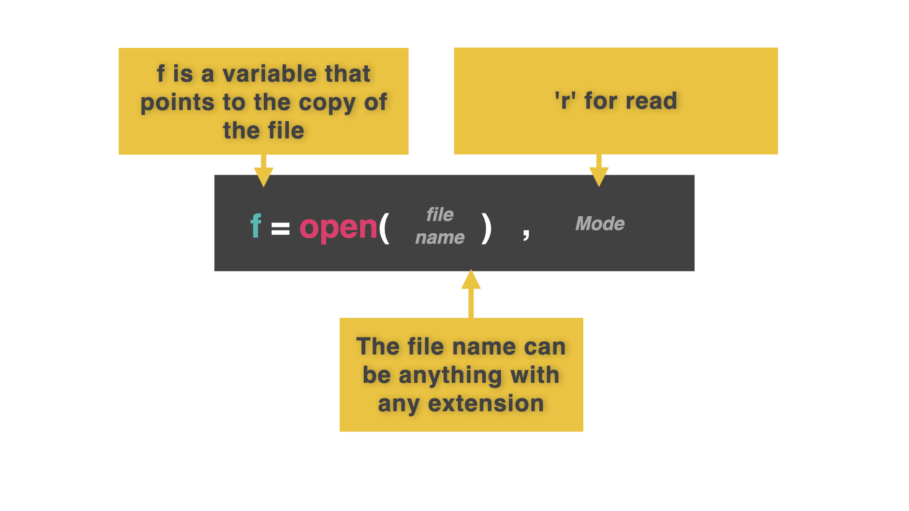
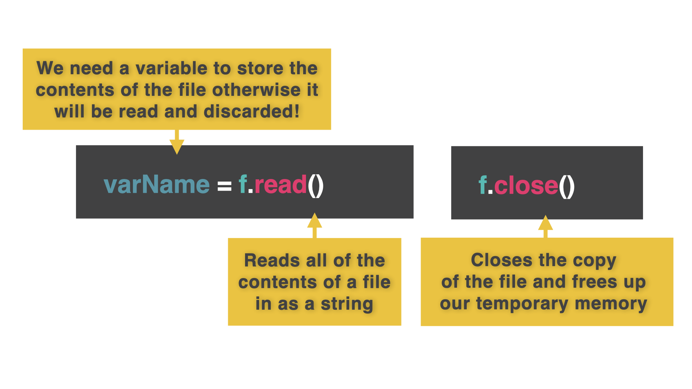
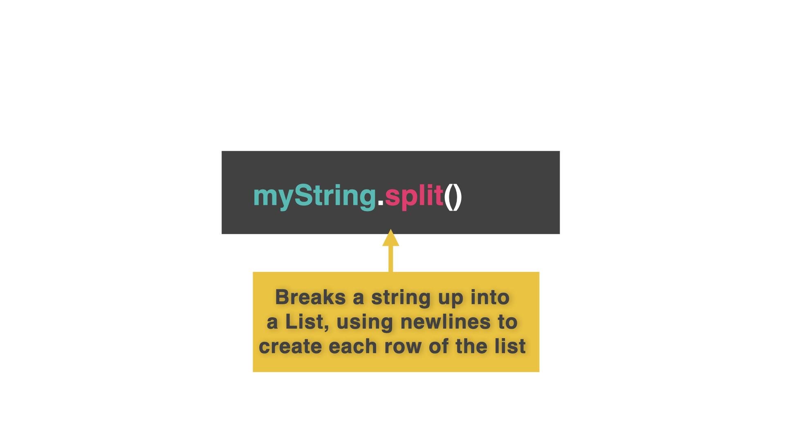
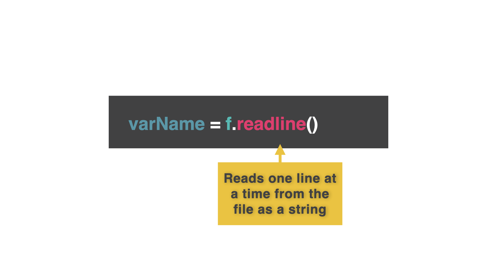

# Lectura de un fichero

Una vez que hemos introducido los datos en un fichero, ¿no sería estupendo volver a cargarlos en nuestro programa para utilizarlos de nuevo?


Sí. Sí es la respuesta que estás buscando.  


## Abrir

👉 El código para cargar desde un fichero es bastante similar al de escritura.  El comando es `open` en lugar de `read`, y los permisos son ligeramente diferentes.


```
f = open("filenames.list", "r")
```



## Leer y Cerrar

👉 En este ejemplo, el permiso 'r' significa 'sólo lectura'. Ahora cargamos el contenido del fichero en una variable utilizando la función `read`. A continuación, cerramos el fichero para liberar la RAM utilizada para almacenarlo.
```
f = open("filenames.list", "r")
contents = f.read()
f.close()
```


## Imprimir

👉 Finalmente imprime el contenido de la variable 'contents' para comprobar que ha funcionado.

```
f = open("filenames.list", "r")
contents = f.read()
f.close()

print(contents)
```
## Dividir

 Traerlo todo de golpe está bien, pero sería mucho más útil tenerlo como elementos separados para poder examinarlo más fácilmente.

👉 Para ello, utiliza la función `.split()` en la penúltima línea. Esto divide la cadena en una lista de elementos individuales.

```
f = open("nombresarchivos.list", "r")
contenido = f.read()
f.close()

contents = contents.split() #se añade la división aquí

print(contenido)
```

### ¡Pruébalo y carga!

# Uno a la vez

## Formar una cola ordenada

Leer todos los datos a la vez está bien, leer un elemento cada vez funciona de forma ligeramente diferente.

Utiliza la función `.readline()`.  

👉 El siguiente código lee una línea del archivo.

```
f = open("filenames.list","r")
contents = f.readline()
print(contents)

f.close()
```


## Repetir
Para leer más de una línea, repetimos el comando. 

👉 La función `strip()` elimina la nueva línea por defecto de cada impresión, lo que provocaría una línea vacía entre cada línea del fichero.

```
f = open("filenames.list","r")
contents = f.readline().strip()
print(contents)
contents = f.readline().strip()
print(contents)
contents = f.readline().strip()
print(contents)
contents = f.readline().strip()
print(contents)

f.close()
```
## ¡Usa un bucle!
👉 Si estás gritando '**¡BUCLE! Usa un maldito bucle, tío!**' a la pantalla ahora mismo.

Tus deseos son órdenes.


```
f = open("filenames.list","r")
while True:
  contents = f.readline().strip()
  
  if contents == "":
    break
  #The last line in the file will be a blank
  #We break the loop if the line read is a blank

  print(contents)
  # Moved the print after the break so it won't output the final blank line.

f.close()


```

# Errores comunes

*Primero, borra cualquier otro código de tu fichero `main.py`. Copia cada fragmento de código en `main.py` haciendo clic en el icono de copia en la parte superior derecha de cada cuadro de código. A continuación, pulsa `run` y comprueba qué errores se producen. Corrige los errores y pulsa "run" de nuevo hasta que estés libre de errores. Pulsa en "Respuesta" para comparar tu código con el correcto.

## ¿Está saliendo un espacio en blanco al final?

👉 ¿Qué le pasa a este código?


```
f = open("filenames.list","r")
while True:
  contents = f.readline().strip()
  print(contents)
  
  if contents == "":
    break
```
<detalles> <sumario> 👀 Respuesta </sumario>

- El print va después del break (pero no dentro de la rama de selección).

```
f = open("filenames.list","r")
while True:
  contents = f.readline().strip()
  
  if contents == "":
    break

  print(contents)

```

</detalles>

## ¡Haz que pare! ¡HAZ QUE PARE!

👉 ¿Cuál es el problema aquí?
```python
f = open("filenames.list","r")
while True:
  contents = f.readline().strip()
  
  print(contents)

```

<detalles> <sumario> 👀 Respuesta </sumario>

A alguien se le olvidó romper el bucle while. no hay postre para ti....

```python
f = open("filenames.list","r")
while True:
  contents = f.readline().strip()
  
  if contents == "":
    break

  print(contents)

```


</detalles>

# 👉 Desafío del día 49

En el reto de ayer, creaste un archivo llamado high.score y almacenaste en él algunas puntuaciones altas.

Hemos añadido una versión de ese archivo a esta réplica.

Tu programa debería:

1. Leer los datos del archivo high.score.
2. Identificar cuál de esos usuarios tuvo la puntuación más alta.  ¡Automáticamente! (¡No lo haces tú!)
3. Escriba el nombre y la puntuación del ganador.


Ejemplo:

```
🌟Current Leader🌟

Analizando puntuaciones altas......

El líder actual es DJM 898,000
```

<detalles> <sumario> 💡 Pistas </sumario>

- Leer cada elemento de uno en uno.
- Divide cada elemento en dos trozos.
- Tendrás que lanzar un elemento como un entero para convertirlo en un número.
- Piensa en la indexación de listas para acceder al segundo índice de la puntuación.
- Utilice una lista *max_score* para almacenar los detalles de la puntuación más alta (a partir de la línea 1 del archivo, sobrescribir los detalles si la línea actual tiene una puntuación más alta). 


</detalles>