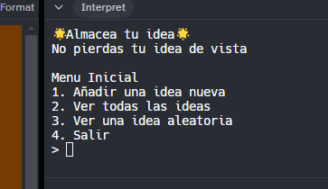

# Idea Maker...

¿Tiene ideas brillantes en momentos inoportunos? ¿Necesitas una forma práctica de almacenar esas ideas?  ¿Nunca has oído hablar de las aplicaciones de notas de voz para smartphones? ¿O de los bolígrafos y el papel?  Entonces, ¡el proyecto de hoy es para ti!


¿Tienes ideas brillantes en momentos inoportunos? ¿Necesitas una forma práctica de almacenar esas ideas?  ¿Nunca has oído hablar de las aplicaciones de notas de voz para smartphones? ¿O de los bolígrafos y el papel?  Entonces, ¡el proyecto de hoy es para ti!


# Reto del Día 50

¡Día 50! Chico, ¡estás destrozando estos 100 días! 🎊 Para celebrarlo, aquí tienes un proyecto para ti.

Tu sistema de almacenamiento de ideas debe:

1. Pedir al usuario que añada una idea, o cargar una al azar.
2. Elegir 'Añadir una idea' da como resultado:
   1. Un mensaje para que el usuario introduzca su idea.
   2. Añadir la idea a un archivo de texto llamado 'mis.ideas'.
   3. Añadir la idea en modo append, con cada nueva idea en una nueva línea.
3. Elegir 'Cargar aleatorio' da como resultado:
    1. Cargar la lista de ideas.
    2. Elegir una al azar.
    3. Mostrarla en pantalla durante unos segundos.
    4. Vuelva al menú.


Ejemplo:

```
🌟Almacenamiento de ideas🌟

¿Añadir una idea o ver una idea aleatoria? a/r. > r

Tenis mono.

¿Añadir una idea o ver una idea ranmdom? a/r. > a

Introduce tu idea. > Albergue juvenil con Chris Eubank

¡Bien! Tu idea ha sido almacenada.
```

<detalles> <sumario> 💡 Pistas </sumario>
  
- Para elegir una idea al azar, podrías usar `split()` para obtener un array de valores. O podrías usar `random.choice` para generar un número aleatorio y seguir cargando líneas hasta llegar a la línea del número aleatorio.
- Intenta implementar tu menú como una subrutina, de forma que puedas llamarlo siempre que necesites volver a él.
</detalles>

LA solucion está en [main.py](main.py)

