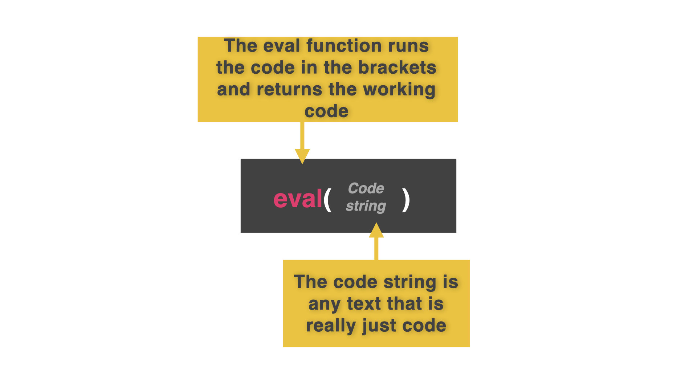
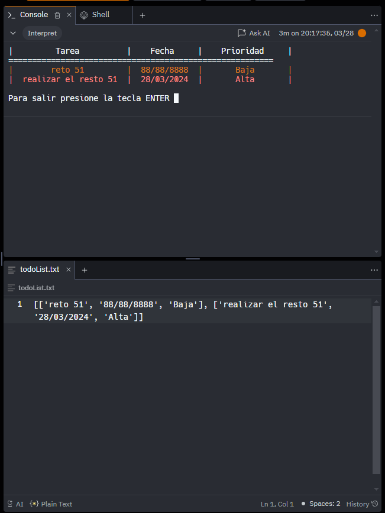

# Guardar en y cargar desde archivos

Hay algunas cosas que el almacenamiento *primario* en la RAM hace mejor. 

Por ejemplo, es fácil acceder, modificar o eliminar un dato almacenado en una lista (en la RAM).

Mantener los datos en almacenamiento *secundario* en un archivo lo hace más difícil. ¿O no?

Con Python, hay más de lo que parece.

## 


👉 El siguiente programa me permite añadir y eliminar eventos y fechas en un sistema de agenda.
Añade el nombre y la fecha de un evento a la lista 2D.  O busca un nombre y fecha existente y lo elimina.

```
myEvents = []

def prettyPrint():
  print()
  for row in myEvents:
    print(f"{row[0] :^15} {row[1] :^15}")
  print()

while True:
  menu = input("1: Add, 2: Remove\n")

  if menu == "1":
    event = input("What event?: ").capitalize()
    date = input("What date?: ")
    row = [event,date]
    myEvents.append(row)
    prettyPrint()

  else:
    criteria = input("What event do you want to remove?: ").title()
    for row in myEvents:
      if criteria in row:
        myEvents.remove(row)
```
Guardar y cargar manualmente desde este programa a un archivo cada vez sería un lío enorme. En su lugar, podemos configurar un auto-guardado escribiendo el código de guardado al final de nuestro bucle infinito.

## Auto-Save


👉 Al final del código, vamos a añadir un auto-guardado **justo antes de que el bucle se repita**.

*Asegúrate de que este nuevo código coincide con la sangría del bucle while, para que forme parte del bucle.*


```python
myEvents = []

def prettyPrint():
  print()
  for row in myEvents:
    print(f"{row[0] :^15} {row[1] :^15}")
  print()

while True:
  menu = input("1: Add, 2: Remove\n")

  if menu == "1":
    event = input("What event?: ").capitalize()
    date = input("What date?: ")
    row = [event,date]
    myEvents.append(row)
    prettyPrint()

  else:
    criteria = input("What event do you want to remove?: ").title()
    for row in myEvents:
      if criteria in row:
        myEvents.remove(row)

  ########### THIS IS THE NEW BIT ########
  f = open("calendar.txt", "w") # Permissions set to 'w' because we are deleting the file and replacing it with the whole 2D list every time.
  f.write(str(myEvents)) # Need to cast the list to a single string
  f.close()
  #########################################
```

### 🐞 Hay un problema potencial con este sistema. Intenta ejecutar el programa unas cuantas veces y añade eventos al calendario.

# Prevenir la pérdida de datos

¿Has encontrado el problema?

Sí. Cada vez que ejecutamos el programa, se crea una nueva lista en blanco `myEvents[]` que se escribe en el archivo.

Esto **sobrescribe** cualquier evento en el fichero que guardamos cuando ejecutamos el programa previamente.
##
Para solucionar esto, configuramos el programa para que cargue cualquier dato preexistente del fichero en la lista "misEventos" al principio del código.

Presta mucha atención a la función `eval()`. Es la salsa especial aquí...

👉 `eval()` toma el texto del archivo, lo convierte en código ejecutable, y lo asigna a `myEvents[]` como una lista 2D.  Bien, ¿eh?

```python
myEvents = []

####### THIS IS THE NEW BIT ################
f=open("calendar.txt","r") # Only need read permissions here
myEvents = eval(f.read())
f.close()
########################################

def prettyPrint():
  print()
  for row in myEvents:
    print(f"{row[0] :^15} {row[1] :^15}")
  print()

while True:
  menu = input("1: Add, 2: Remove\n")

  if menu == "1":
    event = input("What event?: ").capitalize()
    date = input("What date?: ")
    row = [event,date]
    myEvents.append(row)
    prettyPrint()

  else:
    criteria = input("What event do you want to remove?: ").title()
    for row in myEvents:
      if criteria in row:
        myEvents.remove(row)

  
  f = open("calendar.txt", "w") 
  f.write(str(myEvents)) 
  f.close()

```

### ¡Pruébalo! ¿Has ejecutado primero el código de autoguardado?

# Errores comunes

*Primero, borra cualquier otro código de tu fichero `main.py`. Copia cada fragmento de código en `main.py` haciendo clic en el icono de copia en la parte superior derecha de cada cuadro de código. A continuación, pulsa `run` y comprueba qué errores se producen. Corrige los errores y pulsa "run" de nuevo hasta que estés libre de errores. Pulsa en la `👀 Respuesta` para comparar tu código con el código correcto.*

## No Such File

👉 ¿Por qué recibo un error ``no such file``?

```python
f = open("calendario.txt", "r") 
misEventos = eval(f.read())
f.close()
```

<detalles> <sumario> 👀 Respuesta </sumario>

Bueno amigos, esto sucede cuando el archivo aún no existe.  El código de autocarga de abajo intenta abrir el archivo y si no lo encuentra, se bloquea.  Tiene **que existir** un archivo 'calendar.txt' para que funcione.

Este arreglo es temporal porque aprenderemos a arreglar esto correctamente en la lección de mañana.

Por hoy, comentaremos el código de auto-carga para dar al auto-guardado la oportunidad de crear el archivo.

```python
#f = open("calendario.txt", "r") 
#myEvents = eval(f.read())
#f.close()
```

Una vez creado el archivo, elimina los comentarios para activar la autocarga.

</detalles>

# 👉 Desafío del día 51

Recuerdas los primeros días cuando todo esto eran sólo listas? 

¡Qué bien! Vuelve al [**Día 45**](../Dia-45/main.py) y coge el código de tu lista de cosas por hacer. Lo necesitarás hoy.

Mejora tu lista de tareas para añadir autoguardado y autocarga.

Y ya está. ¡A por ellos, tigre!


<detalles> <sumario> 💡 Consejos </sumario>

- Hoy nada, sólo repasa la lección y añade las secciones de código pertinentes a tu programa de "cosas por hacer".

</detalles> 

La solucion la encontramos en [main.py](./main.py)



