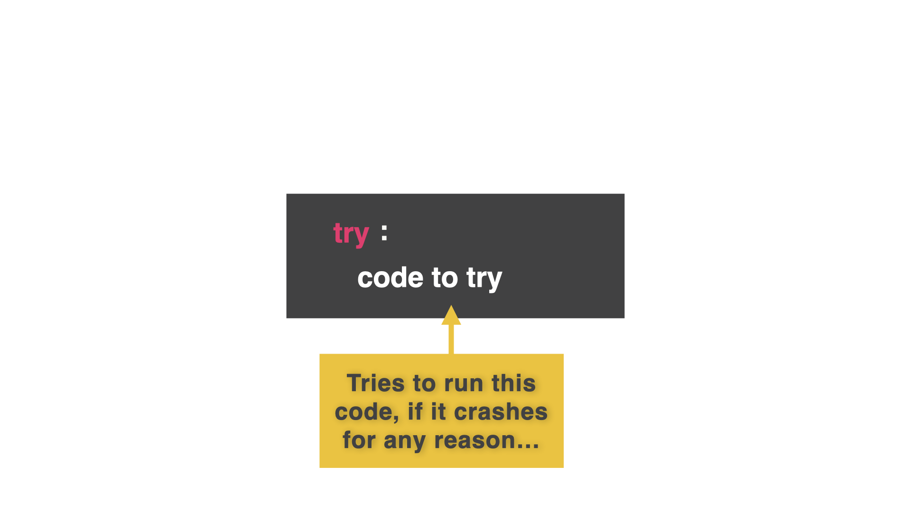
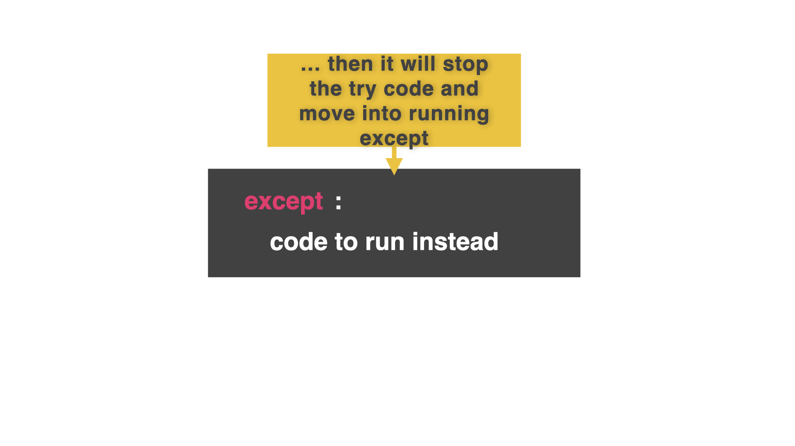
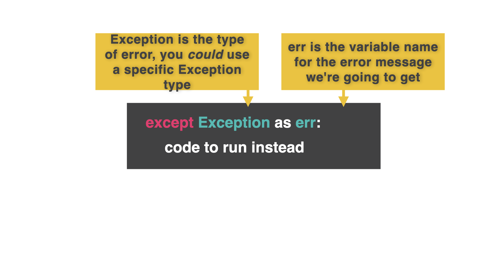
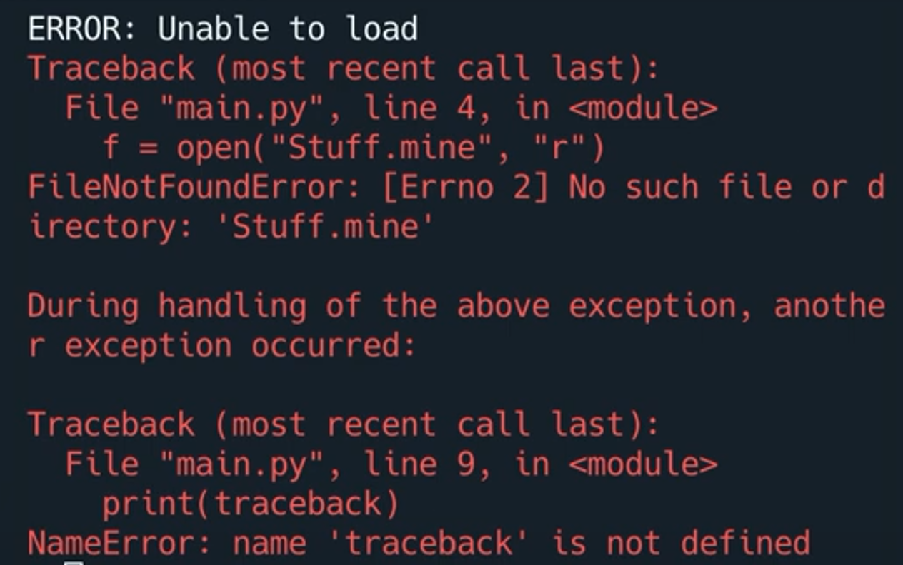

# Evitar fallos

A veces, no podemos evitar un accidente. Va a ocurrir de todos modos, y todo lo que puedes hacer es prepararte para el impacto.

Hasta ahora.

Veamos un ejemplo basado en la lección de ayer.
##

👉 En este ejemplo, si el archivo 'Stuff.mine' no existe, entonces el código arrojará un error 'no such file'.

```python
myStuff = []

f.open("Stuff.mine","r")
myStuff = eval(f.read())
f.close()

for row in myStuff:
  print(row)
```
## Prueba...excepto
La nueva construcción para evitar esto se llama `try.... except`.

Todo el código que *debería* funcionar va dentro de `try`.


Los mensajes de error/instrucciones para manejar cualquier error al ejecutar el código `try` van dentro de `except`.



👉 Así:

```python
myStuff = []

try:
  f.open("Stuff.mine","r")
  myStuff = eval(f.read())
  f.close()
# Try to find a file called 'Stuff.mine' and open it

except:
  print("ERROR: Unable to load")
# If the file can't be found, show the error instead of crashing the whole program


for row in myStuff:
  print(row)
```

## ¡Eres un Desarrollador de Software!

`try.... except` es genial para mejorar la experiencia del usuario y reducir la frustración.

Sin embargo, hay problemas con sólo poner el **código completo** en un `` try except``.

Como desarrolladores (sí, ahora eres un desarrollador de software), sería bueno saber qué tipo de error se ha producido para que tengamos una mejor idea de cómo solucionarlo.


Podemos decirle a `except` qué tipo de error(es) debe buscar.  `Exception` (E mayúscula) significa `todo tipo`. He capturado el tipo de error en la variable `error` y lo he impreso para que me diga cuál es el error.
[Aquí hay una lista](https://www.w3schools.com/python/python_ref_exceptions.asp) de algunos códigos de error `except` incorporados.



👉 Mira como he extendido el `except` ahora.
```python
myStuff = []

try:
  f.open("Stuff.mine","r")
  myStuff = eval(f.read())
  f.close()
# Try to find a file called 'Stuff.mine' and open it

except Exception as err:
  print("ERROR: Unable to load")
  print(err)


for row in myStuff:
  print(row)
```

## Traceback

Incluso podríamos deshacernos de la variable 'err' por completo e imprimir un traceback, que te mostrará el trazado de error rojo que ves cuando python se bloquea.

He creado una variable 'debugMode' en la parte superior de mi código y puse el traceback en un `if` dentro del `except`.  

👉 Esto me permite mostrar/ocultar los tracebacks fácilmente poniendo `debugMode` en True/False:

```python
debugMode = True
myStuff = []

try:
  f.open("Stuff.mine","r")
  myStuff = eval(f.read())
  f.close()
# Try to find a file called 'Stuff.mine' and open it

except Exception:
  print("ERROR: Unable to load")

  if debugMode:
    print(traceback)

for row in myStuff:
  print(row)
```


### ¡Pruébalo y mira qué errores puedes detectar!

# Errores comunes

*Primero, borra cualquier otro código de tu fichero `main.py`. Copia cada fragmento de código en `main.py` haciendo clic en el icono de copia en la parte superior derecha de cada cuadro de código. A continuación, pulsa `run` y comprueba qué errores se producen. Corrige los errores y pulsa "run" de nuevo hasta que estés libre de errores. Haz clic en "Respuesta" para comparar tu código con el correcto.

## Inténtalo, inténtalo, inténtalo de nuevo

👉 ¿Cuál es el problema aquí?

```python
myStuff = []

try:
  f.open("Stuff.mine","r")
  myStuff = eval(f.read())
  f.close()

for row in myStuff:
  print(row)
```

<detalles> <sumario> 👀 Respuesta </sumario>

- No hay `except` para atrapar el error. ``try` no se termina sin un except.

```python
misCosas = []

try:
  f.open("Cosas.mías", "r")
  misCosas = eval(f.read())
  f.close()

except:
  print(traceback)

for fila en misCosas:
  print(fila))
```

</detalles>


# 👉 Reto del Día 52

No hay lugar como Roma... O Nápoles, Milán, incluso Nueva York si es necesario.  

Pero no los dudosos comerciantes de pan redondo con ingredientes sospechosos de las 2 de la mañana que yo no visito de camino a casa después de salir por la noche.

¡Así es, vas a abrir una pizzería! Intenta no mancharte el teclado de anchoas. Esa cosa nunca se limpia.

En cualquier caso, tu programa de hoy debe:

1. Pedir al usuario que introduzca la cantidad y el tamaño de las pizzas.
2. Multiplicar las dos entradas para calcular el coste de las pizzas.
3. Guárdelo en una lista 2D con el nombre del usuario.
4. Utilice `try.... except` por **dos** razones:

    1. Incluye auto-guardado y auto-carga. Úsalo con el auto-load.
    2. Al convertir la cantidad de pizzas a un entero. Evita que el usuario bloquee el programa tecleando 'tres' en lugar de '3'. O cualquier otra entrada no entera. Si lo hace, pídale que lo intente de nuevo.


Ejemplo:

```
🌟Dave's Pizzas Esquivas🌟

¿Cuántas pizzas? > tres
Debe introducir un carácter numérico, inténtelo de nuevo. > 3

¿De qué tamaño? > XXXXXX

Nombre, por favor > David

Gracias David, tus pizzas costarán XXXXX
```

<detalles> <sumario> 💡 Consejos </sumario>

- Utiliza subrutinas para `agregar` y `ver`.
- Utiliza un bucle `while.... true` para el menú principal
- Usar una lista 2d para almacenar los detalles de cada pizza.
- Usa la selección para decidir qué subrutina ejecutar, luego escribe la lista 2d en el fichero.
- Para añadir, obtenga todas las entradas en variables y añádalas a una lista. Añade esta lista a una 2d que almacene todos los detalles de la pizza.
- Para ver, obtener cada índice de una fila de la lista 2d a la vez.


</detalles>

La solucion la encontramos en [main.py](./main.py)