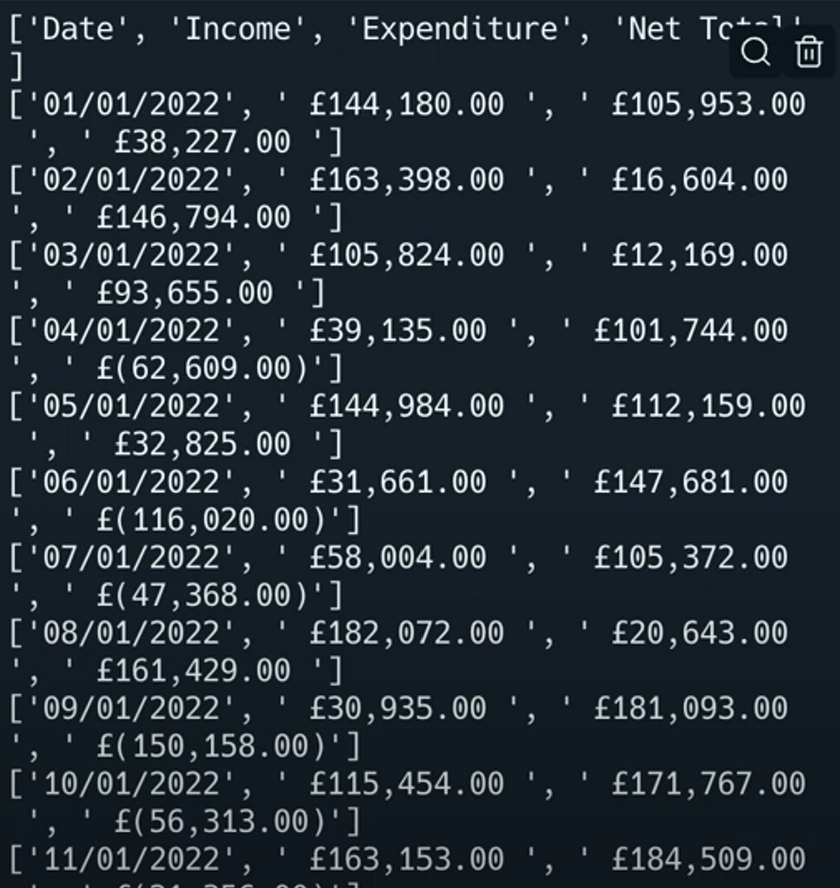
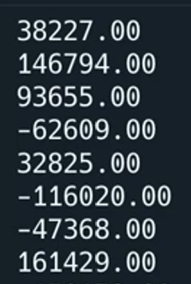

# Comma-Separated Values

Los archivos CSV son una forma de almacenar una hoja de cálculo como archivo de texto. Cada valor del archivo está separado por una coma.(comma separated values)

De ahí el nombre...

Mira, es básicamente una hoja de cálculo.


## Abrir un archivo CSV

Afortunadamente, los archivos CSV son tan comunes que Python ya tiene bibliotecas incorporadas para trabajar con ellos.

👉 El fichero csv 'January.csv' ha sido añadido para ti. Veamos qué ocurre:


```python
import csv # Imports the csv library

with open("January.csv") as file: # Opens the csv file
  reader = csv.reader(file) # reads the contents of the csv file into the 'reader' variable
  line = 0

  for row in reader: # loop to output each row in the 'reader' variable one at a time.
    print (row)
```

Esto funciona, pero la salida no es muy bonita. Y nos gusta lo bonito.



## ¡Hazlo bonito!
👉 Usemos `join`. Nos permite combinar listas de una forma más interesante.
```python
import csv 

with open("January.csv") as file: 
  reader = csv.reader(file) 
  line = 0

  for row in reader: 
    print (", ".join(row)) # adds a comma and space and then joins data, you could try joining with tabs too with `\t`
```


## Filtrar la salida

👉 El truco es tratar el CSV como un diccionario, usando la función `csv.DictReader()`. En el siguiente código, lo he filtrado para que sólo muestre el total neto de cada día.

```python
import csv # Imports the csv library

with open("January.csv") as file: 
  reader = csv.DictReader(file) # Treats the file as a dictionary 
  line = 0
  for row in reader: 
    print (row["Net Total"])
```


👉 Ahora vamos a ver si podemos sumar los totales netos de cada día para crear un total. Ten en cuenta que he convertido los datos a float porque nuestra biblioteca los tratará como texto.

```python
import csv # Imports the csv library

with open("January.csv") as file: 
  reader = csv.DictReader(file) # Treats the file as a dictionary 
  total = 0
  for row in reader: 
    print (row["Net Total"])
    total += float(row["Net Total"]) # Keeps a running total

print(f"Total: {total}") #Outputs
```

### ¡Pruébalo!

# Errores comunes

*Primero, borra cualquier otro código de tu fichero `main.py`. Copia cada fragmento de código en `main.py` haciendo clic en el icono de copia en la parte superior derecha de cada cuadro de código. A continuación, pulsa `run` y comprueba qué errores se producen. Corrige los errores y pulsa "run" de nuevo hasta que estés libre de errores. Haz clic en "Respuesta" para comparar tu código con el correcto.

👉 ¿Cuál es el problema aquí?


```python
import csv # Imports the csv library

with open("January.csv") as file: 
  reader = csv.DictReader(file) 
  line = 0
  
  for row in reader: 
    print (row["Net Total"])
    total += row["Net Total"] 

print(f"Total: {total}") 
```

<detalles> <sumario> 👀 Respuesta </sumario>

- Los datos leídos se tratan como texto. Para realizar cálculos, necesitamos lanzarlo. En este caso, como un float.

```python
import csv # Imports the csv library

with open("January.csv") as file: 
  reader = csv.DictReader(file) 
  line = 0
  
  for row in reader: 
    print (row["Net Total"])
    total += float(row["Net Total"])

print(f"Total: {total}") 
```

</detalles>


👉 ¿Cuál es el problema aquí?
```python
import csv # Imports the csv library

with open("January.csv") as file: 
  reader = csv.DictReader(file) 
 
  
  for row in reader: 
    print (", ".join(row["Net Total"]))
    total += float(row["Net Total"])

print(f"Total: {total}")
```
¿Obtuvo esta salida?


<detalles> <sumario> 👀 Respuesta </sumario>

Se ha aplicado el comando join a una cadena. Es unir esos caracteres individuales con una coma entre cada uno.

Esto no romperá tu código, sólo hará que la salida se vea un poco rara. Quitando el comando `join()` se soluciona.

```python
import csv # Imports the csv library

with open("January.csv") as file: 
  reader = csv.DictReader(file) 
 
  
  for row in reader: 
    print(row["Net Total"])
    total += row["Net Total"] 

print(f"Total: {total}")
```


</detalles>

# Desafío del Día 54

Te he dado un archivo CSV llamado 'Day54Totals.csv' (mira tu árbol de archivos) que contiene varios datos en los campos 'coste' y 'cantidad' de artículos vendidos. ¿Cuánto dinero ganó esta tienda en un día?

Tu programa debería

1. Leer el archivo CSV.
2. Multiplicar el coste por la cantidad.
3. Súmalo todo para calcular cuánto dinero ha ganado la tienda en un día.


Ejemplo:

```
🌟Shop $$ Tracker🌟

Tu tienda se ha llevado hoy 592 libras.
```

<detalles> <sumario> 💡 Sugerencias </sumario>.

- Utilice el enfoque de diccionario para cargar su archivo.
- Tome en 2 valores diferentes.
- Cast ellos de 2 maneras diferentes.

</detalles>

La solucion a este ejercicio lo encontramos en [main.py](./main.py)