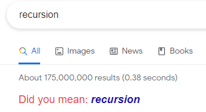

# ¿Qué es la recursión?

Antes de empezar, busca en Google "recursión".

¿Conseguiste esto?



Esos gatos de Google son *hilarantes*, ¿verdad?

##
👉 La recursión es un tipo de programa en el que consigues que una subrutina **se llame a sí misma**. Se hace un poco difícil de explicar. Yo recomendaría mucho [este libro](https://www.amazon.co.uk/Think-Like-Programmer-Introduction-Creative/dp/1593274246), que hace un excelente trabajo explicando este concepto.

La recursión nos permite resolver problemas de una forma más humana. Algunos problemas matemáticos **pueden resolverse mejor** utilizando la recursividad.

Por ejemplo:

Queremos imprimir una secuencia del mismo emoji, reduciendo 2 emojis por línea. (por ejemplo imprimir una fila de 9, luego una fila de 7, luego 5, etc. hasta que no tengamos ninguno).

Terminaremos con un patrón piramidal inverso.

Podríamos usar `range()`, pero es un poco raro contar hacia atrás. O un bucle, pero sería bastante largo.

👉 He aquí un ejemplo de solución recursiva.

```python
def reverse(value):
  if value <= 0:
    print("Done!")
    return
  # This `if` provides the 'stop' condition for the program. Otherwise it would run forever.

  else: # if we're not at the stop condition.
    for i in range(value):
      print("💯", end="") # Outputs 'value' emojis
    print() # New line
    reverse(value - 2) # takes 2 off the value and calls the subroutine again with this new number. Eg if value was 7 it would call 'reverse(value)' again with value as 5.
reverse(5)
```

Prueba a llamar a esto con 10 como argumento. ¿Obtuviste esta salida? 


# Errores comunes

*Primero, borra cualquier otro código de tu fichero `main.py`. Copia cada fragmento de código en `main.py` haciendo clic en el icono de copia en la parte superior derecha de cada cuadro de código. A continuación, pulsa `run` y comprueba qué errores se producen. Corrige los errores y pulsa "run" de nuevo hasta que estés libre de errores. Haz clic en "Respuesta" para comparar tu código con el correcto.

## ¿Qué es la recursión?

👉 ¿Cuál es el problema aquí?

```python
def reverse(value):

  for i in range(value):
    print("💯", end="") 
    
  print() 
  reverse(value - 1)
reverse(10)
```

<detalles> <sumario> 👀 Respuesta </sumario>

No hay condición de finalización. Se repetirá hasta que se coma **todos** los recursos de la máquina ¡hasta que no quede RAM!  Entonces, se bloquea.

Python tiene un límite para la cantidad de recursividad. Si no lo tuviera, ¡habrías desatado un monstruo devorador de RAM!

```python
def reverse(value):
  if value <= 0:
    print("Done!")
    return
  else: 
    for i in range(value):
      print("💯", end="") 
      
    print() 
    reverse(value - 1)
    
reverse(10)
```

</detalles>

# 👉 Desafío del día 57

Intenta utilizar la recursividad para construir un programa factorial.

Sí, es un reto matemático. La recursividad suele ser buena para este tipo de problemas.

Podría ser un verdadero rompecabezas, así que no tengas miedo de usar [100 Days of Code Community](https://replit.com/100-days-code) o el [Discord channel](https://replit.com/discord) para obtener ayuda.

Un factorial es el producto de todos los números hasta un valor, empezando por 1.

Por ejemplo, el factorial 5 sería 1 * 2 * 3 * 4 * 5 = 120

1. Escribe una función que:
    1. Comienza por el número más alto.
    2. Lo multiplica por el factorial de sí mismo menos uno
    3. Termina cuando llega a 1 y devuelve 1
    4. Devuelve el factorial.


Ejemplo:

```
🌟Factorial Finder🌟

Input a number > 5

The factorial of 5 is 120.
```

<detalles> <sumario> 💡 Pistas </sumario>

- No olvides devolver 1 en tu condición de terminación.
- Prueba a multiplicar el número por la llamada factorial (n-1).

</detalles>

La solucion a este ejercicio

```python
def factorial(value):
  if value == 0: # Cuando el valor llegue a 0 detiene la operacion y regresa 1
    return 1
  else:
    return value * factorial(value - 1)

print(factorial(10)) # 3628800
```