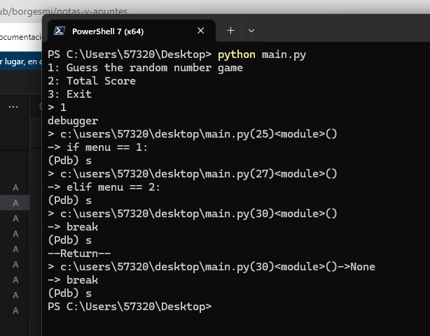
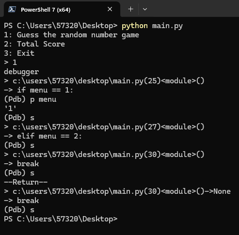

# Realizar un debugging en Windows

Para trabajar en modo debugging en windows, importamos la libreria `pdb` de esta manera:

```python
import pdb
```
> No es necesario realizar instalaciones, ya este modulo viene incluido con python


Establecemos el punto de quiebre

```python

import random, os, time
import pdb
totalAttempts = 0

def game():
  attempts = 0
  while True:
    number = random.randint(1,100)
    guess = int(input("Pick a number between 1 and 100: "))
    if guess > number:
      print("Too high")
      attempts+=1
    elif guess < number:
      print("Too low")
      attempts+=1
    else:
      print("Just right!")
      print(f"{attempts} attempts this round")
      return attempts

while True:
  menu = input("1: Guess the random number game\n2: Total Score\n3: Exit\n> ")
  print('debugger')
  pdb.set_trace()  # Establece un breakpoint aquí
  if menu == 1:
    totalAttempts+= game()
  elif menu == 2:
    print(f"You've had {totalAttempts} attempts")
  else:
    break
```


Y esto nos regresa estos comandos en powershell

```
-> pdb.set_trace()
(Pdb)

```

Debemos elegir una de las opciones para realizar una accion:

+ **s** o **step**: para avanzar a la siguiente línea de código.
+ **n** o next: para avanzar a la siguiente línea de código en una función sin entrar en ella.
+ **c** o **continue**: para continuar la ejecución hasta el siguiente breakpoint.
+ **p** <variable>: para imprimir el valor de una variable.
+ **q** o **quit**: para salir del depurador y detener la ejecución del programa.


En nuestro codigo de ejemplo, con nuestro punto de quiebre nos regresa:



De esto podemos interpretar que, al ser el valor del iput un string y compararlo con unos, el codigo salta hasta el else y cierra el programa, veamoslo de otra manera



Al solicitarle al debugger que nos regrese el tipo de variable que es 'menu' nos regresa que es un string y el programa pide un int, asi que lo solucionamos asi:

```python
import random, os, time
import pdb  # Importa la biblioteca pdb para el debugger
totalAttempts = 0

def game():
  attempts = 0
  while True:
    number = random.randint(1,100)
    guess = int(input("Pick a number between 1 and 100: "))
    if guess > number:
      print("Too high")
      attempts+=1
    elif guess < number:
      print("Too low")
      attempts+=1
    else:
      print("Just right!")
      print(f"{attempts} attempts this round")
      return attempts

while True:
  menu = input("1: Guess the random number game\n2: Total Score\n3: Exit\n> ")
  pdb.set_trace() 
  if menu == "1": # Cambiamos a string
    totalAttempts+= game()
  elif menu == "2": # cambiama string
    print(f"You've had {totalAttempts} attempts")
  else:
    break
```

El programa tiene segundo problema, por mas que lo intentamos no podemos adivinar el numero no importa qué

```python
import random, os, time
import pdb  
totalAttempts = 0

def game():
  pdb.set_trace()  #establecemos el nuevo punto de quiebre
  attempts = 0
  while True:
    number = random.randint(1,100)
    guess = int(input("Pick a number between 1 and 100: "))
    if guess > number:
      print("Too high")
      attempts+=1
    elif guess < number:
      print("Too low")
      attempts+=1
    else:
      print("Just right!")
      print(f"{attempts} attempts this round")
      return attempts

while True:
  menu = input("1: Guess the random number game\n2: Total Score\n3: Exit\n> ")
  print('debugger')
  if menu == "1": 
    totalAttempts+= game()
  elif menu == "2": 
    print(f"You've had {totalAttempts} attempts")
  else:
    break

```
Y el problema es que, cada entra al ciclo `While` llama al 'random.randint' lo que no nos permitira adivinar un numero a menos que sea con un solo intento.


```python
import random, os, time
import pdb  
totalAttempts = 0

def game():
  pdb.set_trace()  
  attempts = 0
  number = random.randint(1,100) # sacamos el numero aleatorio del ciclo While para que lo llame una unica vez en la subrutina game()
  while True:
    guess = int(input("Pick a number between 1 and 100: "))
    if guess > number:
      print("Too high")
      attempts+=1
    elif guess < number:
      print("Too low")
      attempts+=1
    else:
      print("Just right!")
      print(f"{attempts} attempts this round")
      return attempts

while True:
  menu = input("1: Guess the random number game\n2: Total Score\n3: Exit\n> ")
  print('debugger')
  if menu == "1": 
    totalAttempts+= game()
  elif menu == "2": 
    print(f"You've had {totalAttempts} attempts")
  else:
    break
```
```