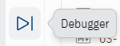
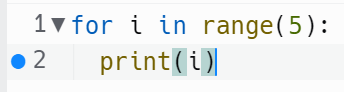
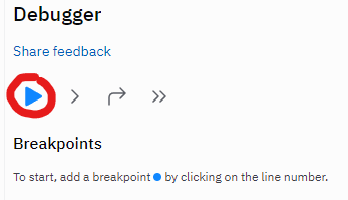
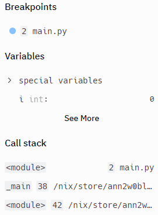

# Depuración

Es el día 58, y nuestro código se está complicando bastante.

El depurador nos ayuda a hacer un seguimiento de lo que está pasando sin tener que imprimir todo el tiempo.

Podemos ralentizar la ejecución del programa, hacer un seguimiento de lo que está almacenado en variables y listas en cualquier punto dado, y establecer *breakpoints* en cualquier línea que necesite atención especial.

Mira tu panel lateral para encontrar este icono. 


¡Ese es el depurador!

##
👉 He aquí un sencillo programa que usaremos con el depurador.

```python
for i in range(5):
  print(i)
```


## Puntos de interrupción

👉 Empezamos estableciendo un **breakpoint** pulsando a la izquierda del número de línea para que aparezca un punto azul. Este punto significa 'pausa aquí'.

Estoy poniendo el breakpoint en la línea `print(i)`:



Ejecuta el código usando el icono 'play' en el panel de depuración:



👉El programa se detendrá en el punto de interrupción. Podrás ver mucha información sobre lo que hay almacenado en tus variables, etc. en el panel de depuración.


👉 Los otros iconos del panel de depuración nos permiten recorrer el código de diferentes maneras. En orden, son:
- Siguiente paso: ejecuta la siguiente línea, luego pausa
- saltar paso
- siguiente punto de interrupción: ejecuta hasta el siguiente punto de interrupción, luego pausa


## Más Depuración

👉 Aquí hay una simple elección al azar con un programa de menú. Vamos a ver cómo los puntos de interrupción son útiles aquí:

```python
import random

colors = ["Red","Orange", "Yellow", "Green", "Teal", "Blue", "Purple", "Violet"]

while True:
  menu = input("1:Color or 2: exit?")

  if menu =="1":
    print(random.choice(colors))
  else:
    break
```

👉 Prueba a poner un breakpoint en la línea `if`. Cuando el programa se detenga, **pasa a través** de la sentencia `if`. 

Luego ve al **siguiente punto de ruptura** para ver cómo puedes acelerar y ralentizar la ejecución del código con una buena colocación de los puntos de ruptura.


### Ahora vuelve atrás y encuentra uno de tus grandes programas. Prueba el depurador en él. 


# Errores comunes

*Primero, borra cualquier otro código de tu fichero `main.py`. Copia cada fragmento de código en `main.py` haciendo clic en el icono de copia en la parte superior derecha de cada cuadro de código. A continuación, pulsa `ejecutar` y observa qué errores se producen. Corrige los errores y pulsa "run" de nuevo hasta que estés libre de errores. Haz clic en "Respuesta" para comparar tu código con el correcto.

## No encuentro los errores


<detalles> <sumario> 👀 Respuesta </sumario>

El único error es no utilizar el depurador correctamente.

Asegúrate de establecer los puntos de interrupción **antes** de pulsar ejecutar en el panel del depurador.

</detalles>

# 👉 Desafío del día 58

Este reto consiste en utilizar el depurador.

Copia el código roto de abajo en 'main.py' y utiliza el depurador para ayudar a detectar los errores en él. 

```python
import random, os, time
totalAttempts = 0

def game():
  attempts = 0
  while True:
    number = random.randint(1,100)
    guess = int(input("Pick a number between 1 and 100: "))
    if guess > number:
      print("Too high")
      attempts+=1
    elif guess < number:
      print("Too low")
      attempts+=1
    else:
      print("Just right!")
      print(f"{attempts} attempts this round")
      return attempts

while True:
  menu = input("1: Guess the random number game\n2: Total Score\n3: Exit\n> ")
  if menu == 1:
    totalAttempts+= game()
  elif menu == 2:
    print(f"You've had {totalAttempts} attempts")
  else:
    break
```


<detalles> <sumario> 💡 Pistas </sumario>

- Establece puntos de interrupción donde quieras que el código se detenga.
- Utiliza el 'paso siguiente' para seguir el contenido de variables y listas línea a línea cuando no estés seguro de lo que ocurre.

</detalles>


La solucion la encontramos en [main.py](./main.py)
Para aprender a usar el debugging en Windows, lease la pequeña guia que he creado utilizando este [enlace](./Debugging.md)