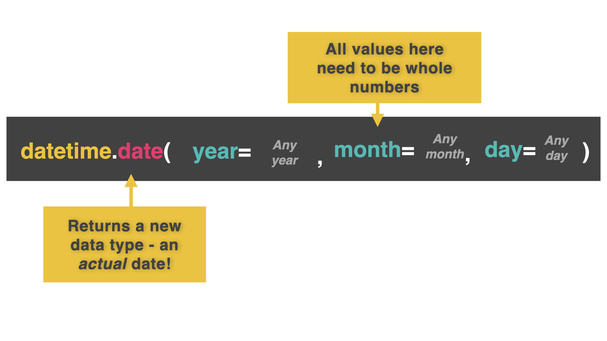
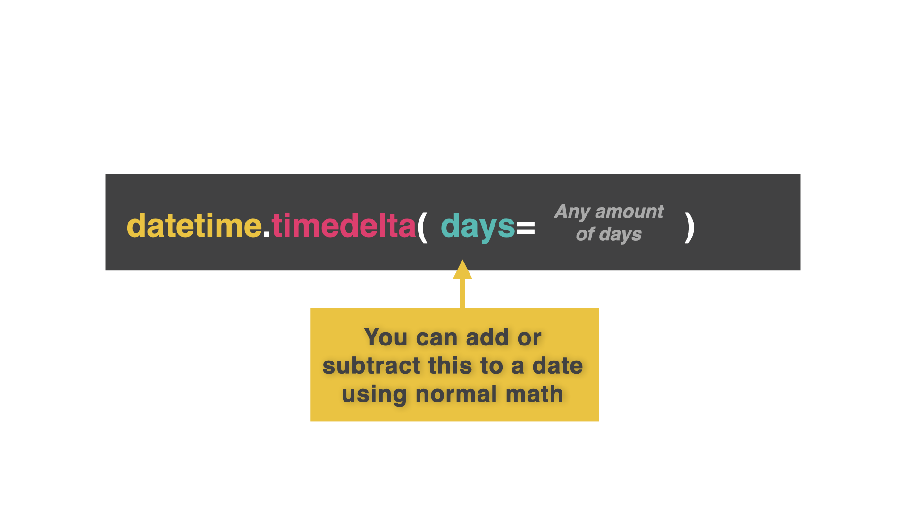

# La magia del tiempo....

En el día 60, vamos a aprender sobre el *tiempo* (no sobre viajes en el tiempo). Siento decepcionarte.

Esto puede ser bastante complicado, porque los humanos no tenemos un tiempo estandarizado agradable. En su lugar tenemos
- Relojes de 24 horas
- AM y PM
- Meses de distinta duración
- Años bisiestos
- Segundos bisiestos

Y todo tipo de rarezas en nuestro marco temporal. 

## Época Unix

👉 Tu ordenador (y todos los demás) utiliza algo llamado **época Unix** para medir el tiempo.

Cuenta la cantidad de segundos transcurridos desde el 1 de enero de 1970 (incluso cuando está apagado - hay una pequeña batería en la placa base que mantiene esta función en funcionamiento). 

Luego, convierte esto en un formato significativo para ti, humano ilógico.

## datetime

Para usar la época Unix, primero necesitamos importar la librería **datetime**.


```python
import datetime
```

👉 Ahora voy a insertar la fecha y asignarla a una variable.

```python
import datetime

myDate = datetime.date(year=2022, month=12, day= 7)

print(myDate)

# This code outputs '2022-12-07'
```



Tienes que usar el formato año -> mes -> día para tus argumentos. Así que británicos y americanos, dejad vuestros calendarios y buscad otra cosa por la que discutir...

La razón de este formato es que los elementos se hacen más pequeños (y menos importantes) secuencialmente de izquierda a derecha. Esto facilita mucho la clasificación. 

## Pedir una fecha


👉 Usemos `datetime` para obtener automáticamente la fecha de hoy.

```python
import datetime

today = datetime.date.today()

print(today)

# This code outputs the current date from your computer's clock.
```
Hmmm, ¿recuerdas cuando creábamos listas de tareas y teníamos que *introducir manualmente* la fecha......

## Getting Date Input

👉 La forma más fácil de hacer esto es preguntar al usuario por el día, mes y año en valores separados.

```python
import datetime

day = int(input("Day: ")) # Get all input as numbers. We're not at text input for months yet.
month = int(input("Month: "))
year = int(input("Year: "))

date = datetime.date(year, month, day)

print(date)
```
### ¡Pruébalo!

# Fuerza Delta

Una tarea común en los programas es calcular la diferencia entre dos fechas, por ejemplo para calcular la edad de alguien.

Para ello, utilizamos un **delta de tiempo**.

Delta es un término informático que significa *la diferencia entre dos cosas*.

Un *delta de tiempo* es una diferencia en el tiempo. El delta de tiempo entre cuando naciste y ahora aumenta todo el tiempo a medida que envejeces.

👉 Aquí hay algo de código que calcula un delta de tiempo entre hoy y dentro de dos semanas para ver qué fecha será dentro de dos semanas.


```python
import datetime

today = datetime.date.today() # Today's date

difference = datetime.timedelta(days=14) # The difference I want

newDate = today + difference # Add today to the delta difference to see the date in 14 days time.

print(newDate)
```

## Sentencias If con fechas

Siempre que hayas formateado la fecha correctamente, puedes usar los operadores de comparación `>` `==` y `<` igual que con enteros.

👉 ¡Puedo usar esto para saber si estoy de vacaciones o no!

```python
import datetime

today = datetime.date.today() # Today's date

holiday = datetime.date(year = 2022, month = 10, day = 30) # The date of my holiday

if holiday > today: # If my holiday is in the future
  print("Coming soon")
elif holiday < today: #If my holiday date has passed
  print("Hope you enjoyed it")
else: # If my holiday date is today
  print("HOLIDAY TIME!")
```

### ¡Pruébalo!

# 👉 Desafío del día 60

El reto de hoy es una cuenta atrás de eventos.

Su programa debe:

1. Elaborar austomáticamente la fecha de hoy.
2. Pedir al usuario que introduzca el nombre y la fecha de su evento (año, mes y día).
3. Calcular el número de días que faltan para el acontecimiento y mostrarlo.
4. Si el evento se celebra hoy, inserta algunos emojis de fiesta.
5. Si el acontecimiento tuvo lugar en el pasado, inserta emojis de caras tristes e indica al usuario cuántos días pasaron.


Ejemplo:

```
🌟Temporizador de cuenta atrás del evento🌟

Introduce el evento > 100 cumpleaños de Nan

Introduzca el año > 2022

Introduzca el mes > 10

Introduzca el día > 16

🎉🎉¡El 100 cumpleaños de Nan es hoy! 🎉🎉
```

<detalles> <sumario> 💡 Pistas </sumario>

- Resta la fecha de hoy del delta.
- Qué tipo de número obtendrás si la fecha ha pasado?

</detalles>