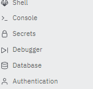
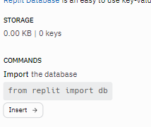
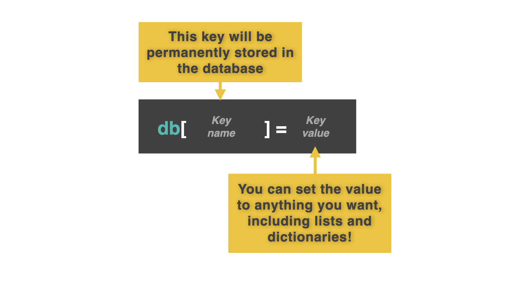
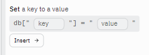
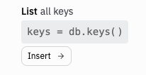
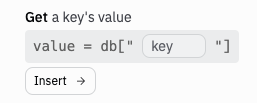
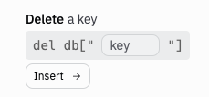

# Replit DB

Replit DB (Database) es una característica específica de Replit que te permite almacenar datos directamente en un repl usando una base de datos incorporada.

Hemos pasado tiempo aprendiendo acerca de los archivos, listas y diccionarios como métodos de almacenamiento de datos, porque a veces, *gasp*, es posible que desee escribir código fuera de Replit también, y todos estos son enfoques comunes para el almacenamiento a través de múltiples plataformas.

Sin embargo, ya que estás aquí, puedes usar Replit DB para almacenar datos de forma fácil y permanente con muy poco código. Todo lo que almacenamos en la base de datos se almacena permanentemente en la repl. 

Lo sabemos... somos increíbles 😊😊😊.

Sin embargo cada usuario que use esto tendrá su propia base de datos única a menos que estés usando un modelo cliente-servidor. Esto significa que es genial para almacenar datos independientes, pero no para compartir datos entre varias personas - a menos que estés construyendo un servidor. Llegaremos a eso más adelante en los 100 días.


## All About That 'base

👉 Vamos a importar la librería replit DB incorporada. Selecciona la opción 'Base de datos' de tu dock en la parte inferior izquierda. Luego, arrastra y suelta la pestaña de base de datos en tu pestaña `main.py`. 

*Nota: Si no haces esto, verás 'copiar' en lugar de 'insertar' dentro de los comandos de la base de datos.




👉 Cuando termines, haz clic en 'Insertar' en la opción 'Importar la base de datos' para obtener este código.


```python
from replit import db
```

Ya está. No, en serio.


## Almacenando Datos
Ahora vamos a almacenar algo de información. Para ello, usamos claves y valores de forma muy similar a un diccionario.



Elija 'Establecer una clave a un valor':


👉 Llamaremos a nuestra clave 'test' y estableceremos el valor a 'Hola'.

```python
from replit import db

db["test"] = "Hello there"
```
Cuando ``ejecutas`` el código, no se imprime nada. No hay que preocuparse. La clave será creada y almacenada entre bastidores. **Ya no necesitas el código de creación de la clave.** Fíjate en que no está en ningún otro código de ejemplo.


## Acessing Data


### Todas las claves
👉 Ahora elige 'Listar todas las claves' y `ejecuta` este código para que el programa imprima todas las claves.




```python
from replit import db

keys = db.keys()
print(keys)
```

### Clave única

*Nota: Si la clave no existe, el programa lanzará un KeyError y se bloqueará, así que aprovecha tus poderes `try.... except`.*

👉 Para acceder a una sola clave, elige 'Obtener el valor de una clave' en el menú. En este ejemplo, "test" es el valor de la clave. Podemos imprimirlo.



```python
from replit import db

value = db["test"]
print(value)
```


## Eliminar datos

👉 Selecciona - sí, ya lo tienes - 'Eliminar una clave' del menú. Luego añade el nombre de tu clave.



```python
from replit import db

del db["test"]
```

## Acceso por prefijo

Si tenemos un montón de claves que empiezan por el mismo texto, también podemos acceder a ellas por prefijo. En este código, he usado nombres de usuario.

```python
from replit import db

db["login1"] = "david"
db["login2"] = "pamela"
db["login3"] = "sian"
db["login4"] = "ian"
```

👉 Ahora puedo usar `.prefix()` para buscar todas las claves que empiecen por 'login'.

```python
from replit import db

matches = db.prefix("login")
print(matches)
```


### ¡Pruébalo!
# Claves y diccionarios

Soy informático y *me encanta* una buena base de datos. 

Una de las cosas más potentes que podemos hacer es asignar más de un dato a una clave. Podemos asignar una lista entera, o un diccionario.

👉 Este ejemplo usa 'david' como clave, y un diccionario como valor. Mira cómo podemos usar esto para almacenar todos los datos del usuario en una ubicación clave.

```python
from replit import db

db["david"] = {"username": "dmorgan", "password":"baldy1"}
```

Lista todas las claves:

```python
from replit import db

keys = db.keys()
print(keys)
```

## Elementos Individuales
👉 Ahora puedo acceder a elementos individuales del diccionario de la forma normal.

```python
from replit import db

value = db["david"]
print(value["password"])
```

### ¡Pruébalo!

# Acceso en bucle

Una de las cosas que podrías querer hacer es acceder a todas las claves y hacer un bucle a través de ellas. 


👉 He aquí cómo:

```python
from replit import db

keys = db.keys()
for key in keys:
  print(f"""{key}: {db[key]}""")
```

### ¡Pruébalo!
# Errores comunes

*Primero, borra cualquier otro código de tu fichero `main.py`. Copia cada fragmento de código en `main.py` haciendo clic en el icono de copia en la parte superior derecha de cada cuadro de código. A continuación, pulsa `run` y comprueba qué errores se producen. Corrige los errores y pulsa "run" de nuevo hasta que estés libre de errores. Pulsa en la `👀 Respuesta` para comparar tu código con el correcto.

## InKeyRect

👉 ¿Cuál es el problema aquí?


```python
from replit import db

value = db["key"]
```

<detalles> <sumario> 👀 Respuesta </sumario>.

La clave 'key' no existe en la base de datos. Usemos un `try except` para atraparla. 

`pass` es una línea de código que le dice al programa 'no te preocupes por esto todavía, no hace falta que hagas nada'. 

Lo he usado aquí para evitar que se cuelgue el programa dejando una línea en blanco después de `except`. Probablemente volvería a esto más tarde y sustituiría el pase por un mensaje de error apropiado.

```python
from replit import db

try:
  value = db["key"]
except:
  pass
```

</detalles>

## ¿Dónde están los datos?

👉 ¿Cuál es el problema aquí?
```python
from replit import db

keys = db.keys
for key in keys:
  print(key)
```

<detalles> <sumario> 👀 Respuesta </sumario>

El código mostraría los nombres de todas las claves, pero no los datos.

Cambiaremos un poco la sentencia print e incluiremos el 'Get key value' del menú de la base de datos. Aquí también he usado una buena técnica fString.

```python
from replit import db

keys = db.keys()
for key in keys:
  print(f"{key}: {db[key]}")
```
</detalles>

# 👉 Día 61 Desafío


### ¡Alguien está *equivocado* en Internet!


Hoy vamos a arreglar la mayor avería de las redes sociales -otras personas y sus estúpidas opiniones- ¡y crear un Twitter para uno! 

¡Sé que te gusta oír el sonido de tu propia voz!

Tu programa debería

1. Mostrar un menú - Añadir o Ver tweets.
2. 'Añadir' debería:
    + Obtener la entrada del tweet.
    + Almacenarlo en la base de datos con la marca de tiempo actual como valor clave.

3. 'Ver' debería:
    + Mostrar los tweets en orden cronológico inverso.
    + Mostrar 10 tuits a la vez.
    + Pedir al usuario que muestre otros 10 tweets (sí o no).
    + La opción "no" vuelve al menú.


Código Timestamp:
```python
timestamp = datetime.datetime.now()
```


<detalles> <sumario> 💡 Consejos </sumario>

- Usa la librería `datetime` para obtener el timestamp actual.
- Usa la librería `os` para limpiar la consola entre cada 10 tweets mostrados.

</detalles>

La solucion la tenemos en [main.py](./main.py)