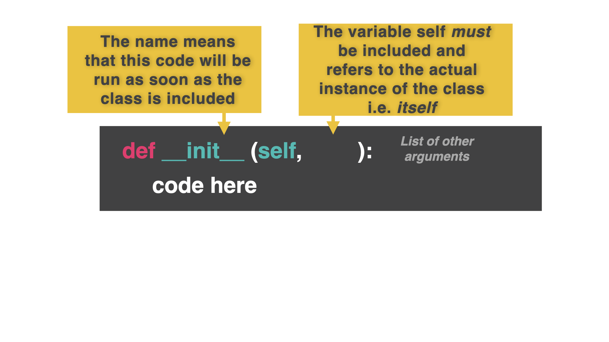

# OPP

La Programación Orientada a Objetos (POO) es un **paradigma de programación** (una forma de pensar sobre cómo resolver un problema) que se basa en **clases** y **objetos**, que almacenan todos sus datos y comportamientos en su interior.

Puedes pensar en una clase como un molde o plantilla. Tiene características predefinidas (forma, tamaño, etc.).

Los objetos son como las galletas creadas con el cortador. Todas tienen el mismo tamaño y la misma forma, pero luego podemos personalizar cada una (virutas, glaseado, etc.).

Algunos lenguajes de programación, como Java, se basan por completo en la programación orientada a objetos. Así que todos los programadores de Java estáis acostumbrados a esta forma de pensar. 

Si eres un programador de Python, entonces esto puede tomar algún tiempo para acostumbrarse, pero quédate con él.

Este enfoque nos permite crear una plantilla para algo como un enemigo en un videojuego, y luego usar esa plantilla para crear, digamos, 20 enemigos. En lugar de tener que codificar cada uno individualmente. 

Es muy potente para proyectos a gran escala, pero vamos a empezar poco a poco.

## Clases

👉 Vamos a crear una *plantilla*, conocida como **class**. Nuestro tema son los animales. Nuestra clase contendrá todas las características (piensa en variables) que los animales tienen en común. 

Recuerda que esto es sólo una plantilla. Todas las características se establecen en "Ninguno" en la plantilla y vamos a personalizar estos valores cuando se utiliza la plantilla para crear (*instantiate*) cada animal. Los valores serán pasados como argumentos a la subrutina `__init__` dentro de cada objeto animal.

También queremos crear una subrutina llamada *init* (abreviatura de inicialización) que le diga a la clase qué hacer cuando se utiliza para crear cada instancia de un animal.



```python
class animal:
  species = None
  name = None
  sound = None
  # Sets the characteristics

  def __init__(self, name, species, sound):
    self.name = name
    self.species = species
    self.sound = sound
  # 'self' means 'this object'
  # This code sets the name, species and sound of each object to the arguments passed in when it is created (instantiated).
```

## Instanciación


Instanciar significa 'usar la plantilla para crear un objeto'. Como presionar el cortador en la masa para hacer una galleta.

👉 Instanciemos un objeto perro.


```python
class animal:
  species = None
  name = None
  sound = None
  # Sets the characteristics

  def __init__(self, name, species, sound):
    self.name = name
    self.species = species
    self.sound = sound

##### THE NEW BIT #######

dog = animal("Brian", "Canine", "Woof") # Use the animal class to create a new object called 'dog' with the following parameters.
```

👉 Ahora vamos a sacar el nombre del perro.

```python
class animal:
  species = None
  name = None
  sound = None
  # Sets the characteristics

  def __init__(self, name, species, sound):
    self.name = name
    self.species = species
    self.sound = sound

dog = animal("Brian", "Canine", "Woof")

##### THE NEW BIT ################
print(dog.name)
```

👉 Puedo usar la clase `animal()` para crear tantos animales diferentes como quiera.


```python
class animal:
  species = None
  name = None
  sound = None
  # Sets the characteristics

  def __init__(self, name, species, sound):
    self.name = name
    self.species = species
    self.sound = sound

dog = animal("Brian", "Canine", "Woof")
print(dog.name)

##### THE NEW BIT ################
cow = animal("Ermintrude", "Bo Taurus", "Moo")
print(cow.sound)
```

# Más métodos 

Las subrutinas dentro de un objeto se llaman **métodos**.

Vamos a crear un método `talk` dentro de la clase `animal`. Este puede ser usado por nuestros objetos `dog` y `cow`.


```python
class animal:
  species = None
  name = None
  sound = None
  # Sets the characteristics

  def __init__(self, name, species, sound):
    self.name = name
    self.species = species
    self.sound = sound

  def talk(self):
    print((f"{self.name} says {self.sound}"))
```

👉 Ahora puedo usar el método `talk()` para cada objeto. 

```python
class animal:
  species = None
  name = None
  sound = None
  # Sets the characteristics

  def __init__(self, name, species, sound):
    self.name = name
    self.species = species
    self.sound = sound

  def talk(self):
    print((f"{self.name} says {self.sound}")) 
  # 'self' significa 'usa el identificador dado al objeto que está accediendo a este método'. Así que si lo uso con perro se convertirá en 'perro.hablar()' etc.

dog = animal("Brian", "Canine", "Woof")
dog.talk()

cow = animal("Ermintrude", "Bo Taurus", "Moo")
cow.talk()
```

### ¡Pruébalo!

# Herencia


Herencia significa que podemos tomar la plantilla de `animal` y dividirla en subclases que utilicen todos los atributos y métodos de esa clase, pero que también añadan sus propios atributos.

Esto es útil cuando pensamos en animales, ya que podemos empezar a dividir el reino animal por especies.


Cuando creo la subclase, utilizo el nombre de su clase padre como parámetro. Esto significa 'coge todas las características de animal y úsalas aquí también'.

Aquí, estoy creando una subclase de `bird`, que hereda de `animal`.

👉 Entonces puedo crear las características 'específicas de pájaro' dentro de la subclase pájaro.

```python
class animal:
  species = None
  name = None
  sound = None
  # Sets the characteristics

  def __init__(self, name, species, sound):
    self.name = name
    self.species = species
    self.sound = sound

##### The New Bit ##########

class bird(animal):

  def __init__(self):
    self.name = "Bird"
    self.species = "Avian"
    self.sound = "Tweet"

    # This automatically sets the information for each bird when it is created.


polly = bird() # Instantiates a new bird which gets it's details from the sub-class.

polly.talk() # polly uses the `talk()` method from the animal class 

```


👉 Añadamos un color específico a la clase pájaro.

```python
class bird(animal):

  def __init__(self):
    self.name = "Bird"
    self.species = "Avian"
    self.sound = "Tweet"
    self.color = color # Only applies to the bird sub class


polly = bird("Green") # Sets polly's colour to 'Green'
polly.talk()
print(polly.color) # Prints polly's color
```

### Podemos usar la herencia para crear una clase genérica (como 'personaje') y luego subdividirla en diferentes tipos (jugador, enemigo, jefe, etc.)


# Errores comunes

*Primero, borra cualquier otro código de tu fichero `main.py`. Copia cada fragmento de código en `main.py` haciendo clic en el icono de copia en la parte superior derecha de cada cuadro de código. A continuación, pulsa `run` y comprueba qué errores se producen. Corrige los errores y pulsa "run" de nuevo hasta que estés libre de errores. Haz clic en "Respuesta" para comparar tu código con el correcto.

## ¿Una vaca de muchos colores?

👉 ¿Qué está mal aquí?


```python
class animal:
  species = None
  name = None
  sound = None
 
  def __init__(self, name, species, sound):
    self.name = name
    self.species = species
    self.sound = sound

class bird(animal):

 def __init__(self):
    self.name = "Bird"
    self.species = "Avian"
    self.sound = "Tweet"
    self.color = color 


cow = animal("Ermintrude", "Bo Taurus", "Moo")
print(cow.sound)
print(cow.color)

polly = bird("Green") 
polly.talk()
print(polly.color)
```

<detalles> <sumario> 👀 Respuesta </sumario>

- La vaca fue creada usando la clase `animal`. El atributo `color` sólo pertenece a los objetos pájaro. La herencia sólo funciona en un sentido.
- `talk` no fue definido por lo que `polly.talk()` debe ser eliminado.

</detalles>

## A strong Sense Of Self

👉 ¿Cuál es el problema aquí?
```python
class animal:
  species = None
  name = None
  sound = None
 
  def __init__(name, species, sound):
    self.name = name
    self.species = species
    self.sound = sound

class bird(animal):

 def __init__(self):
    self.name = "Bird"
    self.species = "Avian"
    self.sound = "Tweet"
    self.color = color # Only applies to the bird sub class


cow = animal("Ermintrude", "Bo Taurus", "Moo")
print(cow.sound)

```

<detalles> <sumario> 👀 Respuesta </sumario>

Un error como este arrojará un error como: 'toma 3 argumentos posicionales pero se dieron 4'. 

Se verá raro porque sólo hay 3 parámetros en los corchetes del método `init` de la clase animal.

Sin embargo, instanciar un objeto también crea un argumento extra invisible, llamado 'self', así que tienes que incluirlo como primer argumento en los parámetros del método `init`.

```python
class animal:
  species = None
  name = None
  sound = None
 
  def __init__(self, name, species, sound, color): # Include the 'self' in the 'init'
    self.name = name
    self.species = species
    self.sound = sound
    self.color = color

class bird(animal):

 def __init__(self):
    self.name = "Bird"
    self.species = "Avian"
    self.sound = "Tweet"
    self.color = "green"


cow = animal("Ermintrude", "Bo Taurus", "Moo", "black")
print(cow.sound)


```


</detalles>

# 👉 Desafío del día 64

En el proyecto de hoy, cree clases para representar puestos de trabajo.

Su programa debe

1. Crear una clase genérica 'job'.
2. El método init almacenará los detalles de nombre, salario y horas trabajadas.
3. 'job' tendrá otro método que imprima bien esos detalles.
4. Crea dos subclases a partir de job: 'doctor' y 'teacher'.
5. La subclase 'doctor' deberá incluir también 'especialidad' y 'años de experiencia'. 
6. La subclase "profesor" debe incluir también "asignatura" y "puesto".
7. Las funciones de impresión de cada subclase deben imprimir estos datos adicionales.
8. Instancie un abogado, un profesor de informática y un médico pediatra (se trata de un médico para niños) con 7 años de experiencia.
9. Imprima la información de cada trabajo.


Ejemplo:

```
🌟Trabajos ¡Trabajos!🌟

Tipo de trabajo: Abogado
Salario: $ Squillions
Horas trabajadas: 60

Tipo de empleo: Profesor
Salario: $ Ni de lejos
Horas trabajadas: Todas
Asignatura: Informática
Puesto: Profesor de aula

Tipo de empleo: Doctor
Salario: $ Haciendo muy bien gracias
Horas trabajadas: 50
Especialidad: Consultor Pediatra
Años de Experiencia: 7
```

<detalles> <sumario> 💡 Consejos </sumario>

- Copia el método `print` en cada una de tus subclases y personalízalo para cada una de ellas.
- No te preocupes por mantener el mismo nombre de método. El de la subclase anulará al de la clase principal ``job``.

</detalles>
