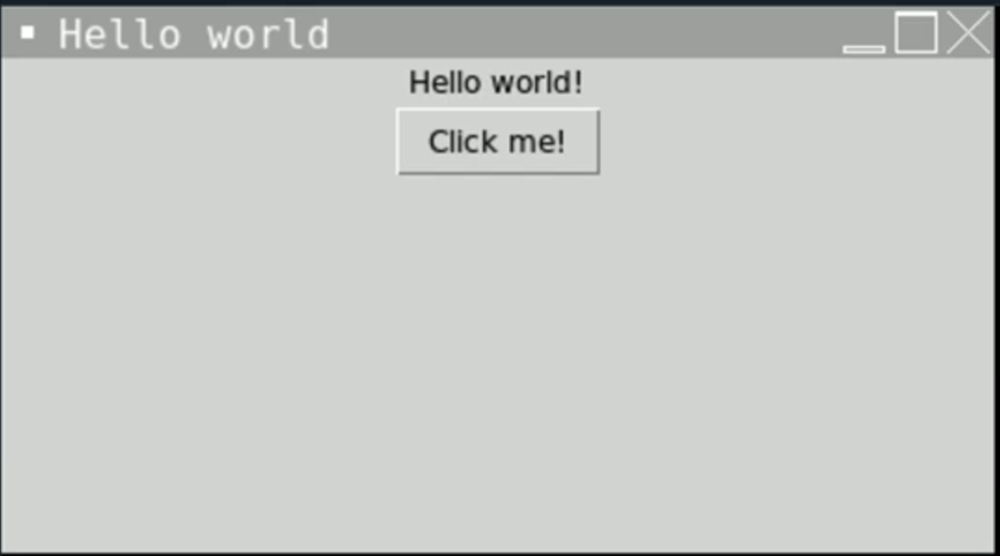
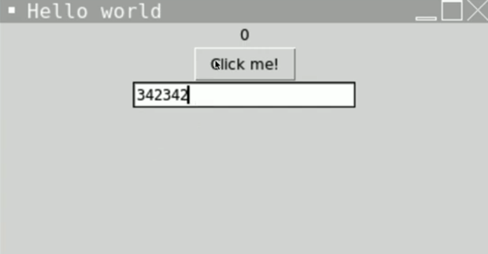
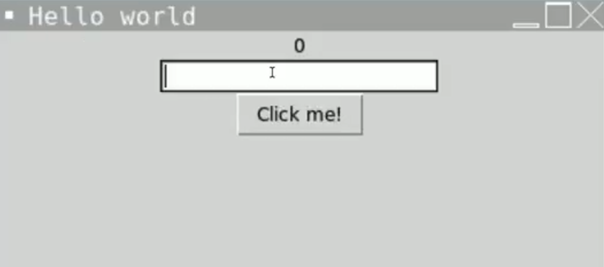
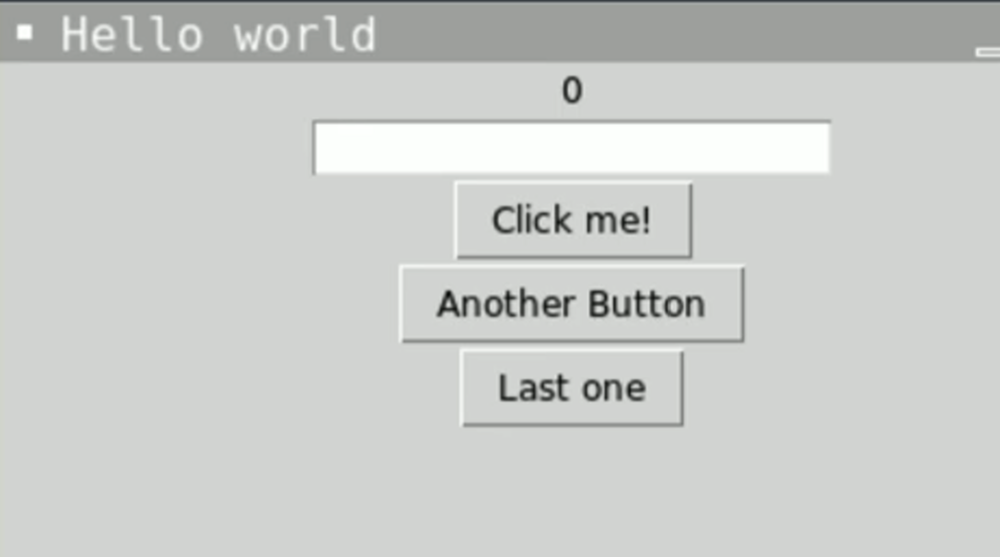
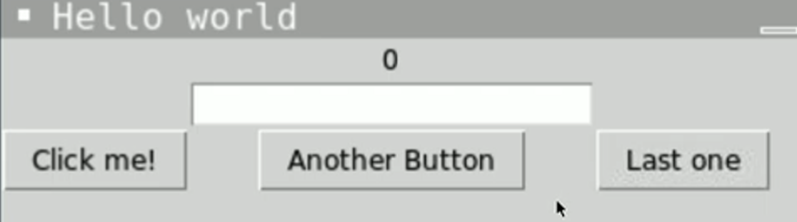
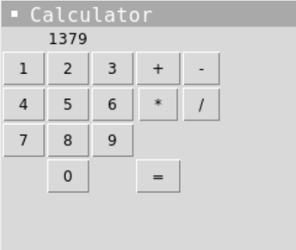
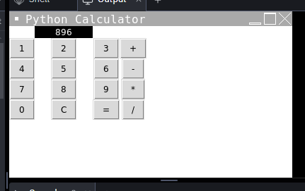

# GUIs pegajosos

**ACLARACIÓN: Como el título indica, esto puede volverse pegajoso. TKinter apesta totalmente - si prefieres pasar a algo más divertido, haz clic en "marcar lección como completa" y pasa al Día 70 para volver a lo bueno.**

Es hora de llevar nuestros programas a principios de los 90 mientras aprendemos a crear una Interfaz Gráfica de Usuario (GUI) con una librería de Python llamada **tkinter**.


## tkinter

tkinter es una de las librerías GUI más populares de Python. 

👉 Cuando comienzas un proyecto tkinter, obtienes algo de boilerplate, o código de inicio.

```Python
import tkinter as tk

window = tk.Tk()
window.title("Hello World") # Sets the name of the window in the border
window.geometry("300x300") # Sets the size of the window in pixels

hello = tk.Label(text = "Hello World") # Creates a text box
hello.pack() # 'pack' places the element on the screen

button = tk.Button(text = "Click me!") # Creates a button
button.pack()

tk.mainloop()
```
Este código producirá una ventana con el siguiente aspecto



Juega con el tamaño de la ventana para ver el efecto de cambiar las dimensiones.

### Trucos de etiquetas

👉 También podemos usar variables para pasar cadenas a las etiquetas como esta:

```python
label = "Hey there world"
hello = tk.Label(text = label)

```

👉 Ahora voy a usar una subrutina que cambie el texto de la etiqueta cuando haga clic en el botón.


```python
window = tk.Tk()
window.title("Hello World") 
window.geometry("300x300") 

label = "Hey there world"

def updateLabel():
  label = "Bye world!"
  hello["text"] = label 
  # Subroutine that updates the text in the label.

hello = tk.Label(text = label) 
hello.pack() 

button = tk.Button(text = "Click me!", command = updateLabel) # Calls the updateLabel subroutine when the button is clicked
button.pack()

tk.mainloop()
```

👉 Intentemos el mismo truco, sólo que esta vez la etiqueta contiene un número que se incrementa con cada click del botón. Para ello necesito usar una variable **global** de etiqueta.

```python
window = tk.Tk()
window.title("Hello World") 
window.geometry("300x300") 

label = 0 # Sets the starting label value to 0

def updateLabel():
  global label # Uses the values in the label variable
  label += 1 # Adds one to the value in the label
  hello["text"] = label 
  

hello = tk.Label(text = label) 
hello.pack() 

button = tk.Button(text = "Click me!", command = updateLabel) # Calls the updateLabel subroutine when the button is clicked
button.pack()

tk.mainloop()
```

# Añadir Texto
## Hablemos de Texto Bebé

Podemos añadir cajas de texto a nuestras ventanas usando el comando `text` totalmente obvio.

👉 Aquí está el código que necesitas aislado:
```python

text = tk.Text(window ,height=1, width = 50)
# Three arguments, name of the window to place the text box in, height & width.
text.pack()

```

👉 Y aquí está en contexto.

```python
window = tk.Tk()
window.title("Hello World") 
window.geometry("300x300") 

label = 0

def updateLabel():
  global label
  label += 1 
  hello["text"] = label 
  

hello = tk.Label(text = label) 
hello.pack() 

button = tk.Button(text = "Click me!", command = updateLabel) 
button.pack()

text = tk.Text(window ,height=1, width = 50)
text.pack()

tk.mainloop()
```
Esto nos da una ventana con una caja de texto como esta:


## Todo suma

Hagamos que nuestro programa añada el número del cuadro de texto al número de la etiqueta cuando se pulse el botón.

👉 Para ello, tenemos que cambiar la subrutina `updateLabel`. Aquí está el código aislado:

```python
def updateLabel():
  global label
  number = text.get("1.0","end") # Gets the number from the text box (starting at the first position and going to the end.) and stores in the number variable
  number = int(number) #Casts to an integer. I've done this on a separate line to prevent the line above getting too complex, but you can combine the two.
  label += number # Adds the number from the text box to the one in the label.
  hello["text"] = label
```

### ¡Pruébalo!

# Colocación de artículos

Nuestra ventana tiene un aspecto un poco extraño, ¿verdad? ¿Por qué tener el botón encima de la caja de texto?


👉 Podemos simplemente cambiar el orden definiendo la caja de texto **antes** del botón en el código:

```python
window = tk.Tk()
window.title("Hola Mundo") 
window.geometry("300x300") 

etiqueta = 0

 def actualizarEtiqueta(): 
global label
 número = text.get("1.0", "fin") 
número = int(número) 
etiqueta += número
 hola["texto"] = etiqueta 


hola = tk.Label(texto = etiqueta) 
hola.pack() 

text = tk.Text(window ,height=1, width = 50)
text.pack

button = tk.Button(text = "¡Hazme clic!", command = updateLabel) 
button.pack()

tk.mainloop()
```


### Empaquetar

Podemos añadir argumentos a `pack()` para controlar la posición de los elementos en la ventana. De nuevo, sólo muestro las líneas de código relevantes en estos ejemplos.

👉 Movamos el botón a la parte inferior de la ventana.

```python
button.pack(side=tk.BOTTOM)
```

👉 Y la caja de texto a la parte superior a la izquierda de la ventana.

```python
text.pack(side=tk.LEFT)
```
También puedes usar TOP, RIGHT, CENTER para controlar la ubicación.


## Desempaquetando 
Si tuviéramos varios botones, por defecto se pondrían uno encima de otro.

```python
button = tk.Button(text = "Click me!",
command = updateLabel) 
button.pack()

button = tk.Button(text = "Another Button", command = updateLabel) 
button.pack()

button = tk.Button(text = "Last one", command = updateLabel) 
button.pack()

```


Podemos organizarlos en una cuadrícula más bonita, pero para ello tenemos que **eliminar completamente `pack`** y romper toda la ventana en una cuadrícula.

👉 A continuación, utilizamos los números de fila y columna (cero indexado recuerde) para colocar nuestros elementos. Yo he puesto la etiqueta en la fila 0, la caja de texto en la fila 1 y los botones en la fila 2.

```python
window = tk.Tk()
window.title("Hello World") 
window.geometry("300x300") 

label = 0

def updateLabel():
  global label
  number = text.get("1.0","end") 
  number = int(number) 
  label += number
  hello["text"] = label 
  

hello = tk.Label(text = label).grid(row=0, column=1)


text = tk.Text(window ,height=1, width = 50).grid(row=1, column=1)


button = tk.Button(text = "Click me!", command = updateLabel).grid(row=2, column=0)

button = tk.Button(text = "Another Button", command = updateLabel).grid(row=2, column=1)

button = tk.Button(text = "Last one", command = updateLabel).grid(row=2, column=2)

tk.mainloop()
```

### Pruébalo

# Errores comunes

*Primero, borra cualquier otro código de tu fichero `main.py`. Copia cada fragmento de código en `main.py` haciendo clic en el icono de copia en la parte superior derecha de cada cuadro de código. A continuación, pulsa `run` y comprueba qué errores se producen. Corrige los errores y pulsa "run" de nuevo hasta que estés libre de errores. Pulsa en la `👀 Respuesta` para comparar tu código con el correcto.

## Error de Atributo

👉 ¿Por qué hay un error de atributo 'hello.pack()'?


```python
window = tk.Tk()
window.title("Hello World") 
window.geometry("300x300") 

label = 0

def updateLabel():
  global label
  number = text.get("1.0","end") 
  number = int(number) 
  label += number
  hello["text"] = label 
  

hello = tk.Label(text = label).grid(row=0, column=1)
hello.pack()

text = tk.Text(window ,height=1, width = 50).grid(row=1, column=1)

button = tk.Button(text = "Click me!", command = updateLabel).grid(row=2, column=0)

button = tk.Button(text = "Another Button", command = updateLabel).grid(row=2, column=1)

button = tk.Button(text = "Last one", command = updateLabel).grid(row=2, column=2)

tk.mainloop()
```

<detalles> <sumario> 👀 Respuesta </sumario>

`pack` no funciona con `grid`. Tienes que decidir usar uno u otro.

</detalles>

## Otro Error de Atributo

👉 ¿Por qué estoy recibiendo un error de atributo 'NoneType' cuando hago clic en un botón? Mi programa funcionaba, pero ahora ya no.
```python
text = tk.Text(window ,height=1, width = 50).grid(row=1, column=1)
```

<detalles> <sumario> 👀 Respuesta </sumario>

'Obtener' los datos de la caja de texto funcionaba bien con `pack`, pero no con `grid`.

El método `grid` está directamente en la línea de código de creación del objeto `text`. Esto causa problemas cuando la subrutina `updateLabel` intenta `get` el contenido de la caja de texto.

Siempre que he utilizado `grid` con el cuadro de texto y la etiqueta, tengo que separar esto en una línea separada. Esto es porque quiero manipular estos datos más tarde. No necesito hacerlo con los botones porque no necesito manipular esos datos.

```python
window = tk.Tk()
window.title("Hello World") 
window.geometry("300x300") 

label = 0

def updateLabel():
  global label
  number = text.get("1.0","end") 
  number = int(number) 
  label += number
  hello["text"] = label 
  

hello = tk.Label(text = label)
hello.grid(row=0, column=1) # New line here

text = tk.Text(window ,height=1, width = 50)
text.grid(row=1, column=1) # New line here

button = tk.Button(text = "Click me!", command = updateLabel).grid(row=2, column=0)

button = tk.Button(text = "Another Button", command = updateLabel).grid(row=2, column=1)

button = tk.Button(text = "Last one", command = updateLabel).grid(row=2, column=2)

tk.mainloop()
```


</detalles>

# 👉 Desafío del día 66

Tu reto es crear una sencilla calculadora GUI.

Su programa debe:

1. Tener botones para los números del 0 al 9, más, menos, multiplicar, dividir e igual.
2. El usuario debe ser capaz de pulsar los botones para crear su cálculo.
3. Debe mostrar el resultado correcto cuando se pulsa igual.

Ejemplo:





<detalles> <sumario> 💡 Consejos </sumario>

- Utiliza una cuadrícula para distribuir los botones.
- Crea una subrutina buttonChoice o similar que tome el valor del botón numérico pulsado, lo convierta en un int y lo muestre en la etiqueta.
- Crea una subrutina operatorChoice que seleccione qué operador mostrar y usar.
- Investiga el comando `lambda` para tus botones.
- Usa una subrutina `calc` con variables globales para answer, lastnumber y operator.

</detalles>

La solucion la encontramos en [main.py](./main.py)


> Nota: este es un primer boceto, este codigo puede recibir muchas mejoras. Cuando lo tenga lo pueblico

