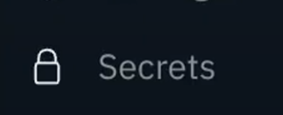
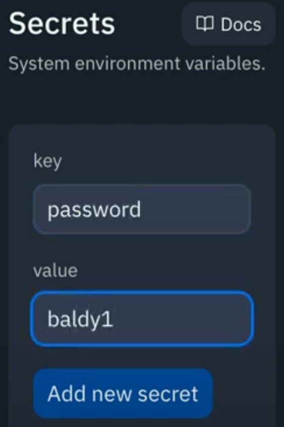

# For Your Eyes Only
**Volvemos a lo bueno otra vez.

A veces, necesitamos almacenar información en nuestro código que no queremos que otros puedan ver. Como contraseñas y demás.

Las réplicas de Replit son *públicas*, y no queremos que otros pequeños forkers pongan sus manos en nuestras contraseñas, ¿verdad?

👉 Podemos hacer que esta información sea secreta en nuestros repls seleccionando 'secretos' en la barra de herramientas de la izquierda.




👉 Los secretos se parecen mucho a los **diccionarios** en que tienen una clave que se usa para acceder a un valor. Vamos a crear un secreto de contraseña.



En cuanto lo hayamos hecho, tendremos un montón de opciones más abajo en nuestro menú de secretos. Usan la librería `os`, así que tendremos que importarla.

👉 Ahora vamos a usar nuestro secreto para configurar un sistema de login muy simple.

```python
import os

password = os.environ['password'] # Uses the os library to talk to the environment and get the secret password stored there.

userPass = input("Password > ")

if userPass == password:
  print("Well done")
else:
  print("Better luck next time")
```

Los datos secretos **no se copian cuando se bifurca el repl**, por lo que están protegidos de que otros obtengan una copia.


### ¡Pruébalo!
# Errores comunes

*Primero, borra cualquier otro código de tu fichero `main.py`. Copia cada fragmento de código en `main.py` haciendo clic en el icono de copia en la parte superior derecha de cada cuadro de código. A continuación, pulsa `run` y comprueba qué errores se producen. Corrige los errores y pulsa "run" de nuevo hasta que estés libre de errores. Haz clic en "Respuesta" para comparar tu código con el correcto.

## Hay un gran mensaje de error que incluye `KeyError`.

👉 ¿Por qué recibo este error?


```python
import os

password = os.environ['password'] 

userPass = input("Password > ")

if userPass == password:
  print("Well done")
else:
  print("Better luck next time")
```

<detalles> <sumario> 👀 Respuesta </sumario>

No hay nada malo en tu código. Simplemente no has creado un secreto llamado 'password'.

</detalles>
# 👉 Desafío del Día 70

Construye un sistema de login para dos tipos de usuario.

Su programa debe:

1. Tener **dos** tipos de usuario - admin y normal. Cada uno debe tener su propio nombre de usuario y contraseña.
2. El usuario admin debe ser saludado con 'Hola admin'.
3. 3. El usuario normal debe ser saludado con 'Hola normie'.


Ejemplo:

```
🌟Login System🌟

Nombre de usuario > admin01

Contraseña > thepowerTHEPOWER

Hola admin
```

<detalles> <sumario> 💡 Pistas </sumario>

- Necesitarás 4 secretos.

</detalles>

La solución la encontramos en [main.py](./main.py)