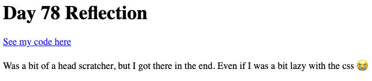

# 👉 Desafío del día 78

El reto de hoy consiste en construir un lugar donde almacenar tus reflexiones sobre los próximos 22 días de código.

👉 Para ayudarte a conseguirlo, aquí tienes una habilidad más.

En el código de abajo, he utilizado una variable en chevrons para tirar en cualquier cosa más allá de la primera `/` en la URL.

Entonces puedo usar eso en mi definición y llamarlo para usarlo en mi página. Aquí está el código:

```python
from flask import Flask

app = Flask(__name__)

@app.route('/<pageNumber>')

def index(pageNumber):
  return f"This is page {pageNumber}"
```
Ahora, puedo poner un / al final de la URL en mi navegador, y lo que escriba se utilizará en la salida de la página.

👉 Tu programa debería:

1. Tener una plantilla para la página accesible yendo a *URL/númeroDía* (por ejemplo, myLovelyWebsite/78).
2. Cada página debe tener:
    1. El número del día en el título
    2. Un enlace a su réplica
    3. Tus reflexiones en el texto
3. Cada página debe estar bien estilizada con CSS.
4. Si voy a la página en un navegador, y cambio el número después del / debería cargar la página correspondiente.


Ejemplo:




<detalles> <sumario> 💡 Pistas </sumario>

- La forma más fácil de almacenar todo el contenido de tu página es en un diccionario o lista 2D que buscas y reemplazas las variables en el código Flask con el contenido de tu diccionario/lista.

</detalles>

Traducción realizada con la versión gratuita del traductor DeepL.com