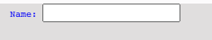
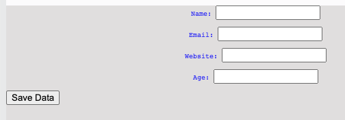
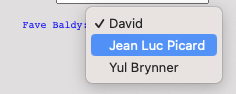
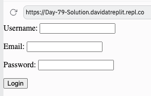

# ¡Yakkety Yak!

El día 79 trata sobre cómo hacer que nuestras páginas web se comuniquen con el servidor web.

Para ello, construimos un formulario que empaqueta todos los datos introducidos en un pequeño diccionario y los envía al diccionario.

## formulario
👉 En la plantilla actual en `index.html`, borra `hola mundo` y añade una etiqueta`<form>` para añadir un formulario dentro del `<body>`.

```html
  <form>
    
  </form>
```
No se preocupe. Se supone que debe estar vacío cuando se pulsa `run`. Vamos a arreglar eso.

## method & action


👉 Primero, añadiremos un método `post` que empaqueta los datos del formulario y los envía al servidor web. (Como empaquetar algo en un sobre y enviarlo a través del servicio postal de vuelta a tu servidor web...bueno algo así).

También añadiré una `action`. Esto especifica donde enviar los datos. Más adelante, escribiremos algún código de 'process' en Flask para tratar los datos que lleguen del formulario, así que esa es la dirección que le daremos ahora. No olvides la barra diagonal.
```html
<form method = "post" action = "/process">
    
</form>
```

## Getting Input
:point_right: Dentro del formularop, vamos a usar la etiqueta `<input>` para obtener el nombre del usuario. Las etiquetas `<input/>` tienen muchos tipos que especifica el tipo de data que van a almacenar. En este caso, vamos a usar 'text'. Cada etiqueta input debe tener un idetificador configurando la propiedad `name` dentro de la etiqueta.


```html

<form method = "post" action = "/process">
    <p>Name: <input type="text" name="username"> </p>
</form>

```
Refresca la página y veremos nuestro primer input y la etiqueta de texto en nuestra página.



Puedes escribir dentro de la caja de texto y presionar 'enter', pero por ahora obtendremos un error 'not found'. Eso es porque no hemos escrito el codigo de procesamiento de los datos. Y no lo haremos hasta mañana.

## Distintos 'types' de cajas de texto.

Aqui hay unos ejemplos de distintos tipos de cajas de texto que podemos usar:

```html
<form>
  <p>Name: <input type="text" name="username">
  </p>
  <p>Email: <input type="Email" name="email">
  </p>
  <p>Website: <input type="url" name="website">
  </p>
  <p>Age: <input type="number" name="age">
  </p>
  <p>
    <input type="hidden" name="userID" value="232">
  </p>
</form>
```

`hidden` es particularmente útil cuando tienes alguna información que es relevante para el formulario o el procesamiento back-end (como el ID de usuario), pero que el usuario no necesariamente necesita ver.

## Botones

A continuación, necesitamos un botón de 'enviar'. Y la etiqueta, como la mayoría de las etiquetas HTML, es cegadoramente obvia. A ver si eres capaz de encontrarla en el siguiente código:

```html
<form>
    <p>Name: <input type="text" name="username"> </p>
    <p>Email: <input type="Email" name="email"> </p>
    <p>Website: <input type="url" name="website"> </p>
    <p>Age: <input type="number" name="age"> </p>
    <p><input type="hidden" name="userID" value="232"></p>

  <button type="submit">Save Data</button>
    
  </form>
```

De nuevo, hay diferentes tipos de botón que puedes especificar.

Ahora nuestra página se parece un poco a esto:



# Required

Configurando el atributo `required` dentro de un `input` los hace... requeridos. POr esto, el usuario no puede irse y dejarlo en blanco.

```html
<p>Name: <input type="text" name="username" required> </p>
```

# Drop down

:point_right: Para crear un menu de drop dowm, usamos la eqtiqueta `<select>`, que funciona un poco como una lista no ordenada. Cada opcion en el menu es rodeado por una etiqueta `<option>`. HEmos añadido un drop dwn a nuestro formulario asi:

```html
<form>
  <p>Name: <input type="text" name="username" required> </p>
  <p>Email: <input type="Email" name="email"> </p>
  <p>Website: <input type="url" name="website"> </p>
  <p>Age: <input type="number" name="age"> </p>
  <input type="hidden" name="userID" value="232"> </p>

  <p>
    Fave Baldy: 
    <select name="baldies">
      <option>David</option>
      <option>Jean Luc Picard</option>
      <option>Yul Brynner</option>
    </select>
  </p>

  <button type="submit">Save Data</button>
</form>
```

Esto nos da un lindo drop down como este:



# Errores comunes

:point_right: ¿Que pasa aqui?

```html
<p>Email: <input type="Email"> </p>
```

:eyes: Respueta:
Nos olvidamos del atributo `name`. NOtaremos que nada sale mal con est etipo de error. NO habrá un charsheo en nuestro codigo o un mensaje de error.

```html
<p>Email: <input type="Email" name="email"> </p>
```

:point_right: ¿Cual es el problema aqui?

```

<p>Name: <input type="text" name="username" required> </p>
<p>Email: <input type="Email" name="email"> </p>
<p>Website: <input type="url" name="website"> </p>
<p>Age: <input type="number" name="age"> </p>
<input type="hidden" name="userID" value="232"> </p>

<p>
  Fave Baldy: 
  <select name="baldies">
    <option>David</option>
    <option>Jean Luc Picard</option>
    <option>Yul Brynner</option>
  </select>
</p>

<button type="submit">Save Data</button>
```

:eyes: Respuesta:

Nuestro  formulario debe estar dentro de las etiquetas `<form>`, de lo contrario no funcionará.

```
<form>
  <p>Name: <input type="text" name="username" required> </p>
  <p>Email: <input type="Email" name="email"> </p>
  <p>Website: <input type="url" name="website"> </p>
  <p>Age: <input type="number" name="age"> </p>
  <input type="hidden" name="userID" value="232"> </p>

  <p>
    Fave Baldy: 
    <select name="baldies">
      <option>David</option>
      <option>Jean Luc Picard</option>
      <option>Yul Brynner</option>
    </select>
  </p>

  <button type="submit">Save Data</button>
</form>
```

# 👉 Desafío del día 79

Tu reto de hoy es hacer un formulario de acceso para una página web.

Tu programa debe:

1. Recibir un nombre de usuario, una dirección de correo electrónico y una contraseña.
2. Tener un botón de envío con el texto 'login' en él.
3. Enviar los datos a '/login' como acción cuando se pulse el botón de envío.

## Ejemplo:



<detalles> <sumario> 💡 Consejos </sumario>

- Prueba a usar el tipo 'password' para uno de tus cuadros de entrada y observa qué ocurre.

</detalles>
