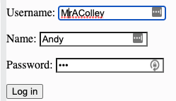

# Logins Cliente/Servidor

Cuando aprendimos sobre **repl.db**, mencionamos la idea de un modelo **cliente/servidor** para almacenar datos en un lugar y distribuirlos a múltiples usuarios. Este modelo es la forma de superar el problema con repl.db de que cada usuario tenga su propia copia de la base de datos.

Bien, ahora podemos usar Flask como servidor web. Podemos construir este modelo cliente-servidor para almacenar datos de forma persistente en la repl (el **servidor**) y hacer que múltiples usuarios que accedan al sitio web a través de la URL (los **clientes**) puedan acceder a ellos.


## Empezar

Anteriormente, hemos construido sistemas de login usando Flask & HTML. Vamos a empezar con uno de esos sistemas y adaptarlo para usar un diccionario en su lugar.

👉 Primero, recordemos cómo funciona el sistema. Aquí está el código de Flask. Lee los comentarios para ver las explicaciones de lo que hace:

```python
from flask import Flask, request, redirect
# imports request and redirect as well as flask

app = Flask(__name__, static_url_path='/static')
# path to the static file that stores my images

users = {}
users["david"] = {"password" : "Baldy1"}
users["katie"] = {"password" : "k8t"}
# A dictionary hard coded into the program that stores the login details for two users


@app.route('/login', methods=["POST"])
def login():
  form = request.form

  try:
    if users[request.form["username"]]["password"]== request.form["password"]:
      return redirect("/yup")
    else:
      return redirect("/nope")
  except:
    return redirect("/nope")
# Login checking code - uses POST because it's dealing with usernames & passwords so we want encryption

# If the user details are correct, they get a lovely success gif, if not, they get a 'nope' gif.

# Try except used to load the 'nope' in case there's an error.

@app.route("/nope")
def nope():
  return """"""

@app.route("/yup")
def yup():
  return """"""

# The two methods above load the relevant gif depending on the result of the '/login' method

@app.route('/')
def index():
  page = ""
  f = open("login.html", "r")
  page = f.read()
  f.close()
  return page

# Loads the login HTML page that I've built separately on run.

app.run(host='0.0.0.0', port=81)
```

## Static Folder
👉 Tambien hemos creado una carpeta 'static' conlos gifs, y hemos escrito un login basico en una pagina HTML en una carpeta aparte llamado `login.html`


👉 Este es el codigo para el login en html:

```html
<form method="post" action="/login">
  <p>Username: <input type="text" name="username" required></p>
  <p>Password: <input type="password" name="password" required></p>
  <button type="submit">Log in</button>
</form>
```

El **problema** con esta tecnica es que el diccinario está codificado en el codigo de Flask.


### En la proxima pagina, vamos a mirar como usar una base de datos para los detalles del login

# Almacenar y usar datos

👉 Para sustituir el diccionario por una base de datos, primero necesito importar repl.db.


```python
from flask import Flask, request, redirect
from replit import db

```

## Almacenando Los Datos
👉 A continuación, voy a borrar la línea que define el diccionario y cambiar la asignación de las dos líneas siguientes para almacenar los datos en la base de datos en su lugar.

```python
db["david"] = {"password" : "Baldy1"}
db["katie"] = {"password" : "k8t"}

```
👉 Ahora **ejecuta el programa** para añadir los datos al diccionario. Puedo decir que ha funcionado porque el panel de base de datos ahora muestra 2 keys:


👉 Luego **comenta estas líneas** - no querrás añadir los datos más de una vez.

```python
#db["david"] = {"password" : "Baldy1"}
#db["katie"] = {"password" : "k8t"}

```

## Using The Data

👉 Ahora voy a cambiar mi subrutina `login` para que haga referencia a la base de datos en lugar de al diccionario `users{}`.

```python
@app.route('/login', methods=["POST"])
def login():
  form = request.form
  try:
    if db[request.form["username"]]   ["password"]== request.form["password"]:
      return redirect("/yup")
    else:
      return redirect("/nope")
  except:
    return redirect("/nope")
```

### ¡Pruébalo!

# 👉 Desafío del día 84

El reto de hoy es construir un sitio web en flask con un formulario de registro.

El formulario de registro debe:

1. Pedir nombre, nombre de usuario y contraseña.
2. Crear una cuenta de usuario en una repl db usando estos datos.
3. Dirigirle al formulario de inicio de sesión, que obtiene el nombre de usuario y la contraseña como entrada.
4. Si los datos son válidos, aparecerán en pantalla "Hola" y el nombre del usuario.

Ejemplo:





<detalles> <sumario> 💡 Pistas </sumario>
- Obtener las claves de la base de datos usando `db.keys`.  
- Usa `if form["username"] not in keys` para comprobar si el usuario existe o no.

</detalles>