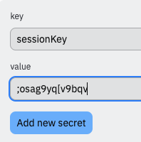
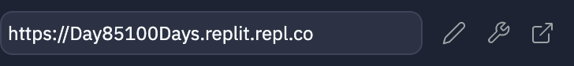
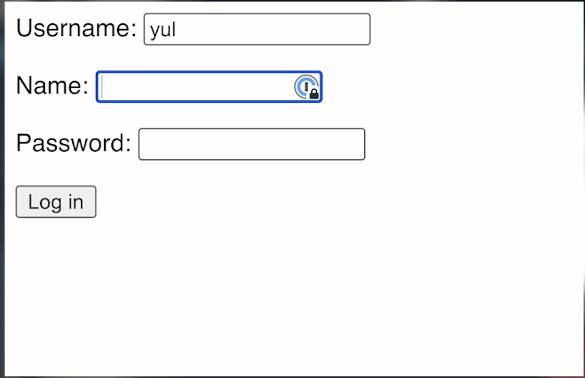

# HTTP y Sesiones

Uno de los principales **protocolos** (reglas que gobiernan cómo se comunican los ordenadores) en la web se llama [**HTTP**](https://www.smarty.com/articles/what-is-http#:~:text=HTTP%20stands%20for%20%22HyperText%20Transfer,on%20the%20world%20wide%20web).

HTTP es lo que se conoce como un protocolo **sin estado** (stateless). Esto significa que no "recuerda" cosas. 

Es un poco como mantener una conversación con un pez dorado. Puedes hacer una pregunta y obtener una respuesta, pero cuando haces una pregunta posterior, la original ya ha sido olvidada, al igual que quién eres y de qué estabas hablando.

Entonces, si HTTP es apátrida, ¿cómo es que mi sitio de noticias se acuerda de darme el tiempo de mi ciudad natal, mi tienda en línea preferida basada en un río sudamericano me dice cuándo es el momento de pedir más multivitaminas, y estoy justificadamente orgulloso de mi racha de éxitos de 100 días?

La respuesta es.........

## Sesiones

Las sesiones son una forma de almacenar archivos en tu ordenador que permiten a un sitio web mantener un registro de "conversaciones" y "preguntas" anteriores que has hecho.

Mediante el uso de sesiones, podemos almacenar esta información sobre el usuario para acceder a ella más tarde. Esto es realmente útil a la hora de crear cosas como sistemas de login.

Por defecto, una sesión está activa hasta que se cierra el navegador, pero podemos ajustarlo más adelante.

👉 Pongamos en marcha las sesiones importando todo lo clásico: importando `session` y añadiendo una **key** a la definición de nuestra app.

La clave se usará para encriptar los datos almacenados por la sesión, de forma que el usuario no pueda acceder a ellos.  La clave debe ser algo larga, difícil de adivinar y **no almacenada en el código fuente**. Voy a utilizar la función **secrets** de Replit para almacenar la clave.

Mi clave es sólo una cadena sin sentido, pero puedes hacer lo que quieras. Una vez creada la clave, puedes elegir 'insertar' para añadirla a tu código a continuación:



👉 Ahora voy a crear el código e insertar mi clave (NOTA: tendrás que insertar la clave de sesión cada vez que `ejecutes` el código):

```python
from flask import Flask, request, redirect, session # extra session import
import os

app = Flask(__name__)
app.secret_key = os.environ['sessionKey'] # new line to include the key, inside [''] is the key you created

@app.route('/')

def index():
  return 'Hello from Flask!'

app.run(host='0.0.0.0', port=81)
```
## Information from the user
👉 Ahora, vamos a obtenet informacion del usuario, asi que hemos creado un rapido formulario HTML e importado a nuestro Flask. Aqui está el codigo, lo hemos hecho por ti.

```html
<form method="post" action="setName">
  <p>Name: <input type="text" name="name"></p>
  <button type="submit">Submit</button>
</form>
```
## Importa la pagina del formulario
```python
from flask import Flask, request, redirect, session
import os

app = Flask(__name__)
app.secret_key = os.environ['sessionKey']

@app.route('/')

def index():
########################### NEW BIT
  # Import the form page
  page = ""
  f = open("form.html", "r")
  page = f.read()
  f.close()
  return page
##############################
app.run(host='0.0.0.0', port=81)
```
## Almacena el nombre
👉 Ahora quiero almacenar el nombre introducido por el usuario en una sesión.  Para ello voy a definir una página que haga que esto ocurra. En la subrutina, voy a añadir este código `session["myName"] = request.form["name"]` que funciona como una entrada de diccionario, con una clave llamada `myName` y el valor que se establece a los datos del formulario.

Luego voy a enviar al usuario de vuelta a la página de inicio usando `return redirect("/")`.

Aquí está todo el código:
```python
from flask import Flask, request, redirect, session
import os

app = Flask(__name__)
app.secret_key = os.environ['sessionKey']

@app.route('/')

def index():
  page = ""
  f = open("form.html", "r")
  page = f.read()
  f.close()
  return page

###### NEW BIT #######################
@app.route("/setName", methods=["POST"])

def setName():
  session["myName"] = request.form["name"]
  return redirect("/")
############################################
app.run(host='0.0.0.0', port=81)
```
## Extraer los datos de la sesión
👉 Ahora vamos a ver si podemos sacar esos datos de sesión y mostrarlos en pantalla para ver si ha funcionado.

Para hacer esto, necesito cambiar algunas cosas en la subrutina `index`. Aquí está la original:

```python
def index():
  # Import the form page
  page = ""
  f = open("form.html", "r")
  page = f.read()
  f.close()
  return page
```

Y aquí está la nueva versión. He añadido:
1. Una sentencia `if` para comprobar si esa clave existe realmente.
2. 2. Una sentencia `session.get` para asignar la variable si existe.
3.  `+=` Para añadir los datos a la página 
```python
def index():
  page = ""
  myName = ""
  if session.get("myName"):
    myName = session["myName"]
  page += f"<h1>{myName}</h1>"
  f = open("form.html", "r")
  page += f.read()
  f.close()
  return page
```

## NOTA IMPORTANTE

Esto no funcionará si sólo lo ejecutas en el mini navegador en Replit, ya que no almacena los datos de sesión. Necesitas abrir el sitio en una pestaña separada (el botón en el extremo derecho) para probarlo correctamente.



# Cookies! Cookies!

Sesiones son efectivamente cookies en la computadora del usuario. Asi que, necesitamos una manera para borrarlas tambien.

:point_right: VAmos a crear un boton que nos dirija a una pagina que haga eso. Aqui esta el codigo del formulario con el boton extra.
Actualice el codigo en `form.html` para que coincida con lo siguiente:

```html
<form method="post" action="setName">
  <p>Name: <input type="text" name="name"></p>
  <button type="submit">Submit</button>
  <button type="button" onclick="location.href='/reset'">Reset</button>
</form>
```

## Reiniciar

:point_right: Ahora, vamos a construir la pagina de "reinicio". Hemos usado `session.clear()` para borarr la sesion (borra todo lo almacenado en la data) y hemos incluido un redirect para enviar nuevamente a la pagina inicial.

```python
@app.route("/reset")
def reset():
  session.clear()
  return redirect("/")
```

## **Recuerda abrir un sitio en una pestaña separada para probar que si esté funcionando correctamente.

# 👉 Desafío del día 85

El reto de hoy es ampliar tu sistema de login de ayer.

Extiéndelo así:

1. Utiliza el valor `sessions` para almacenar la información de inicio de sesión en un diccionario `sessions` en el ordenador del usuario.
2. Añade una comprobación para ver si los datos de sesiones se han establecido para el nombre de usuario **a cada página**.
3. Si no es así, devuelve al usuario a la pantalla de inicio de sesión.
4. 4. Añadir un botón de 'logout' que borre los datos de sesión y devuelva al usuario a la página de login.
5. El usuario no debería poder ir a ninguna página (aparte de 'login' a menos que haya iniciado sesión).

Ejemplo:




<detalles> <sumario> 💡 Consejos </sumario>

  - Utiliza `if form["username"] not in keys` para comprobar si un usuario ya existe.
  - Prueba a usar `if session.get("loggedIn")` para establecer el estado de inicio de sesión.

</detalles>