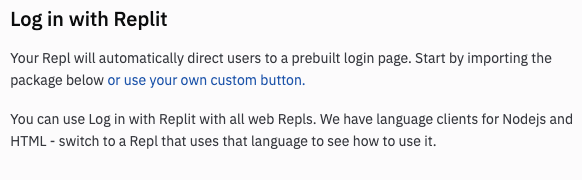
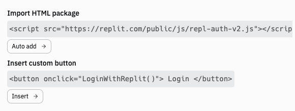
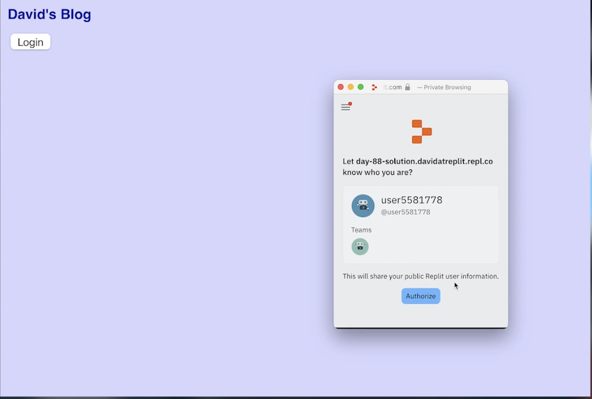

# Delicadeza de autenticación

Hasta ahora, hemos usado la autenticacion de Replit como un bully. Estamos forzando a los usuarios a autenticarse para cada pagina.

Para un blog, esto podria desanimar a los usuarios. Queremos que ellos sean capaces de leer nuestro genio literario online sin desanimar al usuario creando una cuenta y un login.

Hoy es sobre la delicadeza del autenticador de Replit asi que funciona un poco mas sutil.

## Botones Personalizados

Para comenzar, activaremos el autenticador del panel de archivos y entonces seleccionamos `or use a prebuilt login page`. **Aseguremosnos de hacer esto antes de escribir cualquier codigo**

:point_right: Para este momento, hemos clickeado en `usar nuestro propio boton de enlace personalizado`



:point_right: Ahora, tenemos algunos fragmentos de codigo para ~robar~ trabajar.



## Añadir una plantilla HTML

:point_right: Ahora, añadimos dentro de la plantilla HTML el boton que va a aparecer. La pagina es llamada `page.html` y puede ser encontrada en el arbol de archivos. Esta es el código:

```html
<html>
  <head>
    <title>My Website</title>
  </head>

  <body>
    <h1>Here's my site</h1>
    <p>Everyone can read this.</p>
  </body>  
</html>
```

:point_right: Y leemos esa pagina dentro de nuestro codigo Flask en `main.py`:

```python
from flask import Flask

app = Flask(__name__)

@app.route('/')
def index():
  page = ""
  f = open("page.html", "r")
  page = f.read()
  f.close()
  return page


app.run(host='0.0.0.0', port=81)
```

## Editar page.html

:point_right: Vamos a añadir la autenticacion. Para hacer esto, vamos a editar el archivo `page.html`.

1. Usamos el boton de agregar automaticamenete el paquete en el panel de autenticacion y movimos el codigo al header.
2. Usamos la opcion **Insert custom buttton** para añadir el boton al body.

Aqui esta el codigo actualizado de `page.html`

```html
<html>
  <head>
    <title>My Website</title>
    <script src="https://replit.com/public/js/repl-auth-v2.js"></script>
  </head>

  <body>
    <h1>Here's my site</h1>
    <p>Everyone can read this.</p>

    <button onclick="LoginWithReplit()"> Login </button>
  </body> 
</html>
```

Detener el codigo y re-ejecutarlo va a mostar el boton en nuestra pagina.

## Construye una pagina "hello"

Ahora vamos a construir una rapida pagina 'hello' a donde podamos redireccionar al usuario reconocido.

```python
def index():
  if request.headers["X-Replit-User-Name"]:
    return redirect("/hi")`
```

3. Construimos una pagina rapida `hi` que muestre el nombre de usuario.

```html
@app.route("/hi")
def hi():
  page = ""
  page += f"""<h1>{request.headers["X-Replit-User-Name"]}</h1>"""
  return page
```

4. Añade un corto `if` que redireccione al usuario que no este loggeado. Esto detendrá al usuario si coloca `/hi` manualmente en la URL para hacer un bypass del login.
```python
def hi():
if not request.headers["X-Replit-User-Name"]:
  return redirect("/")
```

### Aqui está el codigo completo

```python
from flask import Flask, request, redirect

app = Flask(__name__)

@app.route('/')
def index():
  if request.headers["X-Replit-User-Name"]:
    return redirect("/hi")

  page = ""
  f = open("page.html", "r")
  page = f.read()
  f.close()
  return page

@app.route("/hi")
def hi():
  if not request.headers["X-Replit-User-Name"]:
    return redirect("/")

  page = ""
  page += f"""<h1>{request.headers["X-Replit-User-Name"]}</h1>"""
  return page

app.run(host='0.0.0.0', port=81)
```

#### Intentalo

##

# ¿Cuál es la mejor clave?

El nombre de usuario puede no ser la mejor información para identificar a un usuario porque el usuario puede cambiarlo. Lo que es único y nunca cambia es su **ID de usuario** - esta sería una buena pieza de información para usar como clave porque es única y permanente para cada usuario.

También podemos obtener información sobre:
- A qué equipos pertenece un usuario.
- Roles (profesor, estudiante, personal de Replit, etc.)
- Perfil

## Mostrar la foto

Sí, eso sería *genial*, ¿no? Como un libro de caras, un libro de fotos, una novela de caras ....Ok, voy a parar ahora.

De todos modos, vamos a añadir la foto de perfil del usuario a la página `hi`:

👉 Aquí está todo el código:

```python
from flask import Flask, request, redirect

app = Flask(__name__)

@app.route('/')
def index():
  if request.headers["X-Replit-User-Name"]:
    return redirect("/hi")

  page = ""
  f = open("page.html", "r")
  page = f.read()
  f.close()
  return page

@app.route("/hi")
def hi():
  if not request.headers["X-Replit-User-Name"]:
    return redirect("/")
  
  page = ""
  page += f"""<h1>{request.headers["X-Replit-User-Name"]}</h1>"""

  ###### The new bit ##################
  page += f""""""
  
  return page

app.run(host='0.0.0.0', port=81)
```

## ¡Pruébalo!
# 👉 Reto del día 88

El reto de hoy es adaptar de nuevo el motor de tu blog.

Tu programa debe:

1. Permitir que la página normal de tu blog sea visible para cualquiera, independientemente del estado de inicio de sesión.
2. Si un usuario inicia sesión y eres tú, llevarlo a la página de administración.
3. Si un usuario se conecta y no eres tú, ¡repréndelo por travieso! 

Ejemplo:



<detalles> <sumario> 💡 Consejos </sumario>

- Para comprobar si el usuario eres tú o no (se trata de un ID de usuario genérico), utiliza
  
```python
  userid = request.headers['X-Replit-User-Id']
  if userid != "13197838":
    return redirect("/")
```
</detalles>
