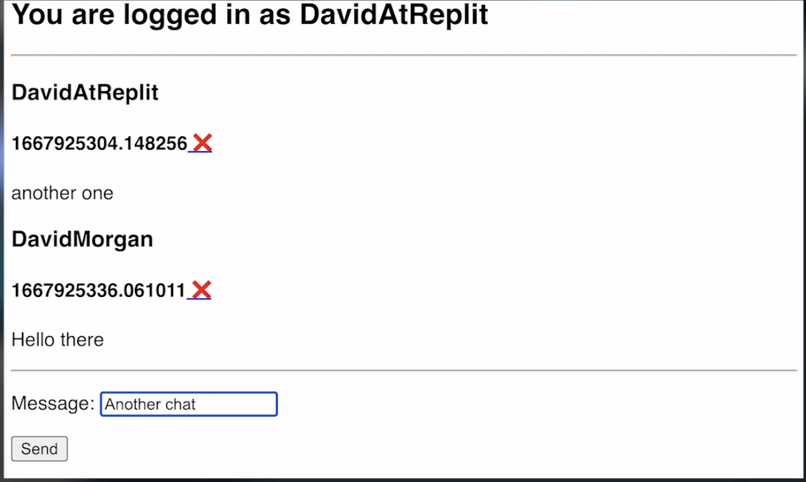

# 👉 Desafío del día 89

El reto de hoy es construir una app de chat comunitario.

1. Crea una pantalla de inicio de sesión. Puedes usar la versión simple o compleja de autenticación Replit. Depende de ti.
2. Una vez autenticados, los usuarios serán dirigidos a una sala de chat donde:
    1. Pueden ver los últimos cinco mensajes en pantalla.
    2. Puden añadir un nuevo mensaje.
3. Cada mensaje debe mostrarse con el nombre de usuario y la foto de perfil del autor.
4. Permitir **sólo su** nombre de usuario para ser un administrador. Esto debería:
    1. Darte a ti y sólo a ti acceso al botón 'admin'.
    2. Darte el poder de borrar cualquier mensaje del foro con un botón de borrar.

5. No te preocupes por la actualización automática del chat todavía. No vamos a entrar en Javascript en estos 100 días.

Ejemplo:

<detalles> <sumario> 💡 Consejos </sumario>

- Utilizar replit db para almacenar mensajes. 
- Utilice una marca de tiempo como clave para cada mensaje.
- Asegúrese de que el ID del usuario / nombre de usuario, etc está en el diccionario, así el mensaje.

</detalles>

Traducción realizada con la versión gratuita del traductor DeepL.com