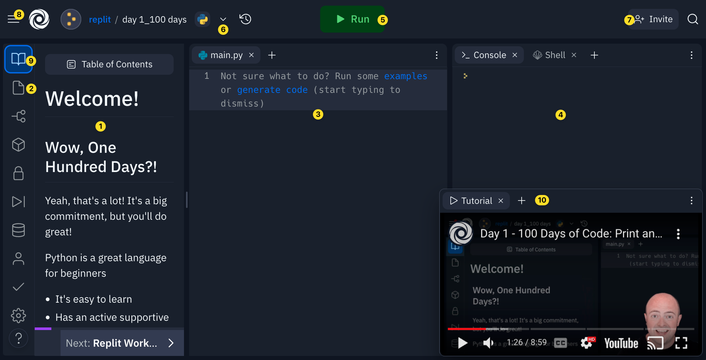

# 100 Days of Python - Repositorio de Aprendizaje
## Descripción
Este repositorio registra mi progreso mientras participo en el programa de 100 días de Python en replit.com. El objetivo es aprender Python dedicando de 10 a 15 minutos al día.

## Entorno de Desarrollo
El entorno de desarrollo está basado en Replit, que proporciona las siguientes herramientas:

1. Tutorial: Accesible desde el ícono 📖 (9), incluye la transcripción del vídeo y el código de ayuda.

2. Archivos: Puedo ver y cargar diferentes archivos, como recursos (imágenes, gifs, etc.), desde aquí.

3. Ventana de Codificación: Donde escribo la mayor parte del código. Aquí también puedo ver los archivos.

4. Consola: Muestra la salida del programa. Todo lo que le digo al programa que muestre a los usuarios aparecerá aquí.

5. Ejecutar: Ejecuta el código.

6. Publicar: Comparte el código con la comunidad para que otros lo vean y modifiquen.

7. Invitar: Permite que otra persona edite mi código en vivo en el modo multijugador.

8. Hamburguesa: Vuelve al menú principal.

9. Botón Tutorial: Abre el panel del tutorial si lo he cerrado.

10. Video Tutorial: Proporciona un video tutorial para seguir junto con el aprendizaje.

| Dia    |  README    |  Codigo   |
|-------|---------|--------|
| Dia 1 | [*print()*](./Dia-01/README.md) | [Codigo](./Dia-01/main.py) |
| Dia 2 | [*Input y variables*](./Dia-02/README.md) | [Codigo](./Dia-02/main.py) |
| Dia 3 | [*Concatenar*](./Dia-03/README.md) | [Codigo](./Dia-03/main.py) |
| Dia 4 | [*Concatenar pt2*](./Dia-04/README.md) | [Codigo](./Dia-04/main.py) |
| Dia 5 | [*Condiciones if*](./Dia-05/README.md) | [Codigo](./Dia-05/main.py) |
| Dia 6 | [*¿QUE ES **elif**?*](./Dia-06/README.md) | [Codigo](./Dia-06/main.py) |
| Dia 7 | [*Anidados*](./Dia-07/README.md) | [Codigo](./Dia-07/main.py) |
| Dia 8 | [*Reto*](./Dia-08/README.md) | [Codigo](./Dia-08/main.py) |
| Dia 9 | [*CAmbio de tipo*](./Dia-09/README.md) | [Codigo](./Dia-09/main.py) |
| Dia 10 | [*Un poco de matematica*](./Dia-10/README.md) | [Codigo](./Dia-10/main.py) |
| Dia 11 | [*Reto*](./Dia-11/README.md) | [Codigo](./Dia-11/main.py) |
| Dia 12 | [*Debug my code*](./Dia-12/README.md) | [Codigo](./Dia-12/main.py) |
| Dia 13 | [*Reto: Generador de calificaciones*](./Dia-13/README.md) | [Codigo](./Dia-13/main.py) |
| Dia 14 | [*Two Players 🪨📄✂️*](./Dia-14/README.md) | [Codigo](./Dia-14/main.py) |
| Dia 15 | [*Todo sobre los loops*](./Dia-15/README.md) | [Codigo](./Dia-15/main.py) |
| Dia 16 | [*Bucle infinito*](./Dia-16/README.md) | [Codigo](./Dia-16/main.py) |
| Dia 17 | [*Cheat code*](./Dia-17/README.md) | [Codigo](./Dia-17/main.py) |
| Dia 18 | [*Reto*](./Dia-18/README.md) | [Codigo](./Dia-18/main.py) |
| Dia 19 | [*Bucle for*](./Dia-19/README.md) | [Codigo](./Dia-19/main.py) |
| Dia 20 | [*Range*](./Dia-20/README.md) | [Codigo](./Dia-20/main.py) |
| Dia 21 | [*Reto*](./Dia-21/README.md) | [Codigo](./Dia-22/main.py) |
| Dia 22 | [*Librerias*](./Dia-22/README.md) | [Codigo](./Dia-22/main.py) |
| Dia 23 | [*Subrutinas*](./Dia-23/README.md) | [Codigo](./Dia-23/main.py) |
| Dia 24 | [*Parametros*](./Dia-24/README.md) | [Codigo](./Dia-24/main.py) |
| Dia 25 | [*return*](./Dia-25/README.md) | [Codigo](./Dia-25/main.py) |
| Dia 26 | [*Otras librerias*](./Dia-26/README.md) | [Codigo](./Dia-26/main.py) |
| Dia 27 | [*Reto*](./Dia-27/README.md) | [Codigo](./Dia-27/main.py) |
| Dia 28 | [*Reto*](./Dia-28/README.md) | [Codigo](./Dia-28/main.py) |
| Dia 29 | [*Los secretos del `print()`*](./Dia-29/README.md) | [Codigo](./Dia-29/main.py) |
| Dia 30 | [*f-string*](./Dia-30/README.md) | [Codigo](./Dia-30/main.py) |
| Dia 31 | [*Reto*](./Dia-31/README.md) | [Codigo](./Dia-31/main.py) |
| Dia 32 | [*Listas*](./Dia-32/README.md) | [Codigo](./Dia-32/main.py) |
| Dia 33 | [*Lista Dinamicas*](./Dia-33/README.md) | [Codigo](./Dia-33/main.py) |
| Dia 34 | [*Pretty Print()*](./Dia-34/README.md) | [Codigo](./Dia-34/main.py) |
| Dia 35 | [*Reto*](./Dia-35/README.md) | [Codigo](./Dia-35/main.py) |
| Dia 36 | [*Manipulacion de los string*](./Dia-36/README.md) | [Codigo](./Dia-36/main.py) |
| Dia 37 | [*Cortar Strings*](./Dia-37/README.md) | [Codigo](./Dia-37/main.py) |
| Dia 38 | [*Strings y bucles*](./Dia-38/README.md) | [Codigo](./Dia-38/main.py) |
| Dia 39 | [*El Ahorcado*](./Dia-39/README.md) | [Codigo](./Dia-39/main.py) |
| Dia 40 | [*Diccionarios*](./Dia-40/README.md) | [Codigo](./Dia-40/main.py) |
| Dia 41 | [*Diccionarios con bucles*](./Dia-41/README.md) | [Codigo](./Dia-41/main.py) |

Para calcular el progreso segun la fecha actual, uso este [código](https://gist.github.com/borgesmj/7271f7d6a02e10024227a468f537c628) o ejecuta directo en este [enlace](https://replit.com/@borgesmj19/Calcular-progreso)
