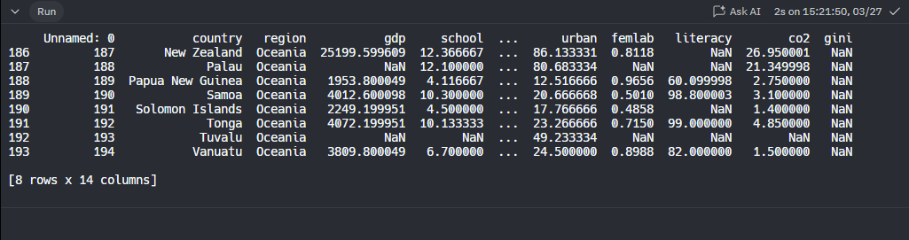

# Introduccion al Analisis de datos con Python

## ¿En que consiste el curso?
Taller introductorio al analisis de datos, en el cual se trabajará con el lenguaje Python, considerando su potencial y usos para el analisis de datos. El taller considera manipulacion de datos, visualizacion y modelacion, lo cual permitirá a los estudiantes manipular, analizar y presentar datos de acuerdo a distintas necesidades

### Unidades de aprendizaje
* Análisis de datos: codificar programa en Python, a traves de operadores matematicos y metodos elementales, para generar estadisticas basicas a partir de la informacion cargada.
* Visualizacion de datos: generar graficos utilizando **Seaborn**, utilizando parametros de acuerdo a necesidades y acorde a la data.
* Modelacion: codificar modelo de regresion lineal generando un grafico **regplot** para entender/interpretar los resultados obtenidos.

### Plataforma y software
* [Google Colaboratory](https://colab.research.google.com/)
* [Anaconda](https://www.anaconda.com/)
* [Visual Studio Code](https://code.visualstudio.com/)

### ¿Por que es importante aprender analisis de datos?
Porque dia a dia se generan millones de datos cada segundo y el desafio para los profesionales es sacrale provecho a toda la informacion que se genera. Se puede comenzar con un analisis de grafico simple, generar reporteria automatica, chatbots, sistemas de recomendacion como netflix o spotify.

### Herraientas de analisis de datos:
Dentro de las herramientas de analisis de datos, existen muchas posibilidades, pero nosorros nos enfocaremos en usar el lenguaje Python.

### ¿Que aprenderemos?
Vamos a cargar y manipular datos, vamos a generar operaciones simples, como suma, filtros, agruparemos , vamos a aprender sobre visualizaciones con graficos.

### Indicaciones
1. Descargar el archivo [Data_analisis.zip](./Data%20Analysis.zip) provisto por **Desafio LATAM**, el el computador y descomprimirlo, aqui encontraremos  el archivo con ña extemsion *.ipynb* que contiene el *.csv* con el que se trabajará en el taller.
2. Inicia una sesion en google, luego ingresa a [https://colab.research.google.com/](https://colab.research.google.com/).
3. Haz click en **Archivo** :arrow_right: **Subir cuaderno**


## Glosario
* **Acumulador**: Variable creada usualmente dentro de una iteración, que va acumulando la suma sucesiva de un dato variable.
* **Algoritmo**: Serie finita de pasos para resolver un problema. 
* Buenas prácticas de programación: Consiste en todo aquello que tenga relación con optimizar el código; desde su comprensión al leerlo, hasta el mejoramiento de su funcionamiento. Existen prácticas de programación generales, así como algunas más específicas dependiendo de cada lenguaje. Se considera parte de las buenas prácticas seguir las convenciones establecidas para cada lenguaje. 
* **Bug**: En programación, corresponde a un error o falla en nuestro programa que genera un resultado o comportamiento inesperado. 
* **Clase**: Modelo que define las propiedades y métodos que tendrá un determinado objeto. 
* **Contador**: Variable que, dentro de una iteración, va aumentando su valor de 1 en 1. 
* **Debug**: Corresponde al proceso de buscar y resolver conflictos o 'bugs' en nuestros programas. Para ello existen herramientas especializadas. 
* **De código abierto**: Término con el que se conoce al software distribuido y desarrollado libremente con licencias que permiten su implementación, modificación y distribución. 
* **Documentación/Documentar el código**: La documentación corresponde a líneas dentro del código que no se ejecutan, y que explican qué está haciendo el código escrito en esa sección, notas relevantes, ejemplos, etc. Documentar el código es un ejemplo de una buena práctica de programación. Además de escribir la documentación en el código mismo del programa, usualmente es posible también acceder a ella a través de páginas web, para el caso de un lenguaje completo, o de una librería específica. 
* **Editor de texto**: Software que permite crear y modificar archivos compuestos únicamente por textos sin formato, conocidos comúnmente como archivos de texto o “texto plano”. 
* **Framework**: Conjunto de herramientas para un propósito. Estas herramientas permiten estandarizar la forma en que se construye el programa.
* **Función**: Bloques de código reutilizables que permiten crear soluciones modulares. Las funciones en Python, están definidas por sí mismas y no pertenecen a ninguna clase. 
* **IDE** (Integrated Desktop Environment): Corresponde a un software que contiene un set de herramientas para desarrollo de software. Un IDE normalmente contiene un editor de texto, compilador o intérprete y herramientas de debug, entre otras funcionalidades. 
* **Indentación**: También conocido como sangrado. Consiste en espacios vacíos que se dan antes de una instrucción para especificar que está dentro de un contexto. 
* **Imprimir en pantalla**: Definir en nuestro código, de manera explícita, que un dato debe ser mostrado en la pantalla a través de instrucciones del tipo print. 
* **Importar**: Se refiere a traer código externo al código que se está escribiendo. Esto se logra mediante la instrucción *import*. Se pueden importar librerías, o archivos propios de extensión “.py”. 
* **Interpolación**: Acción que permite insertar el valor de una variable dentro de una cadena de texto. 
* **Kernel de Python**: Corresponde al servidor levantado en el computador que permitirá ejecutar Python. Se ejecuta al escribir la instrucción python desde la terminal. Otro kernel muy utilizado es IPython, y se ejecuta desde la terminal con la instrucción ipython. El kernel es también el que hace posible hacer bloques de código en Jupyter Notebook. 
* **Lenguaje de programación**: Un lenguaje de programación es un lenguaje diseñado para describir el conjunto de acciones que un computador debe ejecutar. Por lo tanto, un lenguaje de programación es un modo práctico para que los seres humanos puedan dar instrucciones a un equipo. 
* **Librería**: Las "bibliotecas" (su origen es la palabra "library" en inglés, pero es común utilizar "librería") corresponde a un conjunto de funciones orientadas a un objetivo específico (por ejemplo, generar gráficos), estructuradas en uno o más archivos externos al programa principal que se está escribiendo. Para utilizar una librería, ésta se debe importar al código. Normalmente, son de código abierto, y se puede acceder a ellas, o descargarlas, desde un gestor de paquetes, el cual varía para cada lenguaje. 
* **Llamar**: Se refiere a escribir el nombre de una variable, para obtener su valor, o el de una función, para utilizarla. En el caso de llamar a una función, se debe agregar paréntesis () al final del nombre, y agregar parámetros de ser necesario.
* **Método**: Los métodos son acciones o funciones que puede realizar un objeto. Python ofrece un conjunto de métodos ya creados previamente. Estos métodos dependen del tipo de objeto con el que estemos trabajando. Un método es parte de una clase, es decir, es parte de la funcionalidad que le damos a un objeto. Por tanto, siempre va a estar asociado a un objeto. Para utilizarse deben ser "llamados".
* **Métodos nativos/Built-in methods**: Corresponden a métodos integrados en el lenguaje mismo. Para utilizarlos, no es necesario crear un objeto; pueden ser llamados directamente. 
* **Objeto**: Unidad o elemento que corresponde a la instancia de una clase. El objeto tiene propiedades y métodos asociados, y según ellos, se puede realizar distintas operaciones sobre el objeto. 
* **Paradigma de programación**: Representa un enfoque particular para diseñar soluciones utilizando un lenguaje de programación. En el caso de Python, se utiliza el Paradigma Orientado a Objetos. 
* **Programa**: Un programa informático o programa de computadora es una secuencia de instrucciones, escritas para realizar una tarea específica en una computadora. 
* **Prompt**: Se llama prompt al carácter o conjunto de caracteres que se muestran en un terminal para indicar que está a la espera de órdenes. 
* **Refactorización (refactoring)**: Corresponde al proceso de reestructurar un código fuente, alterando su estructura interna sin modificar su comportamiento. Normalmente se aplica para optimizar el funcionamiento del código y/o facilitar su lectura por parte del programador. 
* **Script**: Es un programa usualmente simple que se puede ejecutar desde el terminal. 
* **Terminal**: También se le llama "Consola". Se refiere a la "Línea de comandos" de nuestro sistema operativo, por medio de la cual se pueden ejecutar distintas instrucciones, o comandos, para distintos fines. También se le conoce como "CLI", por sus siglas en inglés ("CommandLineInterface"). 
* **Tipo de dato**: O tipo de objeto. Corresponde a la naturaleza o propiedad de un objeto. Los tipos de datos más utilizados son integer, float, string y boolean. 
* **Variable**: Contenedor de un valor o del resultado de una expresión. Su valor puede cambiar a lo largo del código.

## Analisis de datos
Ahora que estamos en contexto, sabemos lo elemental de programacion, la sintaxis de python, las variables, las librerias, etc. 
Lo primero que haremos es realizar un comentario.
Estaremos trabajando en el archivo **Data Analisis.ipynb** de Google Colab
Python cuando sabe que hay un comentario, lo ignora, solo se mantienen en codigo

Los lenguajes de programación cuentan con una serie de herramientas básicas incorporadas, como las que acabamos de ver. Sin embargo, existen expansiones de funcionalidades que han sido derrolladas previamente de modo de ahorrarnos trabajo y hacer todo más simple.

### Dependencias
Estas "expansiones" se llaman  **bibliotecas o librerías**

```python
#Importemos algunas de las librerías más clásicas para el manejo de datos en Python
#Pandas es la librería básica para la manipulación y análisis de datos
import pandas as pd
#Numpy es la biblioteca para crear vectores y matrices, además de un conjunto grande de funciones matemáticas
import numpy as np
#Seaborn es una librería que usamos para graficar
import seaborn as sns
#Statsmodels es la biblioteca para realizar modelos
import statsmodels.formula.api as smf
```

* [Pandas](https://pandas.pydata.org/docs/)
* [Numpy](https://numpy.org/doc/stable/)
* [Seaborn](https://seaborn.pydata.org/)
* [Statsmodels](https://www.statsmodels.org/stable/index.html)

## Carga de datos
Pandas es la libreria que nos permitira la carga y analisis de datos
## Ahora, ¡manos a la obra!
Trabajaremos con el dataset 'nations', el cual contiene información sobre diferentes atributos de desarrollo humano en 194 países, recolectados por las Naciones Unidas.

-   Contiene información a nivel mundial sobre demografía:
    -   `country`: País.
    -   `region`: Continente del país.
    -   `gdp`: Producto Interno Bruto per cápita, precios 2005.
    -   `school`: Promedio años de escolaridad.
    -   `adfert`: Fertilidad adolescente (Nacimientos 1:1000 en mujeres entre 15 y 19).
    -   `chldmort`: Probabilidad de muerte antes de los 5 años por cada 1000.
    -   `life`: Esperanza de vida al nacer.
    -   `pop`: Población total.
    -   `urban`: Porcentaje de población urbana.
    -   `femlab`: Tasa entre hombres y mujeres en el mercado laboral.
    -   `literacy`: Tasa de alfabetismo.
    -   `co2`: Toneladas de Co2 emitidas per cápita.
    -   `gini`: Coeficiente de desigualdad del ingreso.

```python
import pandas as pd
df_nations = pd.read_csv("https://raw.githubusercontent.com/DireccionAcademicaADL/Nations-DB/main/nations.csv", encoding="ISO-8859-1")
print(df_nations)
```
Python nos regresa una muestra de nuestro data set


### Metodos de pandas
#### HEAD()
Uno de los metodos mas utilizados y que nos va a servir mucho para realizar analisis de datos es el metodo de `head`, este  metodo nos mostrará las primeras 5 observaciones de nuestro data set

```python
import pandas as pd
df_nations = pd.read_csv("https://raw.githubusercontent.com/DireccionAcademicaADL/Nations-DB/main/nations.csv", encoding="ISO-8859-1")
print(df_nations.head())
```

Nos regresa esto:


#### TAIL()
El metodo `tail()` nos regresa las ultimos 5 entradas de la tabla

```python
import pandas as pd
df_nations = pd.read_csv("https://raw.githubusercontent.com/DireccionAcademicaADL/Nations-DB/main/nations.csv", encoding="ISO-8859-1")
print(df_nations.tail())
```


Si le enviamos un paramentro en `tail()` nos traera la cantidad que le pidamos en ese parametro

```python
import pandas as pd
df_nations = pd.read_csv("https://raw.githubusercontent.com/DireccionAcademicaADL/Nations-DB/main/nations.csv", encoding="ISO-8859-1")
print(df_nations.tail(8))
```



#### DROP()
nos ayuda a eliminar columnas de nuestro data set
En nuestro caso vamos a eliminar una columna llamada `UNNAMED: 0`para que nuestro data set tenga las columnas necesarias

```python
import pandas as pd

df_nations = pd.read_csv("https://raw.githubusercontent.com/DireccionAcademicaADL/Nations-DB/main/nations.csv", encoding="ISO-8859-1")
df_nations.drop(columns=["Unnamed: 0"], inplace=True)  # Eliminar la columna "Unnamed: 0" del DataFrame original
print(df_nations.head())  # Imprimir las primeras filas del DataFrame modificado
```


#### .columns
Nos regresa una lista de los nombres de las lulumnas que tiene nuestro data set

```python
import pandas as pd

df_nations = pd.read_csv("https://raw.githubusercontent.com/DireccionAcademicaADL/Nations-DB/main/nations.csv", encoding="ISO-8859-1")
df_nations.drop(columns=["Unnamed: 0"], inplace=True)
print(df_nations.columns) 
```

Si queremos ver una columna en especifico la colocamos entre corchetes

```python
import pandas as pd

df_nations = pd.read_csv("https://raw.githubusercontent.com/DireccionAcademicaADL/Nations-DB/main/nations.csv", encoding="ISO-8859-1")
df_nations.drop(columns=["Unnamed: 0"], inplace=True)
print(df_nations['region']) 
```

#### Crear una columna nueva
Otra cosa que podemos hacer con el data frame de pandas es crear nuevas columnas. Se crea directamente, y como ejemplo, vamos a ver como crear la columna **gdp** en pesos del año 2021


```python
import pandas as pd

df_nations = pd.read_csv("https://raw.githubusercontent.com/DireccionAcademicaADL/Nations-DB/main/nations.csv", encoding="ISO-8859-1")
df_nations.drop(columns=["Unnamed: 0"], inplace=True)
df_nations["gdp_pesos2021"] = df_nations["gdp"]*850
print(df_nations.head()) 
```


### Analisis descriptivo
 Para continuar con nuestro análisis de los datos, vamos a plantear una serie de interrogantes que guiarán el taller:

1.  ¿Qué tipos de atributos nos encontramos en el dataset?
2.  ¿Cuántos datos tenemos en cada región?
3.  ¿Cuántos países tienen índices de CO_2 mayores que el promedio?
4.  ¿Que se puede decir del alfabetismo en áfrica o europa?

#### Metodo `.info()`

```python
import pandas as pd
df_nations = pd.read_csv("https://raw.githubusercontent.com/DireccionAcademicaADL/Nations-DB/main/nations.csv", encoding="ISO-8859-1")
df_nations.drop(columns=["Unnamed: 0"], inplace=True)
df_nations["gdp_pesos2021"] = df_nations["gdp"]*850
print(df_nations.info()) 

```

Nos regresa una tabla que nos indica cuales son los nombres de las columnas, cuantas celdas de esas columnas no tienen valor `NULL` y el tipo de dato


#### Metodo `describe()`
Otro método muy útil cuando estamos explorando los datos, es `describe()`; el cuál calcula estadísticas básicas de los atributos numéricos (float o int), dejando fuera los atributos categóricos o cualitativos.

```python
import pandas as pd

df_nations = pd.read_csv("https://raw.githubusercontent.com/DireccionAcademicaADL/Nations-DB/main/nations.csv", encoding="ISO-8859-1")
df_nations.drop(columns=["Unnamed: 0"], inplace=True)
df_nations["gdp_pesos2021"] = df_nations["gdp"]*850
print(df_nations.describe()) 

```


Tambien podemos llamarlo para una sola columna

```python
import pandas as pd

df_nations = pd.read_csv("https://raw.githubusercontent.com/DireccionAcademicaADL/Nations-DB/main/nations.csv", encoding="ISO-8859-1")
df_nations.drop(columns=["Unnamed: 0"], inplace=True)
df_nations["gdp_pesos2021"] = df_nations["gdp"]*850
print(df_nations['gini'].describe()) 

```


#### Metodo `.mean()`
Podemos traer el promedio
```python
import pandas as pd

df_nations = pd.read_csv("https://raw.githubusercontent.com/DireccionAcademicaADL/Nations-DB/main/nations.csv", encoding="ISO-8859-1")
df_nations.drop(columns=["Unnamed: 0"], inplace=True)
df_nations["gdp_pesos2021"] = df_nations["gdp"]*850
print(df_nations['gini'].mean()) 

```

```
40.4777778107443
```
#### Metodo `.count()`
```python
import pandas as pd

df_nations = pd.read_csv("https://raw.githubusercontent.com/DireccionAcademicaADL/Nations-DB/main/nations.csv", encoding="ISO-8859-1")
df_nations.drop(columns=["Unnamed: 0"], inplace=True)
df_nations["gdp_pesos2021"] = df_nations["gdp"]*850
print(df_nations['gini'].count()) 
```

```
81
```

#### Metodo `.groupby()`
```python
import pandas as pd

df_nations = pd.read_csv("https://raw.githubusercontent.com/DireccionAcademicaADL/Nations-DB/main/nations.csv", encoding="ISO-8859-1")
df_nations.drop(columns=["Unnamed: 0"], inplace=True)
df_nations["gdp_pesos2021"] = df_nations["gdp"]*850
print(df_nations.groupby(["region"])[["country"]].count()) 
```


Recordando que "Region" son los continentes y "country" los paises, este metodo nos agrupa por region y nos cuenta la cantidad de paises que hay en cada uno

#### Metodo `where()`
Este metodo nos regresa las filas que cumplan con una funcion, utilizando la libreria numpy.
Siguiendo con la manipulación de los datos, un método que nos ayuda a recodificar una variable (o crear una nueva a partir de una condición), es el método  `where()`; el cual proviene de la librería numpy y nos permite decidir, a través de una condición, qué va en el lugar de aquellas filas que cumplen la condición, y qué va en el lugar de las filas que no cumplen la condición. La sintáxis correcta de uso sería:

```
df_nations["variable"] =  **np.where**(_Condición_, valor si verdadero, valor si falso)
```

```python
import pandas as pd
import numpy as np

df_nations = pd.read_csv("https://raw.githubusercontent.com/DireccionAcademicaADL/Nations-DB/main/nations.csv", encoding="ISO-8859-1")
df_nations.drop(columns=["Unnamed: 0"], inplace=True)
df_nations["gdp_pesos2021"] = df_nations["gdp"]*850
df_nations["co2_recodificada"] = np.where(df_nations["co2"]> df_nations["co2"].mean(), 1, 0)
print(df_nations.head())
```
Aqui nos está regresando los 5 primeros paises, que si tienen emision de CO2 por encima del promedio la columna `co2_recodificada` tendrá **1** y caso contrario, tendrá **0**


Y si queremos saber cuantos son los paises que estan por encima del promedio de emision de CO2 y cuantos nos, podemos utilizar `.value_count()`

```python
import pandas as pd
import numpy as np

df_nations = pd.read_csv("https://raw.githubusercontent.com/DireccionAcademicaADL/Nations-DB/main/nations.csv", encoding="ISO-8859-1")
df_nations.drop(columns=["Unnamed: 0"], inplace=True)
df_nations["gdp_pesos2021"] = df_nations["gdp"]*850
df_nations["co2_recodificada"] = np.where(df_nations["co2"]> df_nations["co2"].mean(), 1, 0)
print(df_nations["co2_recodificada"].value_counts())

```

```
co2_recodificada
0    130
1     64
Name: count, dtype: int64
```

Y si queremos hacer que nos regrese una respuesta mas elaborada

```python
import pandas as pd
import numpy as np

df_nations = pd.read_csv("https://raw.githubusercontent.com/DireccionAcademicaADL/Nations-DB/main/nations.csv", encoding="ISO-8859-1")
df_nations.drop(columns=["Unnamed: 0"], inplace=True)
df_nations["gdp_pesos2021"] = df_nations["gdp"]*850
df_nations["co2_recodificada"] = np.where(df_nations["co2"]> df_nations["co2"].mean(), 1, 0)
cantidad = df_nations["co2_recodificada"].value_counts()[1]
print("\033[0;31m", f"Existen {cantidad} paises con emision de CO2 por encima del promedio")
```


Y si l queremos en porcentaje

```python
df_nations["co2_recodificada"].value_counts("%")
```

```
0    0.670103
1    0.329897
Name: co2_recodificada, dtype: float64
```
#### Filtros
Filtramos solo los paises que pertenezcan a África de esta manera
```python
import pandas as pd
import numpy as np

df_nations = pd.read_csv("https://raw.githubusercontent.com/DireccionAcademicaADL/Nations-DB/main/nations.csv", encoding="ISO-8859-1")
df_nations.drop(columns=["Unnamed: 0"], inplace=True)
df_nations["gdp_pesos2021"] = df_nations["gdp"]*850
df_nations["co2_recodificada"] = np.where(df_nations["co2"]> df_nations["co2"].mean(), 1, 0)
# Filtro por variable "Region"
africaCountries = df_nations[df_nations["region"]=="Africa"]
print(africaCountries)
```

Para buscar la tasa de alfabetismo en Africa y Europa utilizamos el metodo .mean()

```python
import pandas as pd
import numpy as np

df_nations = pd.read_csv("https://raw.githubusercontent.com/DireccionAcademicaADL/Nations-DB/main/nations.csv", encoding="ISO-8859-1")
df_nations.drop(columns=["Unnamed: 0"], inplace=True)
df_nations["gdp_pesos2021"] = df_nations["gdp"]*850
df_nations["co2_recodificada"] = np.where(df_nations["co2"]> df_nations["co2"].mean(), 1, 0)
# Filtro por variable "Region"
df_africa = df_nations[df_nations["region"]=="Africa"]
alf_africa = df_africa["literacy"].mean()
df_europa =df_nations[df_nations["region"]=="Europe"]
alf_europa = df_europa["literacy"].mean()
print(f"La tasa de alfabetismo en Africa es de {alf_africa}")
print(f"La tasa de alfabetismo en Europa es de {alf_europa}")

```


