# Creado una web store con express y platzy

Aprovechando el fin de semana gratis de platzy, voy a hacer este curso de express para crear una web store

## Creamos la carpeta a trabajar 

```
mkdir my-store
```

## Creamos el package.json
```
npm init -y
```

## Inicializamos GIT (solo se inicializa)
```
git init
```

## Creamos los archivos de configuracion

`.gitignore`, `.eslintrc.json`, `.editorconfig`

* El archivo `.gitignore` ignora los archivos que no queremos que se suban a nuestro repositorio
La configuracion de nuestro archivo .gitignore la encontramos en [gitignore.io](https://www.toptal.com/developers/gitignore/) y colocamos `node`, `window`, `linux`, `macOS` y creamos el archivo, el código que nos genera lo copiamos y lo pegamos en nuestro .gitignore
* El archivo `.eslintrc.json` es para indicarle al linter las normas y buenas practicas a seguir en javascript, copiamos y pegamos este código en el archivo de eslintrc

```
{
  "parserOptions": {
    "ecmaVersion": 2018
  },
  "extends": [
    "eslint:recommended",
    "prettier"
  ],
  "env": {
    "es6": true,
    "node": true,
    "jest": true
  },
  "rules": {
    "no-console": "warn"
  }
}
```

* El archivo `.editorconfig` es para definir como se debe de formatear el codigo en diferentes editores, es recomendable para que todos los desarrolladores que trabajarán en el proyecto tengan la misma configuracion de editor. 
Instalamos el [plugin](https://marketplace.visualstudio.com/items?itemName=EditorConfig.EditorConfig), lo instalamos y ademas al archivo le hacemos esta configuracion:
```
# Editor configuration, see https://editorconfig.org
root = true

[*]
charset = utf-8
indent_style = space
indent_size = 2
insert_final_newline = true
trim_trailing_whitespace = true

[*.js]
quote_type = single

[*.md]
max_line_length = off
trim_trailing_whitespace = false
```


Ademas, creamos nuestro `index.js` principal, en la carpeta raiz de nuestro proyecto

## Creando tareas
Vamos a nuestro `package.json` y creamos unas tareas o scripts

```
"scripts": {
    "test": "echo \"Error: no test specified\" && exit 1",
    "dev": "nodemon index.js",
    "start": "node index.js",
    "lint": "eslint"
  },
```

Para que todo esto funcione, vamos a instalar las dependencias de desarrollo

```
npm i nodemon eslint eslint-config-prettier eslint-plugin-prettier prettier -D
```
Despues de instaladas, corremos `npm run dev` para arrancar en modo desarrollo y nos deverá regresar con exito lo que colocamos en la consola, tambien debemos colocar el comando `npm start` y tambien hará lo mismo.


## Primer servidor
Como ya preparamos todo el entorno de desarrollo y produccion, ahora podemos crear nuestro servidor con Express, procedemos a instalar express como dependencia de produccion

```
npm i express
```

Y en el archivo `index.js` procedemos a requerirla

```
const express = require('express');
const app = express();
const port = 3000;

app.get('/', (req, res) => {
  res.send('este es mi servidor express'); // este mensaje deberá aparecer en pantalla al ejecutar nuestro servidor
});

app.listen(port, () => {
  console.log('app running on port:', port);
});
```

Ejecutamos con `npm run dev`, para que se monitoree los cambios en el codigo, y vamos a [http://localhost:3000/](http://localhost:3000/) y nos estará regresando el mensaje que consiguramos.

## Enrutado

```
const express = require('express');
const app = express();
const port = 3000;

app.get('/', (req, res) => {
  res.send('este es mi servidor express');
});
// rutas de ejemplo
app.get('/nueva-ruta', (req, res) => {
  res.send('nueva ruta') // un ejemplo de una ruta distinta
})

app.get('/productos', (req, res) => {
  res.json({
    producto:"producto 1",
    precio: 100000
  })
}) // en este ámbito estaremos trabajando, regresar un .json con los datos de los productos


app.listen(port, () => {
  console.log('app running on port:', port);
});

```
Este json que es devuelto es pequeño, y por lo general son grandes archivos con multiples datos, es recomendable instalar esta [extension de Chrome](https://chromewebstore.google.com/detail/json-viewer/gbmdgpbipfallnflgajpaliibnhdgobh?hl=es&utm_source=ext_sidebar), para tener mejor visualizacion de los datos.

## API restfull
REST: **representational State Transfer**, es una convecion de backend para hacer servicios web, que general se cominican por metodos de HTTP.

+ `get`: solicitar informacion
+ `put`: Modificar/Actualizar el archivo y datos
+ `patch`: Modificar/Actualizar el archivo y datos
+ `post`: crear nuevos datos
+ `delete`: borrar o eliminar algo

| Method | /products                                                   | /products/{id}                                 |
|--------|-------------------------------------------------------------|------------------------------------------------|
| GET    | Nos regresa una lista de todos los productos                | Nos regresa un producto en especifico          |
| PUT    | Reemplaza todos los elementos de la lista (no recomendable) | Remplaza o actualiza un producto en especifico |
| PATCH  | NO APLICA                                                   | Actualiza los datos de un producto             |
| POST   | Crea una nueva lista                                        | no aplica                                      |
| DELETE | Borra todos los elementos (no recomendable)                 | Borra el producto en especifico                |

## Metodo GET
En esta clase vamos a aprender mas a fondo como funciona GET, como recibir un parametro, y como funcionan las convenciones de REST, nosrmalmente cuando tenemos una endpoint tenemos la tarea y una ID

> api.example.com/task/{id}/
Esta configuracion nos trae una tarea en especifico
> api.example.com/people/{id}/
De esta manera nos regresa los datos de un usuario en especifico
> api.example.com/users/{id}/tasks/
Asi nos estará regresando el listado de tarea de un usuario en especifico

```
const express = require('express');
const app = express();
const port = 3000;

app.get('/', (req, res) => {
  res.send('este es mi servidor express');
});
// rutas de ejemplo
app.get('/nueva-ruta', (req, res) => {
  res.send('nueva ruta'); // un ejemplo de una ruta distinta
});

app.get('/products', (req, res) => {
  // products es nuestro endPoint
  res.json([
    {
      name: 'producto 1',
      value: 2000,
    },
    {
      name: 'producto 2',
      value: 5000,
    },
  ]);
}); // en este ámbito estaremos trabajando, regresar un .json con los datos de los productos

app.get('/products/:id', (req, res) => {
  const {id} = req.params; // tomará el parametro en la url del navegador y lo colocará como un id
  res.json({
    id, // siempre que se cambia este valor en el navegador, tomará ese valor como un id y regresará el mismo producto
    name: 'producto 2',
      value: 5000,
  });
});

app.listen(port, () => {
  console.log('app running on port:', port);
});

```

Tambien podemos solicitar dos parametros en una misma url

```
app.get('/categories/:categoryId/products/:productId', (req, res)=>{ // asi podemos hacer request de dos parametros en una misma url
  const {productId, categoryId} = req.params;
  res.json({
    productId,
    categoryId,
    name: 'producto 2',
      value: 5000,
  });
})
```
y si visitamos [http://localhost:3000/categories/5555/products/1111](http://localhost:3000/categories/5555/products/1111), nos estará regresando un json con

```
// 20231117143234
// http://localhost:3000/categories/5555/products/1111

{
  "productId": "1111",
  "categoryId": "5555",
  "name": "producto 2",
  "value": 5000
}
```
## Query Params (parametros de consulta)
Los "query parameters" (parámetros de consulta) son una forma de pasar información a través de una URL en una solicitud web. Se incluyen en la parte de la URL después del signo de interrogación "?" y se utilizan para enviar datos al servidor. Estos parámetros están formados por pares de clave y valor, separados por el símbolo de igual "=" y pueden ser concatenados con el símbolo "&" si hay más de un parámetro.

Estos parametros de consulta suelen venir dentro de los metodos GET, por ejemplo, podemos tener un endpoint y por medio de parametros tipo query, podemos solicitar datos en especifico

Imaginemos el endpoint `products`

```
api.example.com/products
api.example.com/products?page=1 //nos traerá los productos en la pagina 1
api.example.com/products?limit=10&offset=0 // otro método de paginacion
api.example.com/products?region=USA // filtra los productos que tengan una region en especifica
api.example.com/products?region=USA&brand=XYZ // nos trae unos productos en especificod entro de una region en especifico
```

Veamos un ejemplo en nuestra app

```
//como los parametros query son opcionales, no van directamente junto con nuestro endpoint, como por ejemplo el :id
// creamos un nuevo endpoint
app.get('/users', (req, res) => {
  // creamos dos parametros tipo query
  const { limit, offset } = req.query;
  if (limit && offset) { // ya que estos parametros son opcionales, hay que verificar que si existen
    // si existen, regresa esos dos valores
    res.json({
      limit,
      offset
    })
    //si no, regresa una respuesta sencilla
  } else {
    res.send('no hay parametros')
  }
})

app.listen(port, () => {
  console.log('app running on port:', port);
});

```

si entramos en [http://localhost:3000/users](http://localhost:3000/users) por defecto nos regresará `no hay parametros` pero si entramos en [http://localhost:3000/users?limit=10&offset=200](http://localhost:3000/users?limit=10&offset=200), nos regresará un json:

```
// 20231118184505
// http://localhost:3000/users?limit=10&offset=200

{
  "limit": "10",
  "offset": "200"
}
```

esto nos indica que los parametros query si estan entrando.

Para otro ejemplo, introduzcamos data fake a nuestra app para que tener ejemplos mas claros:

instalamos la libreria FAKER

```
npm i @faker-js/faker
```

y ahora vamos a nuestra aplicación

```
const { faker } = require('@faker-js/faker') //Importamos el paquete

// Vamos a modificar el array de productos
app.get('/products', (req, res) => {
  const products = []
  for (let index = 0; index < 100; index++){ //creamos una iteracion hasta 100 para agregar los productos generados por faker
    products.push({
      name: faker.commerce.productName(), // nombre
      price: parseInt(faker.commerce.price(), 10), // precio
      image: faker.image.imageUrl(), // url de la imagen
    })
  }
  res.json(products);
});
```

Cuando entremos a [http://localhost:3000/products](http://localhost:3000/products) nos va a regresar un archivo json con los 100 productos

Ahora, ¿como haremos para que nuestra app, al pasarle query params nos regrese lo que estamos pidiendo?

```
// Vamos a modificar el array de productos
app.get('/products', (req, res) => {
  const products = []
  const {size} = req.query // estamos obteniendo un tamaño mediante los query params
  const limit = size || 10 // si existe el limite lo asigne a limit, si no, que lo coloque en 10
  for (let index = 0; index < limit ; index++){ // este será el limite de los productos a generar por fakee
    products.push({
      name: faker.commerce.productName(),
      price: parseInt(faker.commerce.price(), 10),
      image: faker.image.url(),
    })
  }
  res.json(products);
});
app.get('/products/:id', (req, res) => {
  const {id} = req.params;
  res.json({
    id,
    name: 'producto 2',
      value: 5000,
  });
});
```

si vamos al endpoint [http://localhost:3000/products](http://localhost:3000/products) ya que no le asignamos valor, colocará 10 productos, pero ahora pidamosle que genere [1 solo producto](http://localhost:3000/products?size=1) y si le pedimos [200 productos](http://localhost:3000/products?size=200) la app los generará.

Un error muy comun es querer crear un filtro con `http://localhost:3000/products/filter` pero esta ruta va a chocar con `http://localhost:3000/products/:id` y tomará la palabra "filter" como un id

```
app.get('/products/:id', (req, res) => {
  const {id} = req.params;
  res.json({
    id,
    name: 'producto 2',
      value: 5000,
  });
});

app.get('/products/filter', (req, res) => {
  res.send('Yo soy un filtro')
})
```

probemos [http://localhost:3000/products/filter](http://localhost:3000/products/filter) te regresará un json

```
{
  "id": "filter",
  "name": "producto 2",
  "value": 5000
}
```

y no una string que dice `yo soy un filtro`, la solucion a este problema es que todo lo que sea fijo, debe estar antes de lo que es dinamico

```
app.get('/products/filter', (req, res) => {
  res.send('Yo soy un filtro');
});

app.get('/products/:id', (req, res) => {
  const { id } = req.params;
  res.json({
    id,
    name: 'producto 2',
    value: 5000,
  });
});
```
```
const express = require('express');
const { faker } = require('@faker-js/faker');

const router = express.Router()

router.get('/', (req, res) => {
  const products = [];
  const { size } = req.query;
  const limit = size || 10;
  for (let index = 0; index < limit; index++) {
    products.push({
      name: faker.commerce.productName(),
      price: parseInt(faker.commerce.price(), 10),
      image: faker.image.url(),
    });
  }
  res.json(products);
});
router.get('/filter', (req, res) => {
  res.send('Yo soy un filtro');
});

router.get('/:id', (req, res) => {
  const { id } = req.params;
  res.json({
    id,
    name: 'producto 2',
    value: 5000,
  });
});

module.exports = router
```

Podemos notar que el endpoint `products` lo hemos borrado, pero ese lo vamos a crear en otro archivo.

Creamos un archivo dentro de este directorio llamado `index.js` al que le colocaremos el endpoint

```
const productsRouter = require('./products.router')
function routerApi(app){
  app.use('/products', productsRouter)
}

module.exports = routerApi

```
en el `index.js` de la carpeta raiz tendriamos asi el codigo

```
const routerApi = require('./Routes') // importamos el archivo de las rutas, no colocamos "index.js" porque ya ese es un archivo que se busca en automatico

app.get('/', (req, res) => {
  res.send('este es mi servidor express');
});
// rutas de ejemplo
app.get('/nueva-ruta', (req, res) => {
  res.send('nueva ruta'); // un ejemplo de una ruta distinta
});

routerApi(app) // llamamos la funcion, enviando la app como parametro
```

Ahora crearemos los otros archivos para las demas rutas

Nos quedará una estructura asi
```
node_modules
Routes
-- categories.router.js
-- index.js
-- products.router.js
-- users.router.js
index.js
```
De esta manera, nuestra app es mas mantenible para otros programadores


## POST
Es el metodo que activa o con el que normalmente deberiamos leer para hacer creacion de elementos en especifico, crear productos, crear tareas.

Para hacer un post debemos tener en cuenta dos cosas:
1. Que estamos recibiendo los datos del body y no del query params.
2. Que tenemos que mandar algo en el response.

Antes de continuar:
Hay maneras de mantener versiones de API complejas, por ejemplo, si tenemos estas url

```
api.example.com/api/v1/users/
api.example.com/api/v1/tasks/
api.example.com/api/v1/customers/
```

Si queremos hacer un ajuste, debemos pensar en todos los suistemas clientes que esten conectados a nuestra API, para eso se comienzan a hacer estructuras en las url para siguientes versiones, y si, por ejemplo, tenemos una nueva version de API de usuarios que cambia drasticamente su comportamiento, podriamos tener `api.example.com/api/v2/users`, y lo podemos gestionar este comportamiento:

En el archivo `index.js` de la carpeta router:

¿como podriamos obtener estas rutas por versiones?

Una manera sencilla es cambiar las rutas

```
function routerApi(app) {
  app.use('api/v1/products', productsRouter);
  app.use('api/v1/categories', categoriesRouter);
  app.use('api/v1/users', usersRouter);
}
```

Esta forma es sencilla, pero tambien valida, sin embargo, en una situacion donde tengamos muchas rutas, es dificil hacer mantenimiento

```
function routerApi(app) {
  app.use('api/v1/products', productsRouter);
  app.use('api/v1/categories', categoriesRouter);
  app.use('api/v1/users', usersRouter);
  app.use('api/v1/users', usersRouter);
  app.use('api/v1/users', usersRouter);
  app.use('api/v1/users', usersRouter);
  app.use('api/v1/users', usersRouter);
  app.use('api/v1/users', usersRouter);
  app.use('api/v1/users', usersRouter);
  app.use('api/v1/users', usersRouter);
}
```

Lo que hacemos es crear una ruta maestra:

```
const productsRouter = require('./products.router');
const usersRouter = require('./users.router');
const categoriesRouter = require('./categories.router');
const express = require('express');

function routerApi(app) {
  const router = express.Router(); // importamos Router desde express
  app.use('/api/v1', router)
  router.use('/products', productsRouter);
  router.use('/categories', categoriesRouter);
  router.use('/users', usersRouter);
}

module.exports = routerApi;
```
De esta manera creamos otros index con otros path para la siguiente version sin afectar a los usuarios que estén usando las versiones anterioresPara comprobar nuestra API.

Paracomprobar que el enlace esté funcionando correctamente, vamos a ir al enlace [http://localhost:3000/api/v1/products](http://localhost:3000/api/v1/products) y nos debería regresar nuestra API generada por **faker**

**Continuaremos con el método POST**

Deberiamos tener un cliente para emular los requerimientos de post, puede ser `insomnia` o `postman`.

Descargamos [insomnia](https://app.insomnia.rest/) e instalamos

Corremos el programa, y creamos un nuevo proyecto, en el cual colocaremos el metodo `GET` y el enlace `http://localhost:3000/api/v1/products`, nos regresará una respuesta satisfactoria pára nuestro requerimiento:

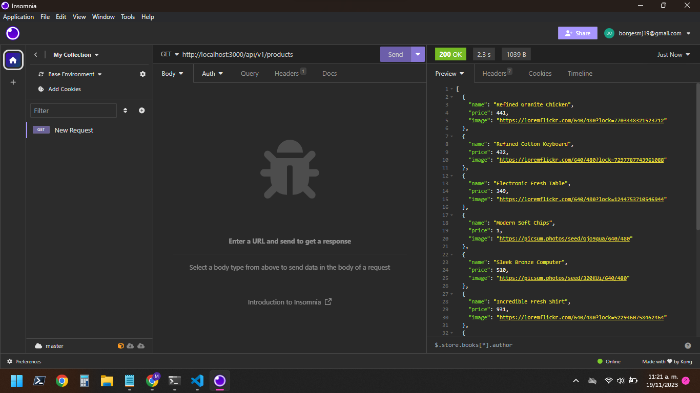

Ahora probaremos el metodo POST
Duplicamos el Metodo get para ahora hacer el metodo POST

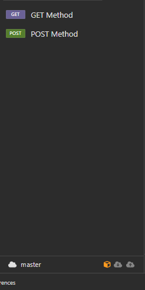

Le vamos a decir que al enlace vamos a hacer un POST em formato JSON

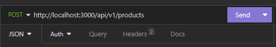

y colocamos estos valores

```
{
	"name": "new product 1",
	"price": 120000,
	"image": "https://loremflickr.com/640/480?lock=7703448321523712"
}
```
Cuando enviamos un request, lo normal es que nos regrese un `error 404`, esto debido a que no hemos creado el metodo que atienda ese metodo desde el usuario.

NOs vamos al archivo que controla el routing de los productos, `products.router.js` y colocamos este codigo

```
router.post('/', (req, res) => {
  const body = req.body;
  res.json({
    message: 'created',
    data: body,
  });
});
```
Asi que ahora, si enviamos la solicitud en insomnia, ahora nos regresará este mensaje

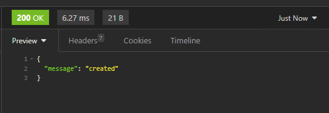

¿Que estamos viendo? 

que nos regresa un mensaje que fue creado, pero no regresa la data o el cuerpo de lo que enviamos, esto se debe a que esta faltando un middleware que tiene express.

Este middleware se debe utilizar cuando queremos empezar a recibir informacion en formato json, en nuestro index principal colocamos

```
app.use(express.json())
```
ya con esto, podemos recibir informacion que nos envian por el metodo POST

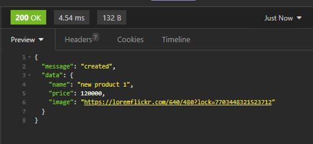

## PUT, PATCH & delete
En esta seccion vamos a trabajar en los metodos de eliminacion y el los metodos de actualizacion

Primero vamos a nuestro insomnia y clonamos nuevamente una solicitud, pero le colocamos el nombre `update product`, y la solicitud la configuramos en `PUT`

Nosotros debemos enviar un id unico para poder actualizar el producto, sin embargo, en el metodo `PUT` debemos enviar todos los datos del producto para poderlo actualizar, si el producto tiene 10 campos, debemos enviar los 10 campos para poder actualizar, a diferencia de `PATCH`, que solo requiere el campo a actualizar.

En nuestro `products.router.js` vamos a agregar el metodo patch

```
router.patch('/:id', (req, res) => { // recibe un id desde los parametros para poder saber cual es el elemento a editar
  const {id} = req.params // extraemos un id desde los parametros
  const body = req.body; // tambien tiene un cuerpo
  res.json({
    message: 'update',
    data: body,
    id,
  });
});
```

Pongamoslo a prueba

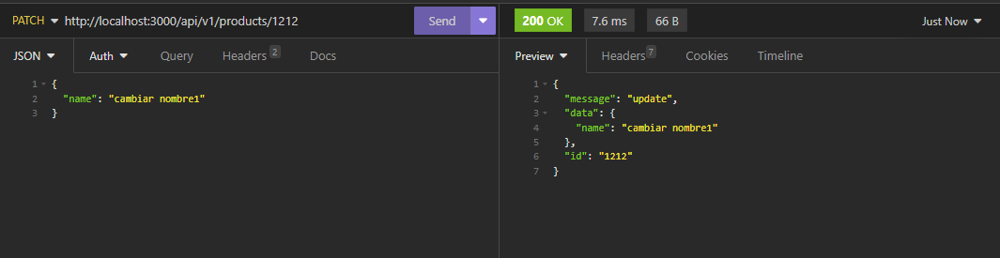


Ahora vamos con el DELETE

```
router.delete('/:id', (req, res) => { // igualmente recibe un id
  const {id} = req.params
  res.json({
    message: 'deleted', // reornamos un mensaje para saber que fue exiotoso, y no recibe u n cuepo, porque estamos borrando elementos
    id,
  });
});
```
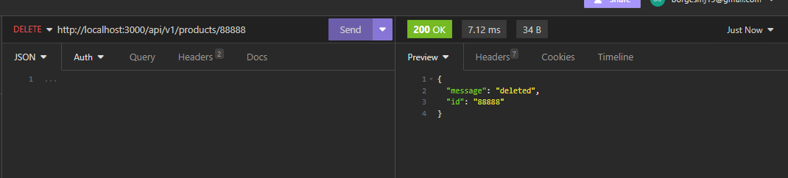

## Status code
Es un standar para poder que el usuario sepa si todo salio bien o si hay algun fallo, los mas comunies es el 404, que es para indicar que la solicitud no fue encontrada en el servidor o el 500 que el algun punto el servidor se rompió.

LOs codigos de estado funcionan por rango, y el la [documentacion de mozzilla](https://developer.mozilla.org/en-US/docs/Web/HTTP/Status) para ver estos rangos mejor definidos, y una manera mas visual de verlos es en la [pagina web](https://http.cat/) donde nos dan ejemplos de los status code con imagenes de gato

Si nos fijamos en las imagenes anteriores, estamos obteniendo de respuesta un [codigo 200](https://developer.mozilla.org/en-US/docs/Web/HTTP/Status/200), que fue exitoso, pero no deberia ser asi, el de crear deberia regresar un [codigo 201](https://developer.mozilla.org/en-US/docs/Web/HTTP/Status/201) que nos indica que el nuevo producto fué creado exitosamente, 

Vamos a nuestro insomnia y solicitamos un producto en especifico `http://localhost:3000/api/v1/products/9999`, insomnia nos regresa 
```
200 OK

{
	"id": "9999",
	"name": "producto 2",
	"value": 5000
}
```

pero no deberia ser asi, ya que ese producto no existe, ¿como hacemos para que nos regrese un 404?

Para poder crear un nuevo producto con `POST` y que nos responda con un status 201 solo hay que cambiar la linea de la respuesta

```
router.post('/', (req, res) => {
  const body = req.body;
  res.status(201).json({
    message: 'created',
    data: body,
  });
});
```

Para poder configurar el 404

```
router.get('/:id', (req, res) => {
  const { id } = req.params; //IMPORTANTE: todos los parámetros tipo query los va a enviar como un string, asi que hay que tener cuidado en ese aspecto
  if (id === '999'){ // si el id a buscar es un 999 nos traera un not found
    res.status(404).json({
      message: 'not found'
    });
  } else{ // de resto nos regresará el producto
    res.status(200).json({
      id,
      name: 'producto 2',
      value: 5000,
    });

  }
});
```

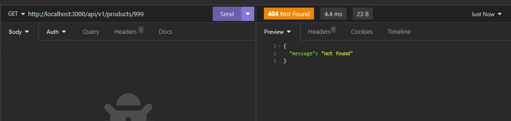

Y para poder cambiarle el 200 al 201 al metodo POST 

```
router.post('/', (req, res) => {
  const body = req.body;
  res.status(201).json({
    message: 'created',
    data: body,
  });
});
```
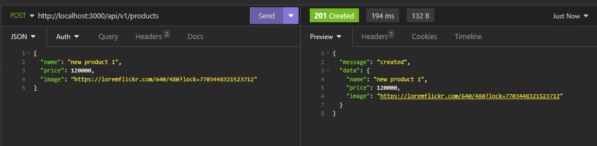

## Services

Llega el momento de hablar acera de los servicios, como hemos notado hemos trabajado la parte de routing, nos hemos enfocado en recibir parametros y ejecutar metodos, pero ¿ donde comenzamos a colocar toda la logica del negocio? es ahi donde entran los servicios que debemos implementar

Nuestra app es una tienda, los servicios serian consulta, hacer compras, transacciones, etc.

Esto como tal sale de una arquitectura, `The Clean Architecture`, normalmente esta arquitectura está frormda por capas


 La capa mas pequeña es de las entidades, ahi es donde encontramos las entidades base de todo nuestro negocio (productos, categorias, usuarios), la siguiente capa es de casos de uso, ahi normalmente tenemos todo lo relacionado a la logica de negocio y tenemos los servicios en esta capa, luego tenemos los controladores, que son los que brindan acceso, y es donde tenemos todos los routing.

 Vamos a ubicarnos en la capa `products.router` de nuestro proyecto, aqui es donde tenemos todas las rutas de producto, crear, editar, etc, sin embargo, comencemos a crear la capa de servicios.


 Segun ChatGPT asi se define:

> Servicios: En el contexto de Node.js, un "servicio" generalmente se refiere a una unidad de funcionalidad independiente y modular. Los servicios son módulos o componentes que realizan tareas específicas dentro de una aplicación. Estos pueden incluir funciones como la gestión de usuarios, la manipulación de datos, la comunicación con bases de datos, el manejo de la lógica de negocios, etc.
> Al organizar una aplicación en servicios, se sigue el principio de diseño de software conocido como "separación de preocupaciones", donde cada servicio se centra en una tarea específica y no está directamente acoplado a otras partes del sistema. Esto facilita la modularidad, el mantenimiento y la escalabilidad de la aplicación.

> Lógica de Servicios: La "lógica de servicios" se refiere a las operaciones y algoritmos específicos implementados en los servicios de una aplicación. Cada servicio tiene su propia lógica interna que define cómo realiza sus tareas asignadas. Por ejemplo, un servicio de autenticación puede tener lógica para verificar credenciales de usuario, mientras que un servicio de gestión de pedidos puede tener lógica para procesar y almacenar información relacionada con los pedidos.

Tomando eso en cuenta, apliquemoslo a nuestra aplicacion:

Creamos una carpeta nueva llamada `products.services.js` y aca haremos OOP (programacion orientada a objetos)

```
const { faker } = require('@faker-js/faker');

class ProductsService {
    // necesitamos un costructor de productos, que inicializa con un array vacio
    constructor (){
        this.products = [];
        this.generate();
    }

    // utilizamos una funcion de generar, que será llamada en el archivo "products.router.js"
    generate(){
        const limit = 100;
        for (let index = 0; index < limit; index++) {
          this.products.push({
            id: faker.string.uuid(),
            name: faker.commerce.productName(),
            price: parseInt(faker.commerce.price(), 10),
            image: faker.image.url(),
          });
        }
    }
    // necesitamos gestionar todo lo que son los productos
    // crear, actualizar, borrar, buscar

    create(){

    }

    // despues de creado, seria sencillo traer de regreso el array completo
    find(){
        return this.products;
    }

    // buscar un producto en especifico
    findOne(id){
      return this.products.find(item => item.id === id)
    }

    update(){

    }

    delete(){

    }
}

module.exports = ProductsService;

```

y el archivo `products.router.js` lo modificamos para traer cada servicio

```
const express = require('express');

ProductsService = require('./../services/product.service')

const router = express.Router();
// creamos una instancia de ese servicio
const service = new ProductsService()


// llamamos al servicio para poder encontrar todos productos
router.get('/', (req, res) => {
  const products = service.find();
  res.json(products);
});

// llamamos al servicio para traer un producto en especifico
router.get('/:id', (req, res) => {
  const { id } = req.params;
  const product = service.findOne(id);
  res.json(product)
});

router.post('/', (req, res) => {
  const body = req.body;
  res.status(201).json({
    message: 'created',
    data: body,
  });
});

router.patch('/:id', (req, res) => {
  const {id} = req.params
  const body = req.body;
  res.json({
    message: 'update',
    data: body,
    id,
  });
});

router.delete('/:id', (req, res) => {
  const {id} = req.params
  res.json({
    message: 'deleted',
    id,
  });
});


module.exports = router;

```
de esta manera separamos al servicio y a las rutas


Ahora probemos nuestra app en Insomnia, 

* Si buscamos en el peticion `GET products` nos deberia regresar un objeto json con los 100 productos con sus id
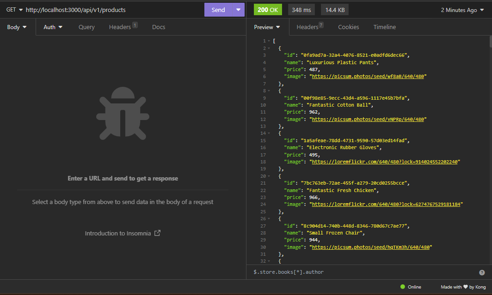

Lo curioso de esta manera, es que antes cada vez que haciamos una peticion GET a todos los productos, generaba productos aleatoriamente, pero ahora que lo estamos haciendo desde un constructor, ya los productos permaneceran igual por mas que lo sigamos haciendo solicitud, a menos que guardemos el cogido o apaguemos el servidor.

* Si buscamos en el peticion `GET product`, nos regresa un solo producto

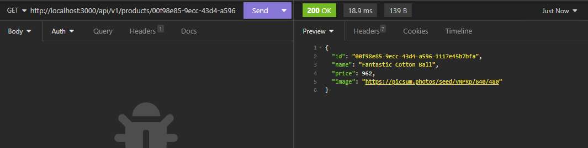

## Create, update & delete
